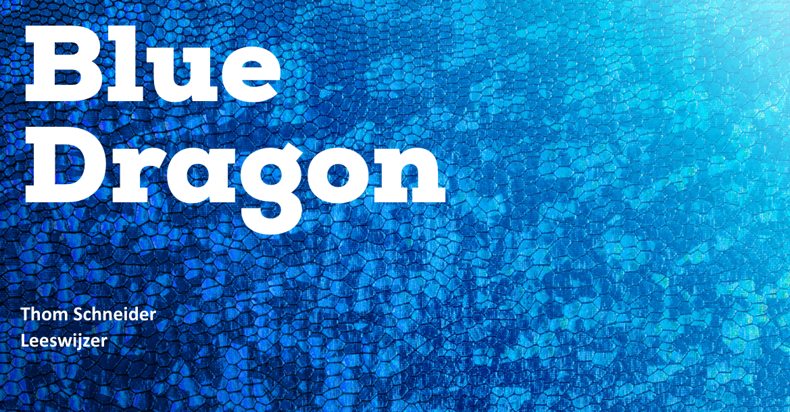

# Leeswijzer

<figure><figcaption></figcaption></figure>

## **Student**

**Naam:** Schneider, Thom T.F.A

**Studentnummer:** 463133

**Profiel:** Media & Design

**Stageperiode:** 29-08-2022 t/m 20-01-2023

**Aantal werkdagen:** 91 dagen (20 jan 2023)

## Gegevens Bedrijf

**Naam:** Blue Dragon

**Afdeling:** Digital Technology

**Plaats:** ’s-Hertogenbosch

**Naam bedrijfsbegeleider:** Verreijt, S

**Functie:** Projectmanager

**Naam bedrijfsbegeleider:** Timmermans, R

**Functie:** Senior front-end developer

## Gegevens Docentbegeleider

**Naam:** Janssen, Olaf O.T.A.

## Gegevens Verslag

**Auteur:** Thom Schneider

**Datum Uitgifte:** 10-01-2023

## Inleiding

Beste lezer,

Dit Portfolio beschrijft het proces dat ik doorlopen heb tijdens het ontwerpen en realiseren van een nieuwe user interface voor het modulaire content managementsysteem dat Blue dragon heeft gemaakt.

Mijn naam is Thom Schneider, ik heb het afgelopen semester (semester 5) stage gelopen bij het bedrijf Blue Dragon in 's-Hertogenbosch.

## De Opdracht

### Het Probleem

Blue Dragon heeft op dit moment een eigen CMS in gebruik waar klanten hun eigen content in kunnen beheren. Dan moet je denken aan nieuwe pagina's aanmaken, nieuwe componenten plaatsen en content aanpassen zoals tekst en dergelijke. Tijdens de ontwikkeling van het CMS was het de bedoeling om dit systeem alleen intern te gebruiken. Maar omdat er steeds meer vraag was vanuit de klanten van Blue Dragon om zelf content te kunnen beheren. Heeft Blue Dragon besloten om het CMS ook uit te leveren naar de klanten zodat zij hun eigen content kunnen beheren. Op dit moment is het huidige CMS al uitgeleverd aan een aantal klanten van Blue Dragon, maar die gebruiken nu dus een ongebruiksvriendelijk design wat in eerste instantie alleen bedoeld is voor developers van Blue Dragon. De klanten die dit CMS uitgeleverd krijgen zijn klanten die een website hebben, gemaakt door Blue Dragon. Nu is het probleem dat het huidige CMS meer gebruiksvriendelijk is voor de developers van Blue Dragon, maar niet voor de klanten die dit systeem ook gaan gebruiken. Mijn taak is nu om een gebruiksvriendelijk CMS te ontwerpen voor de klanten van Blue Dragon.

Design Challenge:

> Ik ga in opdracht van Blue Dragon een gebruiksvriendelijke user interface ontwerpen voor de klanten die dit systeem in gebruik hebben, zodat zij efficiënter en duidelijker componenten kunnen aanpassen en toevoegen op hun website.

### Proces & Resultaten

Nadat ik het [project plan](stage-project/project-plan.md) had afgerond was ik begonnen met het maken van wat [persona's](stage-project/research/personas.md). Ik heb deze persona's gemaakt met als doel om erachter te komen wat de belanghebbende leuk of niet leuk vinden, wat hun frustraties zijn, en vooral, wat hun doelen zijn en hoe zij die gewoonlijk bereiken, ik heb dit gedaan door middel van een [enquête](stage-project/research/personas.md#enquete-opstellen). Doordat ik deze persona's heb gemaakt weet ik nu wat de frustraties zijn van de klanten die dit systeem gebruiken. Deze frustraties zijn onder andere, moeilijke termen die gebruikt worden zonder uitleg wat het doet, ook is het soms onduidelijk welke velden er ingevuld moeten worden en welke niet, en regelmatig is de flow van het systeem onduidelijk.

Nadat ik de persona's had gemaakt was ik begonnen met het maken van het [marktonderzoek](stage-project/marktonderzoek.md), ik heb dit marktonderzoek gedaan omdat ik erachter wilde komen welke concurrerende producten er zijn, hoe de belanghebbende deze producten gebruiken en welke functies er overwogen moeten worden om in Blue Dragons cms toe te passen. Ook heb ik een aantal [usp's](stage-project/marktonderzoek.md#de-usps-unique-selling-points) opgesteld om te kijken hoe Blue Dragon zich onderscheidt van de andere soortgelijke CMS'en. Nadat ik antwoord heb gehad op mijn vragen, ben ik begonnen met het maken van een [gebruiksvriendelijkheid onderzoek](stage-project/gebruiksvriendelijkheid-onderzoek.md) om erachter te komen wat het huidige CMS van Blue Dragon niet gebruiksvriendelijk maakt met behulp van mijn persona's, en hoe ik mijn resultaten van het marktonderzoek op een gebruiksvriendelijke wijze kan toepassen.&#x20;

Omdat ik nu genoeg informatie heb over de huidige omstandigheden kan ik aan de slag met het [concept](stage-project/concept.md). Tijdens deze concept fase ben ik begonnen met het maken van de [user requirements](stage-project/concept.md#user-requirements). Ik heb deze user requirements gemaakt om aan te geven wat het systeem moet doen om de gebruikers in staat te stellen hun doelen te bereiken. Nadat ik de user requirements had opgesteld, ben ik begonnen met het maken van wat [user flows](stage-project/concept.md#user-flows) deze user flows zijn gemaakt op basis van de requirements. Ik heb deze user flows gemaakt om erachter te komen waar de flow onduidelijk is, en waar ik een aantal stappen tussen uit kan halen om de gebruiksvriendelijkheid te verbeteren.

Daarna ben ik op basis van de vorige producten en de huisstijl van Blue Dragon, componenten gaan designen die gebruikt worden voor het nieuwe CMS van Blue Dragon. Voor het designen van deze componenten heb ik ook professionele voorbeelden gebruikt en feedback van collega's. Vervolgens nadat het concept af is ben ik begonnen aan de [realisatie](stage-project/realisatie/) fase. In de realisatie fase ben ik begonnen met het onderzoeken hoe ik Laravel Bootstrap code omzet naar Tailwind code. Voor het converteren van deze code heb ik een tool gevonden genaamd [Tailwindo](stage-project/realisatie/laravel-bootstrap-to-tailwind.md), nu dat ik weet dat het mogelijk is, is het de vraag of het ook nuttig is voor mijn project. Uiteindelijk na wat onderzoek gedaan te hebben, heb ik kunnen vaststellen dat het in mijn geval beter is om vanaf scratch te beginnen.&#x20;

Na het onderzoek over Tailwindo ben ik begonnen met het coderen van een aantal componenten. Maar om het mijzelf makkelijker te maken heb ik gebruik gemaakt van een Tailwind componenten library genaamd [Flowbite](stage-project/realisatie/flowbite.md). Ik heb voor Flowbite gekozen omdat deze library compatibel is met Laravel en Webpack. Nadat ik Flowbite heb kunnen installeren, ben ik aan de slag gegaan met het realiseren van de nieuwe [componenten](stage-project/realisatie/componenten-realiseren.md) en deze vervolgens in [Git](stage-project/realisatie/componenten-realiseren.md#git) gezet. Daarna ben ik begonnen met het maken van een [interactief prototype](stage-project/testen.md), ik heb deze interactieve prototypes gemaakt in Adobe XD op basis van de user requirements. Nadat het interactieve prototype klaar was ben ik aan de slag gegaan met het maken van een [testplan](stage-project/testen.md#testplan) waarin ik uitleg dat ik het nieuwe design wil gaan toetsen door middel van een [usability onderzoek](stage-project/testen.md#usability-onderzoek). Uit dit usability onderzoek is gebleken dat de gebruikers zonder problemen hun doel behalen binnen het CMS. Vervolgens heb ik een [advies document](stage-project/advies-rapport.md) geschreven over de toekomst van dit concept, en met wat verschillende adviezen over gebruikte tools en andere onderwerpen, en tot slot nog een [reflectie](stage-project/reflectie.md) waarin staat wat ik heb geleerd, en wat is lastiger vond.

### **Hoofdvraag**

> "Op welke manier kan ik het ontwerp van het content managementsysteem van Blue Dragon optimaliseren, zodat de gebruikservaring voor de eindgebruikers wordt verbeterd?"&#x20;

Om deze hoofdvraag te beantwoorden; Ben ik verschillende onderzoeken gaan doen om zo informatie te verkrijgen van eindgebruikers, in dit geval de klanten van Blue Dragon. Nadat ik deze informatie had gekregen ben ik gaan kijken naar welke soortgelijke producten er al bestaan, en hoe die hun eigen CMS gebruiksvriendelijk maakt. Vervolgens ben ik een onderzoek gaan doen naar hoe ik deze gebruiksvriendelijkheid toe kan passen op het huidige CMS van Blue Dragon. Met deze onderzoeksresultaten, kon ik een ontwerp maken wat goed past bij de wensen en behoeften van de klanten van Blue Dragon. Om te valideren dat de onderzoeksresultaten en het nieuwe ontwerp juist zijn, ben ik gaan testen door middel van een usability onderzoek. Omdat de usability test zonder tegenslagen was verlopen, kan ik concluderen dat het nieuwe ontwerp goed past bij de wensen en behoeften van de eindgebruikers van dit CMS.

### Leeruitkomsten

| Leeruitkomsten        | Portfolio items                                                                                                                                                                                                                                                                                                                                                                                                                                                                                                                                                                                                                                               |
| --------------------- | ------------------------------------------------------------------------------------------------------------------------------------------------------------------------------------------------------------------------------------------------------------------------------------------------------------------------------------------------------------------------------------------------------------------------------------------------------------------------------------------------------------------------------------------------------------------------------------------------------------------------------------------------------------- |
| Knowledge and Insight | [Persona](stage-project/research/personas.md), [Tailwindo](stage-project/realisatie/laravel-bootstrap-to-tailwind.md), [Flowbite](stage-project/realisatie/flowbite.md), [User flow](stage-project/concept.md#user-flows), [Laravel](stage-project/realisatie/laravel-bootstrap-to-tailwind.md), [Bootstrap](stage-project/realisatie/laravel-bootstrap-to-tailwind.md), [Chamaileon](extra-werkzaamheden/abbott-mail-templates.md), [Adobe experience manager](extra-werkzaamheden/abbott-adobe-experience-manager.md), [Docker](stage-project/realisatie/laravel-bootstrap-to-tailwind.md), [Smart Git](stage-project/realisatie/componenten-realiseren.md) |
| Analysis              | [Marktonderzoek](stage-project/marktonderzoek.md), [Usp](stage-project/marktonderzoek.md#usp), [Gebruiksvriendelijkheid onderzoek](stage-project/gebruiksvriendelijkheid-onderzoek.md), [User requirements](stage-project/concept.md#user-requirements), [User flow](stage-project/concept.md#user-flows)                                                                                                                                                                                                                                                                                                                                                     |
| Advise                | [User flow](stage-project/concept.md#user-flows), [Tailwindo](stage-project/advies-rapport.md#advies-tailwindo), [Toekomst concept](stage-project/advies-rapport.md), [Flowbite](stage-project/advies-rapport.md#advies-flowbite), [Project plan](stage-project/project-plan.md)                                                                                                                                                                                                                                                                                                                                                                              |
| Design                | [Persona](stage-project/research/personas.md), [Concept](stage-project/concept.md), [User requirements](stage-project/concept.md#user-requirements), [User flow](stage-project/concept.md#user-flows), [Interactief prototype](stage-project/testen.md)                                                                                                                                                                                                                                                                                                                                                                                                       |
| Realisation           | [Realisatie componenten](stage-project/realisatie/componenten-realiseren.md), [Tailwindo](stage-project/realisatie/laravel-bootstrap-to-tailwind.md), [Flowbite](stage-project/realisatie/flowbite.md), [Implementatie](stage-project/realisatie/laravel-bootstrap-to-tailwind.md#implementatie)                                                                                                                                                                                                                                                                                                                                                              |
| Manage & Control      | [Concept](stage-project/concept.md), [Git](stage-project/realisatie/componenten-realiseren.md#git), [Aanpak & Planning](stage-project/project-plan.md#aanpak-and-planning), [HCD-methode](stage-project/project-plan.md#hcd-methode), [Documentatie](stage-project/reflectie.md#documentatie)                                                                                                                                                                                                                                                                                                                                                                 |
| Judgement             | [Marktonderzoek](stage-project/marktonderzoek.md), [Gebruiksvriendelijkheid onderzoek](stage-project/gebruiksvriendelijkheid-onderzoek.md), [Testplan](stage-project/testen.md#testplan)                                                                                                                                                                                                                                                                                                                                                                                                                                                                      |
| Communication         | [Enquête](stage-project/research/personas.md#survey), [Communicatie afspraken](stage-project/project-plan.md#\_toc90035032)                                                                                                                                                                                                                                                                                                                                                                                                                                                                                                                                   |
| Learning ability      | [Reflectie](stage-project/reflectie.md), [Feedback project plan](stage-project/project-plan.md#feedback), [Feedback enquête](stage-project/research/personas.md#enquete-opstellen)                                                                                                                                                                                                                                                                                                                                                                                                                                                                            |
