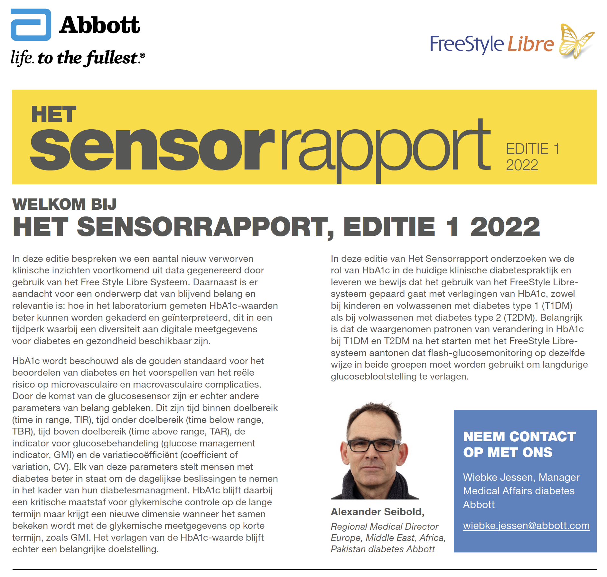

# Abbott Adobe Experience Manager

<figure><figcaption></figcaption></figure>

## Inleiding

Voor deze opdrachtgever heb ik met behulp van Adobe Experience Manager een aantal pagina's moeten maken. De content van deze pagina's bestond al in de vorm van een pdf, ik heb daarna dit moeten omzetten zodat het er ook mooi uit ziet op de website.

## Realisatie

Ik had onlangs de gelegenheid om te werken met Adobe Experience Manager (AEM) en vond het een krachtig hulpmiddel voor het beheren en leveren van digitale ervaringen. Ik was in staat om gemakkelijk inhoud te creëren en te beheren, evenals de look en feel van de website aan te passen met behulp van de interface van AEM. Over het algemeen was mijn ervaring met AEM positief en ik was in staat om het effectief te gebruiken om zo het pdf om te zetten naar een website pagina.

De onderstaande image is het pdf bestand wat ik moest omzetten naar een pagina.

<figure><figcaption></figcaption></figure>

