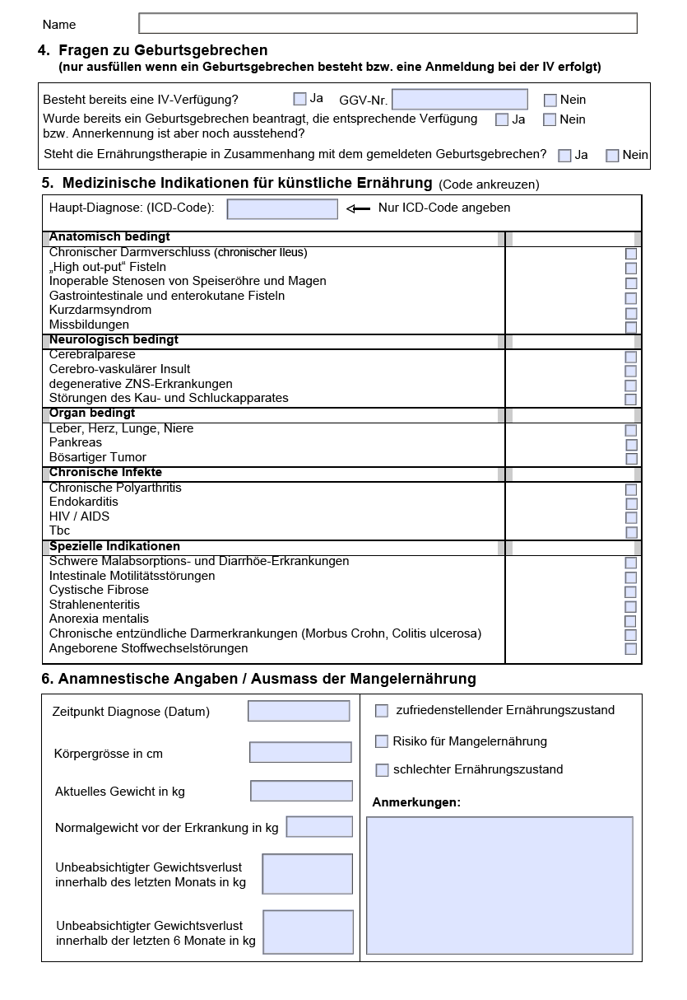
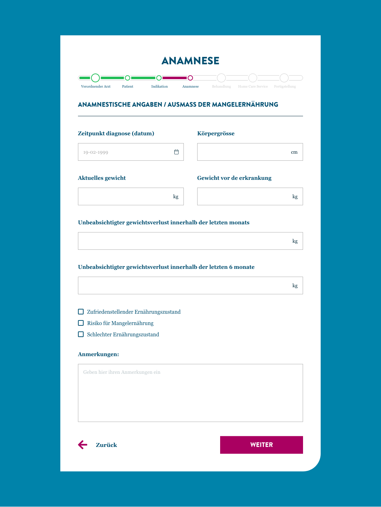

# Abbott

<figure><figcaption></figcaption></figure>

## Inleiding

Voor deze opdrachtgever heb ik een aantal invulformulieren van verschillende zorgverzekeringen moeten ontwerpen, zodat de ervaring voor de eindgebruiker wordt verbeterd. Ook heb ik nog wat andere bijzaken gedaan voor deze opdrachtgever.

## Realisatie Formulieren

Voordat ik met deze opdracht aan de gang ben gegaan heb ik eerst de documenten vertaald naar het Nederlands zodat ik een beter idee heb waar ik naar kijk. Daarna ben ik gaan kijken of ik wat informatie kan bij elkaar kan bundelen zodat het invullen minder lang duurt voor de gebruiker.

<figure><figcaption></figcaption></figure>

Nadat ik het formulier wat compacter heb gemaakt ben ik aan de slag gegaan met het ontwerpen van de formulieren. Ik heb het ontwerp gemaakt op basis van de huisstijl van het bedrijf.&#x20;

<figure><figcaption></figcaption></figure>

Vervolgens heeft mijn bedrijfsbegeleider contact gehad met Abbott om te vragen voor wat feedback. Op de feedback na waren ze zeer te spreken over het design, alleen waren er nog een aantal dingen die verbeterd moesten worden zoals de progressie balk. Uiteindelijk is dit project verder opgepakt door een andere collega die dit design heeft gefinaliseerd.

&#x20;

<figure><figcaption></figcaption></figure>

