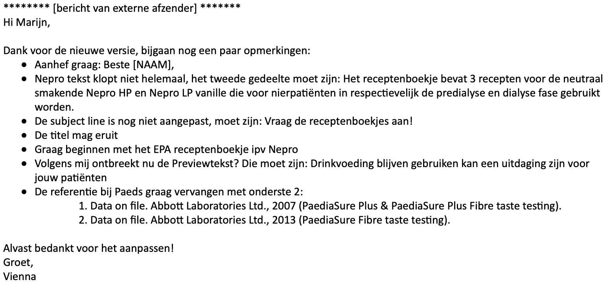

# Abbott Mail Templates

<figure><figcaption></figcaption></figure>

## Inleiding

Voor deze opdrachtgever heb ik een aantal mail templates moeten maken. Ik heb deze templates moeten maken in een tool genaamd "Chamaileon". Chamaileon is een ESP email builder platform ontworpen om agile marketing teams te helpen met het organiseren van hun email productie processen te optimaliseren, en zich te concentreren op het grotere geheel van email marketing.

## Realisatie

Tijdens de realisatie van deze opdracht heb ik gekeken naar een aantal bestaande email templates om wat inspiratie op te doen. In het programma Chamaileon stonden al een aantal templates die eerder gemaakt zijn voor deze opdrachtgever, van die templates kan ik een aantal componenten pakken om die vervolgens bij elkaar te voegen tot een nieuwe email template.

Voor het maken van de email templates krijg ik een aantal bestanden naar mij toegestuurd vanuit de opdrachtgever, zo krijg ik een word bestand met de tekst en verschillende bronverwijzingen die naar pagina's van de website leiden. Ook krijg ik een aantal afbeeldingen via de mail gestuurd die ik kan/moet gebruiken voor die email template.&#x20;

Nadat ik de email template heb gemaakt stuur ik de template door naar een collega binnen het bedrijf, zodat hij nog wat feedback kan geven.

<figure><figcaption></figcaption></figure>

Vervolgens had ik deze feedback verwerkt, zodat de email template gebruikt kan worden door de opdracht gever. Daarna had ik weer een nieuwe opdracht gekregen voor een andere template, en heb ik dezelfde werkzaamheden verricht als de vorige template. Ook hier heb ik weer wat feedback opgekregen wat ik daarna gelijk weer heb verwerkt.&#x20;

<figure><figcaption></figcaption></figure>

<figure><figcaption></figcaption></figure>
