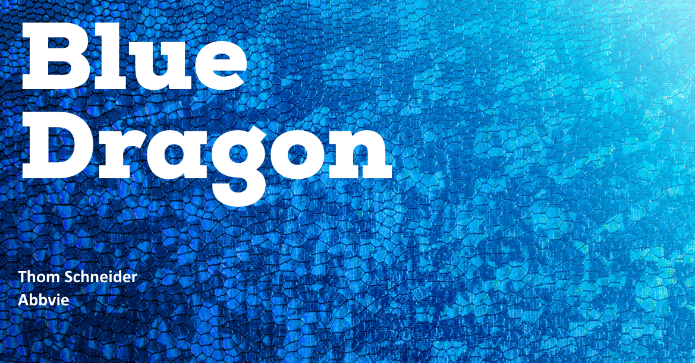
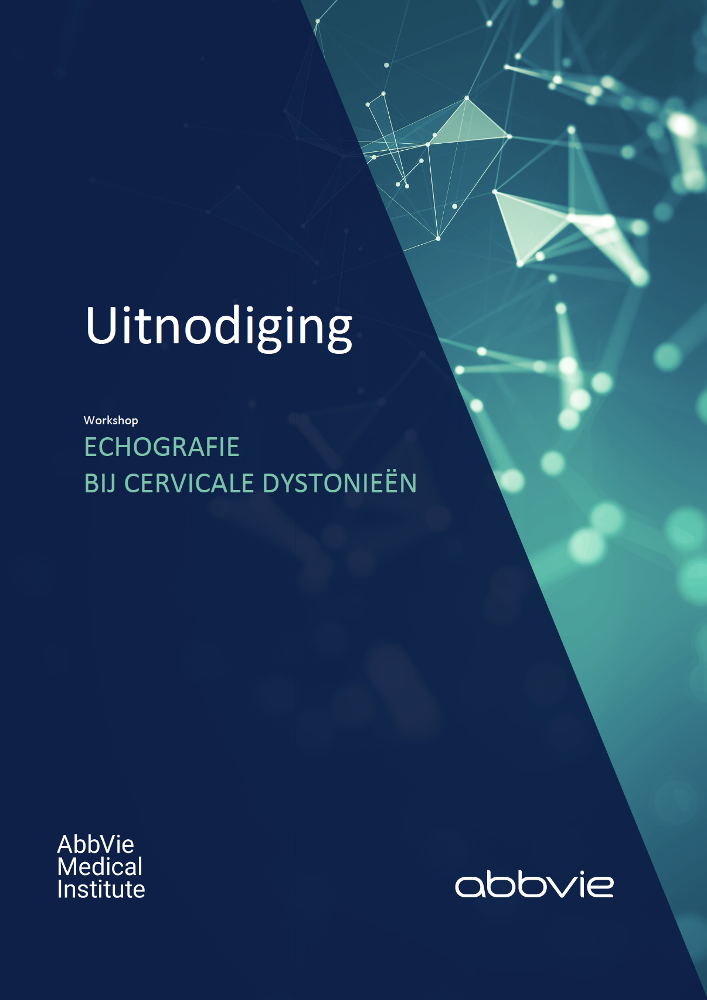
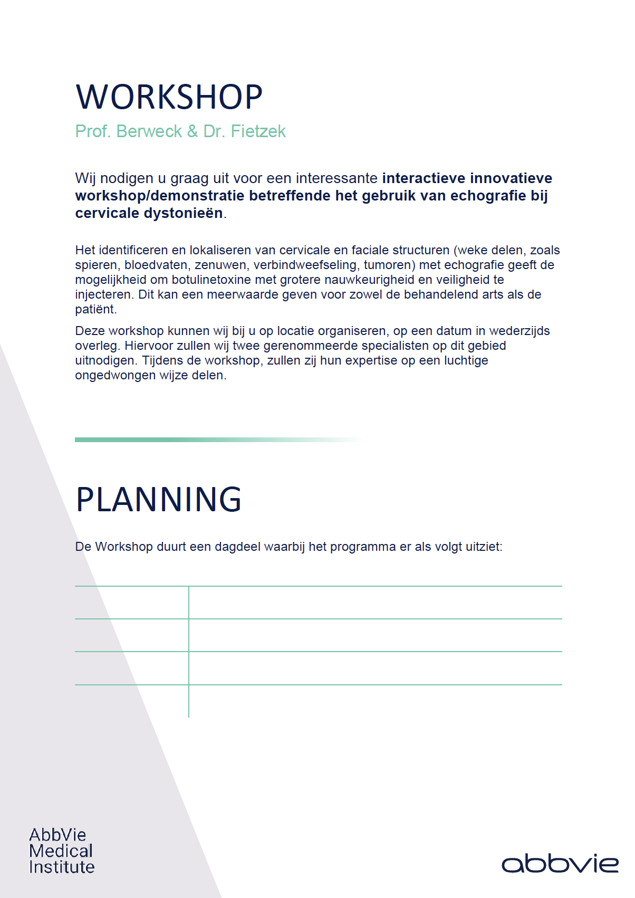
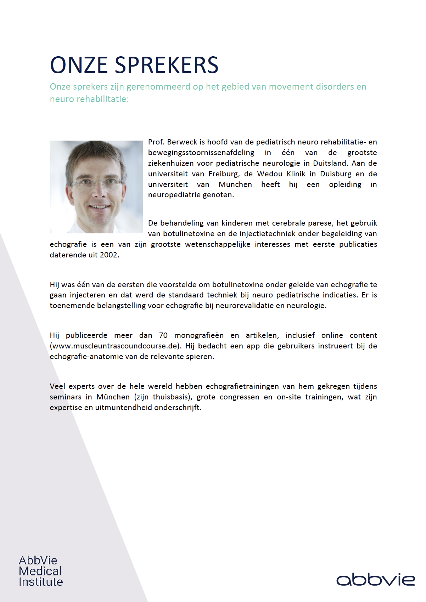
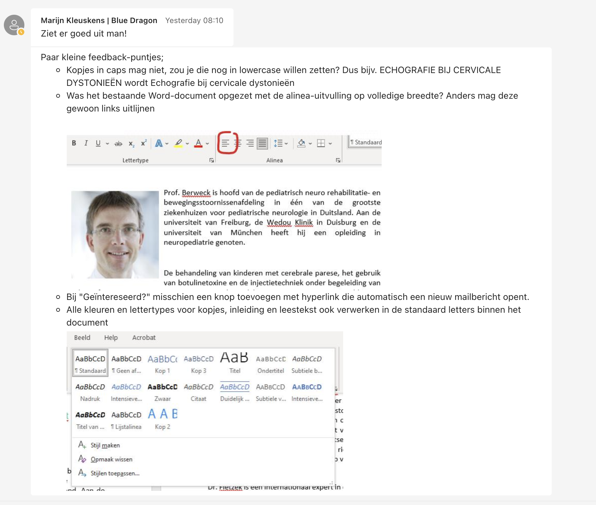
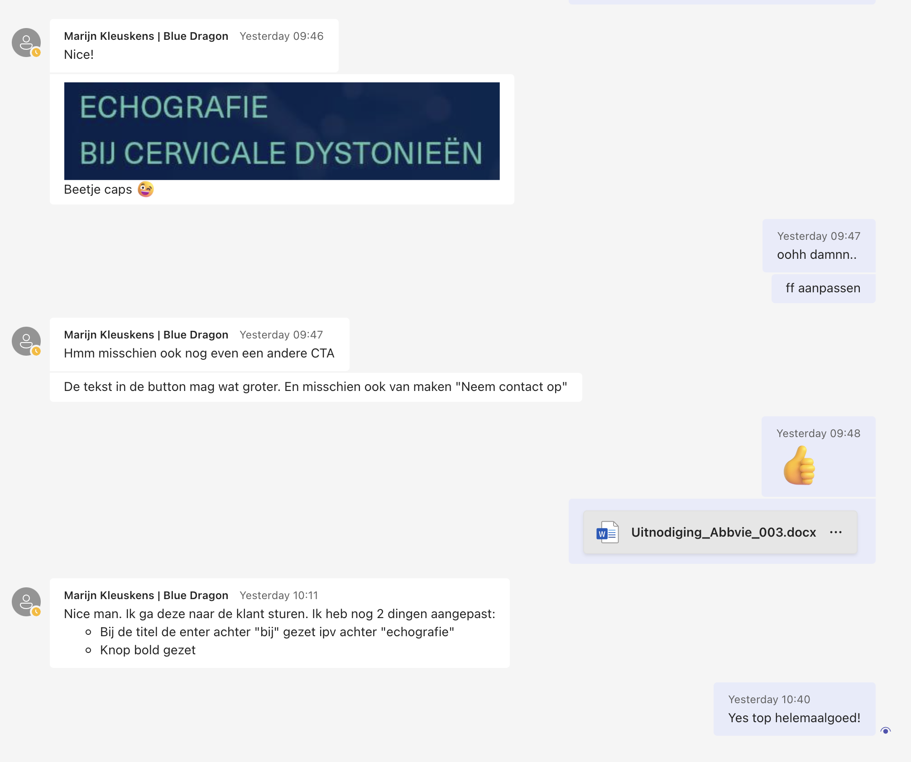

# Abbvie

<figure><figcaption></figcaption></figure>

## Inleiding

Voor deze opdracht moest ik een word template voor Abbvie designen, ze hebben hiervoor inhoudelijk qua tekst alles meegeleverd alleen moest ik een nieuwe template designen aan de hand van hun nieuwe styleguide.&#x20;

Omdat je bij een styleguide je goed moet houden aan de verschillende afspraken was dit een beetje lastig, maar nadat ik de styleguide goed had doorgenomen was dit duidelijk.

## Realisatie

Toen ik was begonnen met deze opdracht kreeg ik een aantal files meegeleverd die mij op weg zouden moeten helpen. Deze files bestaan uit verschillende logo soorten, illustraties, de nieuwe styleguide, wireframes en de inhoudelijke tekst. Uiteindelijk heb ik aan de hand van de meegeleverde files een design gemaakt.

<figure><figcaption></figcaption></figure>

 

<figure><figcaption></figcaption></figure>

 

<figure><figcaption></figcaption></figure>

## Feedback

Nadat ik het design had afgerond heb ik het word document doorgestuurd naar een collega die mij wat feedback heeft gegeven over mijn design. Vervolgens had ik deze feedback verwerkt en het weer opnieuw ingeleverd.&#x20;

Ik was alleen vergeten de kopjes in lowercase te zetten maar uiteindelijk heb ik dit wel weer aangepast. Later heb ik daar dus weer wat feedback opgekregen wat ik gelijk weer heb verwerkt.

<figure><figcaption></figcaption></figure>

 

<figure><figcaption></figcaption></figure>

