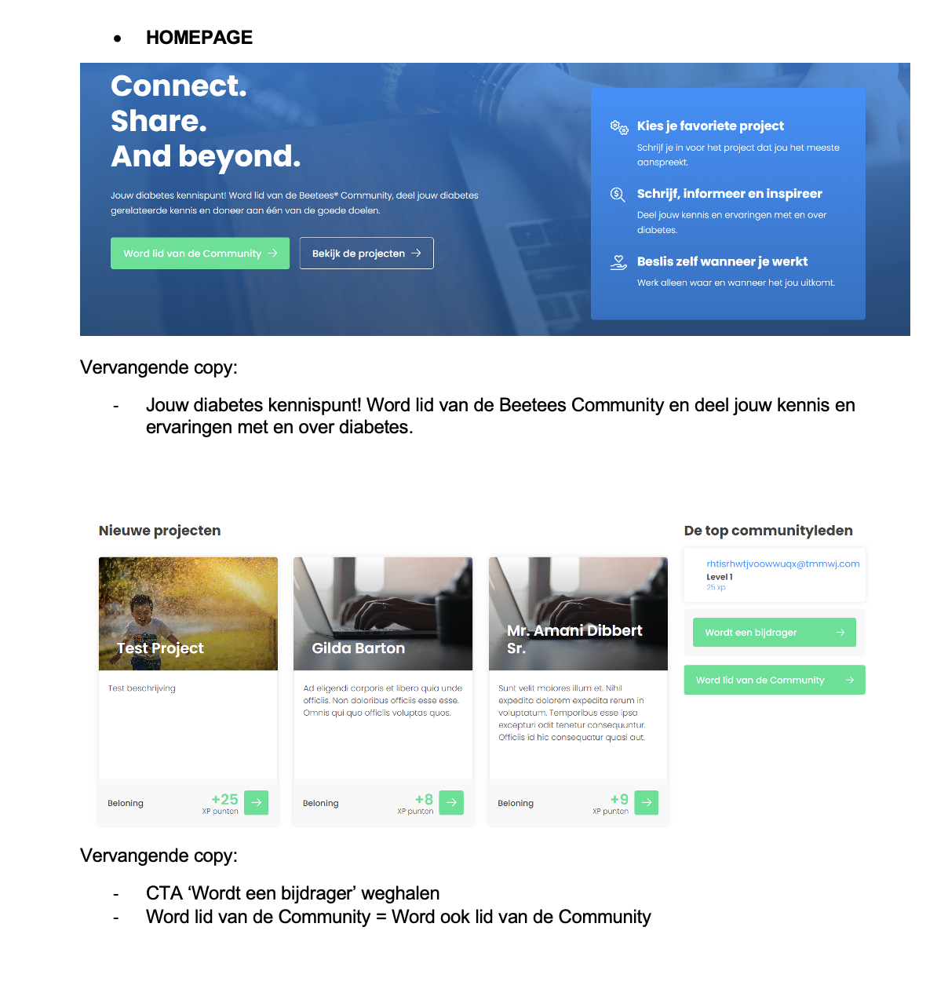

# Beetees

<figure><figcaption></figcaption></figure>

## Inleiding

Voor deze opdrachtgever had ik een pdf gekregen met content wat vervangen moest worden op de website. Ondanks dat deze website niet werkte met een CMS was dit een leuke opdracht om te doen.

## Realisatie

Onlangs had ik de gelegenheid om samen te werken met een klant die de inhoud van zijn website moest bijwerken. De klant gaf me een lijst met veranderingen die ze wilden doorvoeren, waaronder het bijwerken van tekst op bepaalde pagina's, het toevoegen van nieuwe pagina's aan de site en het verwijderen van verouderde informatie.

Ik begon met het bekijken van de lijst met veranderingen van de klant en organiseerde ze in een actieplan. Vervolgens begon ik met het maken van de noodzakelijke updates aan de website, te beginnen met de meest urgente wijzigingen en werkend door de lijst.

Gedurende het hele proces hield ik de klant op de hoogte van mijn vorderingen en eventuele vragen of problemen. Ik zorgde er ook voor dat ik mijn werk dubbel controleerde om er zeker van te zijn dat alle wijzigingen correct waren en dat de website goed functioneerde.

Uiteindelijk was de klant erg blij met de vernieuwde inhoud van hun website. Ze waardeerden mijn aandacht voor detail en mijn snelle communicatie tijdens het hele proces. Al met al was het een succesvol project waar ik met plezier aan heb gewerkt.

De image hieronder laat het document zien met de lijst van de wijzigingen die doorgevoerd moeten worden.

<figure><figcaption></figcaption></figure>
