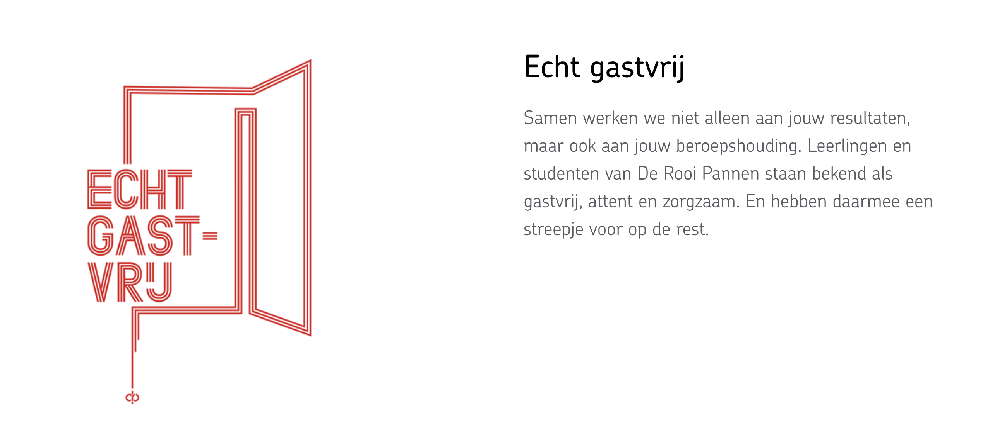

# De Rooi Pannen

<figure><figcaption></figcaption></figure>

## Inleiding

Binnenkort wordt de nieuwe website van de Rooi pannen gelanceerd. Op deze website staan een aantal images waar wat mee gedaan moet worden. Zo moet de positie van de images worden veranderd en de resolutie moet ook aangepast worden door middel van Adobe Photoshop.

Mijn taak voor deze opdracht is het aanpassen van de resolutie van de images en de positionering te verbeteren, zodat de website er beter uit komt te zien.

## Realisatie

Voor het realiseren van deze opdracht heb ik de images die in Blue Dragons content management systeem even gedownload zodat ik deze kan aanpassen in Adobe Photoshop. Tijdens het aanpassen van deze images heb ik de hoogte en de breedte van de image verkleint en de dpi (Dots per pixel) Verghoogd.&#x20;

<figure><figcaption></figcaption></figure>
