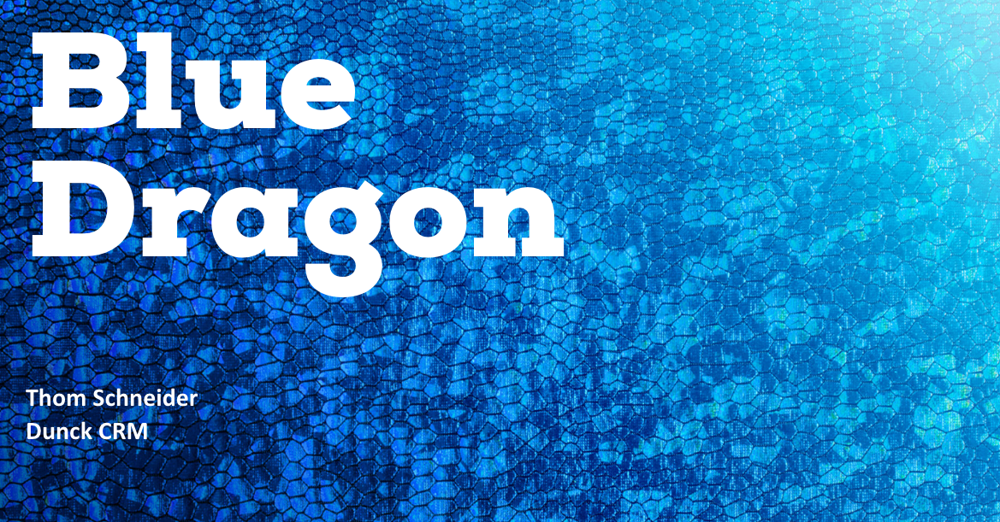

# Dunck CRM

<figure><figcaption></figcaption></figure>

## Inleiding

Voor deze opdracht had ik een aantal wireframes gekregen die ik moest namaken met Bootstrap.

## Realisatie

Met de wireframes als hulpmiddel begon ik de website te bouwen met behulp van het Bootstrap framework. Hierdoor kon ik snel en gemakkelijk een responsieve, mobielvriendelijke lay-out maken die op verschillende apparaten zou werken.

Ik heb veel tijd besteed aan het aanpassen van de look en feel van de site, met behulp van de richtlijnen van de klant om ervoor te zorgen dat het eindproduct overeenkwam met de gewenste esthetiek. Ik heb ook verschillende functies en functionaliteiten toegevoegd, zoals contactformulieren om de site interactiever en gebruiksvriendelijker te maken.

Het was een uitdagende en leerzame opdracht. Ik kon mijn vaardigheden in HTML, CSS en Bootstrap gebruiken om een functionele en visueel aantrekkelijke website te maken die aan de behoeften van de klant voldeed. Ik ben trots op het eindresultaat en kijk ernaar uit om in de toekomst aan soortgelijke projecten te werken.

<figure><figcaption></figcaption></figure>

