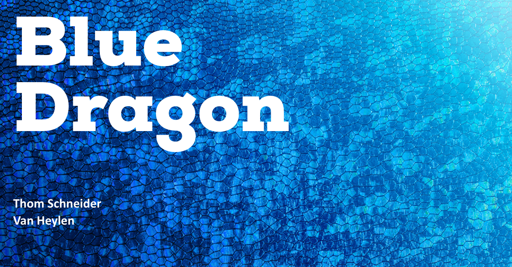

# Van Heylen

<figure><figcaption></figcaption></figure>

## Inleiding

Voor deze opdrachtgever moest ik de website aanpassen, zodat het voor de gebruikers duidelijker wordt waar ze naar toe moeten navigeren.

## Realisatie

Tijdens de realisatie voor deze opdracht, heb ik in het CMS gewerkt van Blue Dragon. Dit was wel een goede opdracht omdat ik zo ook zelf verbeter punten kon zien in het CMS van Blue Dragon. Voor deze opdracht moest ik ervoor zorgen dat de vacature pagina op de website een goede en duidelijke lay-out krijgt.

<figure><figcaption></figcaption></figure>

