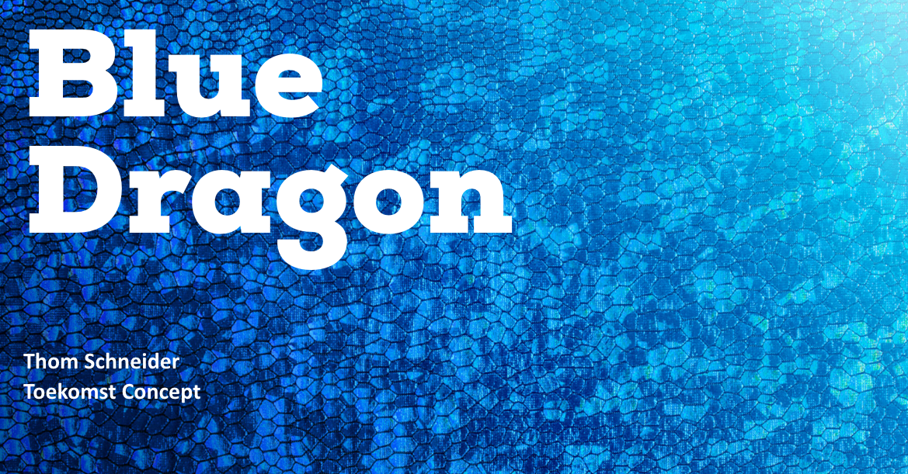

# Advies rapport

<figure><figcaption></figcaption></figure>

## Inleiding

In dit document vindt u richtlijnen en aanbevelingen over verschillende onderwerpen en tools die ik ben tegengekomen tijdens dit project. Ik heb deze verzameling van nuttige adviezen samengesteld op basis van mijn eigen ervaringen en expertise.&#x20;

In dit document ga ik advies geven op:

* Welke functies ik adviseer om in het nieuwe design te implementeren.
* Het gebruik van Tailwindo voor het converteren van Bootstrap naar Taiwind.
* Het gebruik van Flowbite voor het implementeren van componenten.
* Het concept in het algeheel.

## Advies functies

Tijdens mijn marktonderzoek ben ik gaan onderzoeken welke functies ik moet overwegen om in Blue Dragons nieuwe CMS te zetten. In mijn onderzoek heb ik aan kunnen tonen dat de aanbevolen functies goed bij het CMS van Blue Dragon passen, en dat het door deze functies het CMS een stuk gebruiksvriendelijker wordt. Voor meer informatie over de specifieke functies die ik heb overwogen verwijs ik u door naar mijn [marktonderzoek](marktonderzoek.md).

## Advies Tailwindo

Mijn advies voor het gebruiken van Tailwindo is een beetje wisselvallig omdat het niet in alle gevallen efficiënt is. Als je een hele lay-out wilt converteren dan kun je het beste Tailwindo gebruiken want dan staan de meeste componenten al op de goede positie. Maar heb je echt custom design keuzes die je wilt door voeren dan zou ik adviseren om het vanaf scratch te maken. In mijn geval heb ik besloten om vanaf scratch te beginnen, omdat het design waar ik naar toe wil werken meer custom en gedetailleerd is.

## Advies Flowbite

Mijn advies voor het gebruiken van Flowbite is zeer positief, omdat er genoeg componenten in staan die gebruikt kunnen worden voor het nieuwe CMS van Blue Dragon. Ook is deze Library goed toepasselijk omdat het compitabel is met Laravel, wat Blue Dragon ook gebruikt in de echte omgeving.&#x20;

## Advies concept

Ik adviseer het CMS ten zeerste aan vanwege het gebruiksvriendelijke ontwerp. De lay-out is clean en intuïtief, waardoor gebruikers gemakkelijk de inhoud die ze zoeken kunnen vinden en openen. De navigatie is duidelijk en logisch, zodat gebruikers snel tussen de verschillende pagina's en secties van het CMS kunnen bewegen. Bovendien heeft het CMS een aantal handige functies die het gebruik ervan vergemakkelijken. De zoekfunctie is snel en accuraat, waardoor gebruikers snel specifieke stukken content kunnen vinden. De bewerkingstools zijn ook gebruiksvriendelijk, waardoor gebruikers eenvoudig inhoud op de site kunnen toevoegen en bijwerken. De multi select tool bij elke tabel, waardoor de gebruiker meerdere rijen in een tabel kan selecteren en aanpassen. De multi language optie is verbeterd zodat deze meer schaalbaar is voor het systeem.

Kortom, het CMS is een uitstekende keuze voor iedereen die op zoek is naar een gebruiksvriendelijke manier om zijn website te beheren en bij te werken. Het intuïtieve ontwerp en de handige functies maken het efficiënt om te gebruiken, en ik twijfel er niet aan dat het een waardevolle aanwinst zal zijn voor Blue Dragon.
