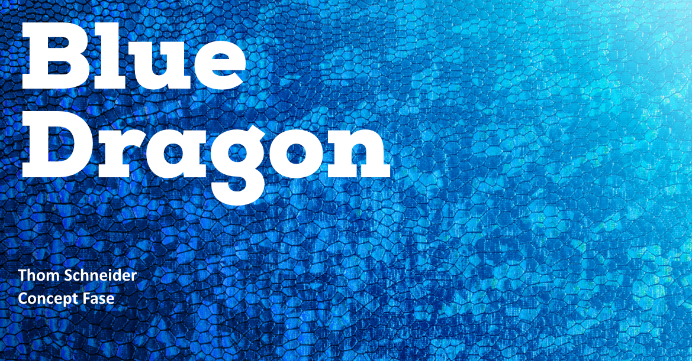
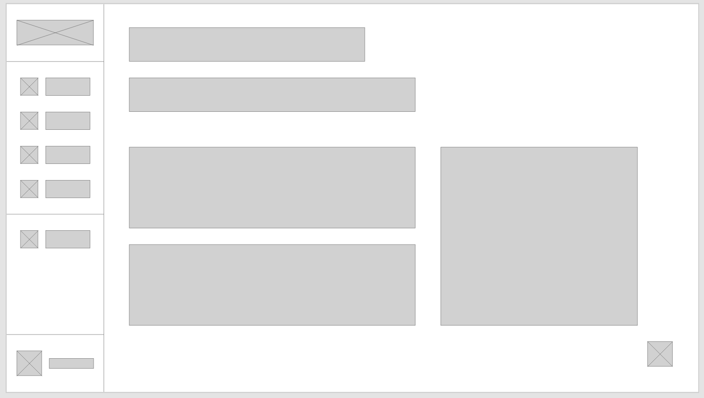
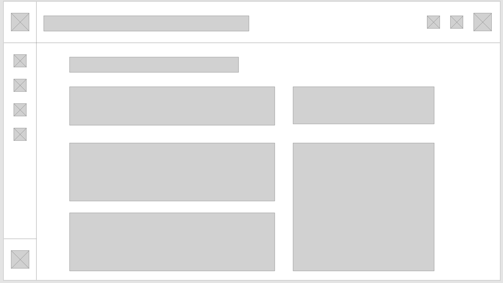

# Concept UI

<figure><figcaption></figcaption></figure>

## Inleiding

Nu dat ik informatie heb verzameld over de doelgroep door middel van de persona's die ik gemaakt heb, kan ik gaan beginnen met het maken van een eerste opzet van de wireframes op basis van de behoeften en eisen van de stakeholders.&#x20;

## User Flows

Ik ben begonnen met een aantal user flows maken op basis van verschillende user stories die ik heb gemaakt. Ik heb gekozen om de user flows te maken om een beter beeld te krijgen van hoe het cms van blue dragon in elkaar zit en om te kijken hoe verschillende processen verlopen.&#x20;

## Wireframes

Voordat ik ben begonnen met het maken van de wireframes heb ik een design gemaakt op een vel papier zodat ik dan sneller wat verschillende designs heb gemaakt. Uiteindelijk heb ik de 2 ontwerpen gekozen die het meest duidelijkheid geven, en die passen bij de behoeften van de klanten.

<figure><figcaption>
Wireframe 1
</figcaption></figure>

 

<figure><figcaption>
Wireframe 2
</figcaption></figure>

Nadat ik deze 2 ontwerpen heb gekozen, ben ik dit gaan voorleggen aan een paar collega's binnen het bedrijf. Na wat verschillende feedback te hebben ontvangen heb ik besloten om een soort mix te maken van beide wireframes.

## Mockup Design

Vervolgens ben ik begonnen met het maken van de mockup van dit cms,&#x20;
