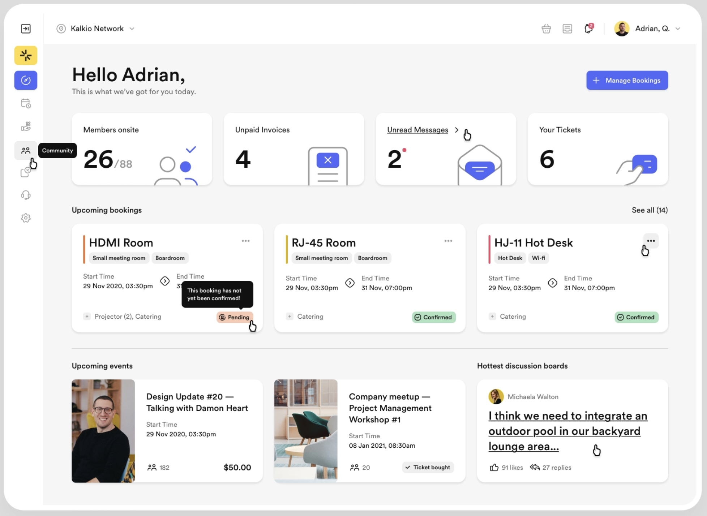
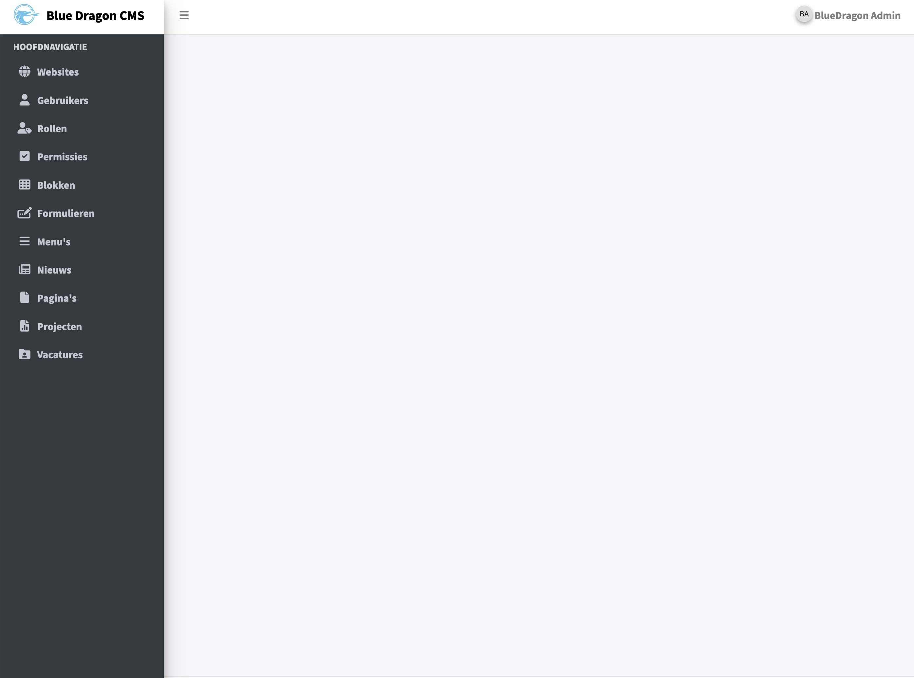

# Concept UI

<figure><figcaption></figcaption></figure>

## Inleiding

Nu dat ik informatie heb verzameld over de doelgroep door middel van de persona's die ik gemaakt heb, kan ik gaan beginnen met het maken van een eerste opzet van de wireframes op basis van de behoeften en eisen van de stakeholders.&#x20;

## User Flows

Ik ben begonnen met een aantal user flows maken op basis van verschillende user story's die ik heb gemaakt. Ik heb gekozen om deze user flows te maken om een beter beeld te krijgen van hoe het cms van Blue Dragon in elkaar zit, en om te kijken hoe verschillende processen verlopen. Ik heb dit gedaan zodat ik kan zien waar ik een extra stap uit kan halen zodat de user experience wordt geoptimaliseerd.&#x20;



## Inspiratie

Om te beginnen met een nieuw design voor een user interface ben ik wat inspiratie gaan op doen door te kijken naar wat verschillende user interfaces die goed aansluiten op de bijpassende doelgroep. Omdat de doelgroep die dit systeem gebruikt redelijk jong is, ben ik gaan kijken naar een modern design wat erg duidelijk en gebruiksvriendelijk is. Uiteindelijk na wat rond zoeken heb ik de onderste 2 designs gekozen.    &#x20;

<figure><figcaption></figcaption></figure>

 

<figure><figcaption></figcaption></figure>

Nadat ik een keuze had gemaakt in welke richting ik mijn design wil laten gaan, ben ik begonnen met het maken van wat wireframes.

## Wireframes

Voordat ik ben begonnen met het maken van de wireframes heb ik een design gemaakt op een vel papier zodat ik dan sneller wat verschillende designs kan maken. Uiteindelijk heb ik de 2 ontwerpen gekozen die ik het meeste vind passen bij de behoeften van de doelgroep.

<figure><figcaption>
Wireframe 1
</figcaption></figure>

 

<figure><figcaption>
Wireframe 2
</figcaption></figure>

Nadat ik deze 2 ontwerpen heb gekozen, ben ik dit gaan voorleggen aan een paar collega's binnen het bedrijf. Na wat feedback te hebben ontvangen heb ik besloten om een soort mix te maken van beide wireframes. Ook heb ik een wireframe gemaakt voor het login scherm waar ik als eerste mee aan de slag ga.

## De huisstijl van Blue Dragon

Omdat Blue Dragon een huisstijl heeft moet ik mij houden aan wat verschillende design aspecten zoals het kleur gebruik, de verschillende lettertypes en het gebruik van het Blue Dragon logo. Het is wel fijn om een vaste huisstijl te hebben omdat ik dan makkelijk mijn design keuzes kan maken.

## Mock-up

Nadat ik de styleguide van Blue Dragon goed heb doorgenomen, ben ik begonnen met het maken van de verschillende mock-ups. Op basis van de verschillende wireframes heb ik de lay-out van het dashboard en login scherm bepaald.&#x20;

### Login Mock-up

Bij het maken van de verschillende mock-ups ben ik begonnen met het ontwerpen van het login scherm.&#x20;

<figure><figcaption></figcaption></figure>

In de afbeelding hierboven staat het huidige ontwerp van het login scherm van Blue Dragons CMS. Wat ik een beetje raar vond is dat er een feature is om een account aan te maken, wat ik onlogisch vond omdat iedereen die op deze pagina terecht komt dan een account kan aanmaken. Maar nadat ik dit had aangekaart hadden we er al snel voor gekozen om deze feature weg te halen. Tijdens het ontwerpen van het nieuwe inlog scherm moet ik natuurlijk ook rekening houden met de huisstijl van Blue Dragon. Uiteindelijk na wat verschillende ontwerpen gemaakt te hebben heb ik een ontwerp gekozen wat goed voldoet aan de huisstijl van Blue Dragon.

<figure><figcaption></figcaption></figure>

Ook kun je in de afbeelding hierboven zien dat ik de feature van "registreren" weg heb gehaald. Overigens is er nog een pagina voor de feature van "Wachtwoord vergeten" die er hetzelfde uitziet maar is de inhoud veranderd.&#x20;

### Dashboard Mock-up

Nu dat ik klaar ben met het ontwerpen van het login scherm ga ik beginnen met het maken van het dashboard.&#x20;

<figure><figcaption>
Huidig Ontwerp
</figcaption></figure>

 

<figure><figcaption>
Nieuw Ontwerp
</figcaption></figure>

Zoals je ziet is het huidige dashboard ontwerp akelig leeg, er staan geen shortcuts of content in waar de gebruiker iets aan kan hebben. Daarom heb ik ervoor gekozen om het nieuwe dashboard vol te zetten met wat content modules. Als eerste heb ik gekozen voor een welkoms bericht waar wat informatie komt te staan over het CMS zelf.  In het blok onder het welkoms bericht heb ik een tabel staan met de laatste veranderingen. Zo kan je zien welke gebruiker wat heeft veranderd en op welke pagina dit is veranderd. Uiteindelijk kun je dan op de pagina naam klikken waar iets veranderd is. &#x20;

<figure><figcaption>
Latest changes module
</figcaption></figure>

 

<figure><figcaption>
News module
</figcaption></figure>

Ook heb ik hiernaast nog een blok staan met wat nieuws, hier komt bijvoorbeeld nieuws in over updates, bug fixes of andere veranderingen.&#x20;

### Pop over

Tijdens het doornemen van het huidige CMS van Blue Dragon kom je soms veel termen tegen die mensen zonder technische kennis niet weten. Daarom heb ik ervoor gekozen om een icoontje achter deze termen te zetten met een pop over waarin wat uitleg staat over deze term. Verder heb ik er ook voor gekozen om deze pop overs te gebruiken als een soort drop down voor wat menu items, natuurlijk ook in de huisstijl van Blue Dragon.

<figure><figcaption></figcaption></figure>

### Table module

