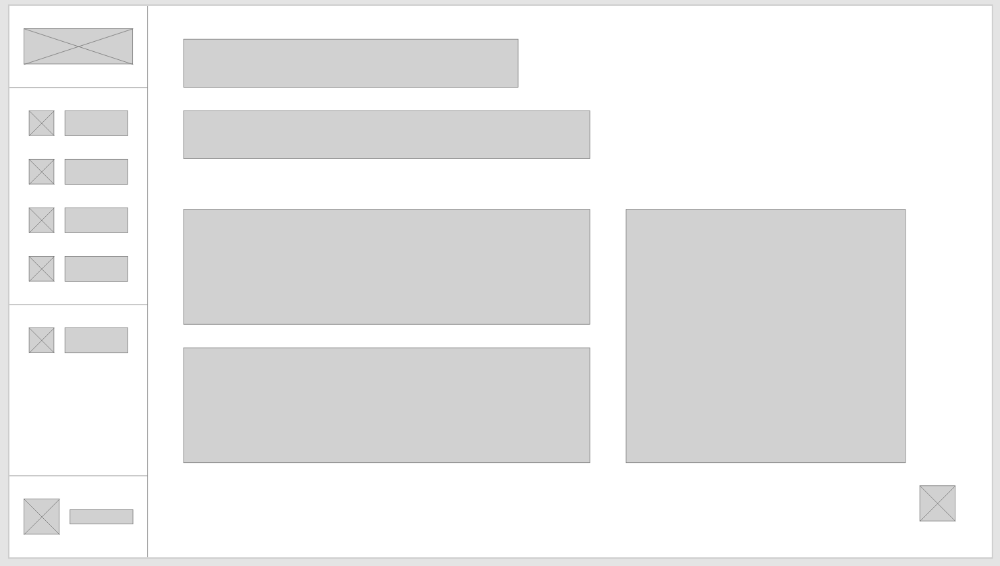
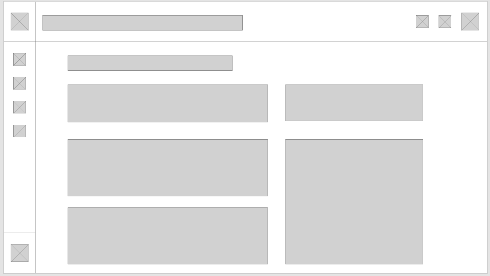

# Concept

<figure><figcaption></figcaption></figure>

## Inleiding

Nu dat ik informatie heb verzameld over de doelgroep door middel van de persona's die ik gemaakt heb, kan ik gaan beginnen met het maken van een eerste opzet van de wireframes op basis van de behoeften en eisen van de stakeholders.&#x20;

## User requirements

Op basis van mijn onderzoeksresultaten heb ik een aantal user requirements kunnen opstellen. In de lijst hieronder staat "Must have" voor alle requirements die essentieel zijn voor dit CMS, daarnaast staat "Should have" hierin staan alle requirements die een goede toevoeging zijn voor dit CMS. Verder heb je ook nog "Could have" hierin staan punten die ook toegevoegd kunnen worden maar die geen prioriteit hebben. Uiteindelijk heb je ook nog "Won't have" waarin punten staan die niet binnen de scope van het CMS vallen.

<figure><figcaption></figcaption></figure>

## User Flows

Ik ben begonnen met een aantal user flows maken op basis van verschillende user story's die ik heb gemaakt. Ik heb gekozen om deze user flows te maken om een beter beeld te krijgen van hoe het cms van Blue Dragon in elkaar zit, en om te kijken hoe verschillende processen verlopen. Ik heb dit gedaan zodat ik kan zien waar ik een extra stap uit kan halen zodat de user experience wordt geoptimaliseerd.&#x20;



Nu dat ik een flow voor me heb kan ik beter zien welke stappen onnodig zijn, zo heb je bijvoorbeeld bij het aanmaken van een user de NAW gegevens nodig die helemaal geen meerwaarde hebben. Daarom heb ik ook besloten deze uit mijn design te houden. Ook heb je bij de inlog de keuze om een account aan te maken wat ook niet erg slim is aangezien iedereen die op de login pagina komt een account kan aanmaken. Ik heb specifiek voor deze user flows gekozen omdat dit essentiële stappen zijn om iets aan te passen of te plaatsten op een website, wat ook het doel is van de gebruiker.

## Inspiratie

Om te beginnen met een nieuw design voor een user interface ben ik wat inspiratie gaan op doen door te kijken naar wat verschillende user interfaces die goed aansluiten op de bijpassende doelgroep. Omdat de doelgroep die dit systeem in gebruik heeft tools zoals Canva, LMS en andere soorten CMS gebruikt, ben ik gaan zoeken naar een modern en gebruiksvriendelijk design wat aansluit op deze tools die gebruikt worden. Uiteindelijk na wat rond zoeken heb ik de onderste 2 designs gekozen.    &#x20;

<figure><figcaption></figcaption></figure>

 

<figure><figcaption></figcaption></figure>

Nadat ik een keuze had gemaakt in welke richting ik mijn design wil laten gaan, ben ik begonnen met het maken van wat wireframes.

## Wireframes

Voordat ik ben begonnen met het maken van de wireframes heb ik een design gemaakt op een vel papier zodat ik dan sneller wat verschillende designs kan maken. Uiteindelijk heb ik de 2 ontwerpen gekozen die ik het meeste vind passen bij de behoeften van de doelgroep.

<figure><figcaption>
Wireframe 1
</figcaption></figure>

 

<figure><figcaption>
Wireframe 2
</figcaption></figure>

Nadat ik deze 2 ontwerpen heb gekozen, ben ik dit gaan voorleggen aan een paar collega's binnen het bedrijf. Na wat feedback te hebben ontvangen heb ik besloten om een soort mix te maken van beide wireframes. Ook heb ik een wireframe gemaakt voor het login scherm waar ik als eerste mee aan de slag ga.

## De huisstijl van Blue Dragon

Omdat Blue Dragon een huisstijl heeft moet ik mij houden aan wat verschillende design aspecten zoals het kleur gebruik, de verschillende lettertypes en het gebruik van het Blue Dragon logo. Het  is wel fijn om een vaste huisstijl te hebben omdat ik dan makkelijk mijn design keuzes kan maken.

<figure><figcaption></figcaption></figure>

## Mock-up

Nadat ik de styleguide van Blue Dragon goed heb doorgenomen, ben ik begonnen met het maken van de verschillende mock-ups. Op basis van de verschillende wireframes heb ik de lay-out van het dashboard en login scherm bepaald.&#x20;

### Login Mock-up

Bij het maken van de verschillende mock-ups ben ik begonnen met het ontwerpen van het login scherm.&#x20;

<figure><figcaption></figcaption></figure>

In de afbeelding hierboven staat het huidige ontwerp van het login scherm van Blue Dragons CMS. Wat ik een beetje raar vond is dat er een feature is om een account aan te maken, wat ik onlogisch vind omdat iedereen die op deze pagina terecht komt dan een account kan aanmaken. Maar nadat ik dit had aangekaart hadden we er al snel voor gekozen om deze feature te verwijderen. Tijdens het ontwerpen van het nieuwe inlog scherm moet ik natuurlijk ook rekening houden met de huisstijl van Blue Dragon. Uiteindelijk na wat verschillende ontwerpen gemaakt te hebben heb ik een ontwerp gekozen wat goed voldoet aan de huisstijl van Blue Dragon.

<figure><figcaption></figcaption></figure>

Ook kun je in de afbeelding hierboven zien dat ik de feature van "registreren" weg heb gehaald. Overigens is er nog een pagina voor de feature van "Wachtwoord vergeten" die er hetzelfde uitziet maar is de inhoud veranderd.&#x20;

### Dashboard Mock-up

Nu dat ik klaar ben met het ontwerpen van het login scherm ga ik beginnen met het maken van het dashboard.&#x20;

<figure><figcaption>
Huidig Ontwerp
</figcaption></figure>

 

<figure><figcaption>
Nieuw Ontwerp
</figcaption></figure>

Zoals je ziet is het huidige dashboard ontwerp akelig leeg, er staan geen shortcuts of content in waar de gebruiker iets aan kan hebben. Daarom heb ik ervoor gekozen om het nieuwe dashboard vol te zetten met wat content componenten. Als eerste heb ik gekozen voor een welkoms bericht waar wat informatie komt te staan over het CMS zelf.  In het blok onder het welkoms bericht heb ik een tabel staan met de laatste veranderingen. Zo kan je zien welke gebruiker wat heeft veranderd, en op welke pagina dit is veranderd. Uiteindelijk kun je dan op de pagina naam klikken waar iets veranderd is. &#x20;

<figure><figcaption>
Latest changes component
</figcaption></figure>

 

<figure><figcaption>
News component
</figcaption></figure>

Ook heb ik hiernaast nog een blok staan met wat nieuws, hier komt bijvoorbeeld nieuws in over updates, bug fixes of andere veranderingen.&#x20;

### Pop over

Tijdens het doornemen van het huidige CMS van Blue Dragon kom je soms veel termen tegen die mensen zonder technische kennis niet weten. Daarom heb ik ervoor gekozen om een icoontje achter deze termen te zetten met een pop over waarin wat uitleg staat over deze term. Verder heb ik er ook voor gekozen om deze pop overs te gebruiken als een soort drop down voor wat menu items, natuurlijk ook in de huisstijl van Blue Dragon.

<figure><figcaption></figcaption></figure>

### Table Component

Voor het maken van het table component, heb ik gekozen voor een design dat ik overal kan toepassen. Ik heb hiervoor gekozen omdat deze table vaker terug komt maar dan met een andere inhoud. Als extra feature heb ik een aantal checkboxes gemaakt aan de linkerkant zodat je meerder items kunt selecteren en dan verwijderen. Bij het huidige design moet je elk item individueel verwijderen.

<figure><figcaption></figcaption></figure>

### Input fields & Error messages

Tijdens het maken van de verschillende forms heb ik ervoor gekozen om genoeg ruimte te laten tussen de verschillende input velden. Ik heb dit gedaan zodat daar de error messages kunnen komen zonder dat heel het form verspringt. Verder heb ik in de input velden een duidelijke placeholder staan zodat ik misverstanden vermijd.&#x20;

&#x20;

<figure><figcaption></figcaption></figure>

 

<figure><figcaption></figcaption></figure>

Ook heb ik de error messages een beetje aangepast zodat deze duidelijker zijn voor de eindgebruiker. Voor meer informatie over het maken van duidelijke error messages verwijs ik u door naar het volgende artikel:



### Tree view Components

Bij het huidige cms van Blue Dragon is er een lijst gemaakt met allemaal pagina's die verschillende dieptes kent. Zo heb je bijvoorbeeld een "Home" pagina met daaronder alle andere pagina's die in de "Home" pagina verwezen zijn. Dus in dit geval wordt de pagina "test2" verwezen in de pagina "test1".

<figure><figcaption></figcaption></figure>

Maar omdat dit bij een echte website mega veel pagina's worden heb je al snel een hele grote lijst wat onduidelijk is, daarom heb ik ervoor gekozen om een foldable tree view te designen zodat je een beter overzicht krijgt van welke pagina's onder een hoofdpagina vallen. Ook heb ik iedere row een andere kleur gegeven zodat je makkelijker kunt zien in welke row je bezig bent.

<figure><figcaption></figcaption></figure>

Ook heb ik een andere form gemaakt waarin je een rol kunt toepassen aan een gebruiker, in deze view kun je zien aan welke website deze rol is gekoppeld. Daarom heb ik gekozen voor een tree view, omdat dit duidelijk aangeeft welke rol bij welke website past. Ik heb genoeg wit ruimte over gelaten aan de rechter kant, mocht er een lange naam in komen. Dit component kan niet verder verschuiven omdat de diepte van de tree view niet meer dan 2 is.

<figure><figcaption></figcaption></figure>

### Accordion Components

Voor het nieuwe design van Blue Dragons CMS heb ik een aantal accordion components gemaakt die wat informatie kunnen laten weergeven.&#x20;

<figure><figcaption>
Accordion1
</figcaption></figure>

 

<figure><figcaption>
Accordion2
</figcaption></figure>

Zoals je kunt zien in de afbeelding hierboven heb ik 2 accordion components gemaakt die ik gebruik voor het nieuwe cms van Blue Dragon. De eerste afbeelding (Accordion1) is een nieuws component waar frequente updates en nieuwtjes komen over het CMS of Blue Dragon zelf.&#x20;

In de tweede afbeelding (Accordion2) heb ik ook een accordion component gemaakt maar dan in plaats van dat er tekst uit klapt, ziet de gebruiker een dropdown met verschillende permissies die de gebruiker kan kiezen en deze toepassen aan een custom rol. Ik heb in dit geval gekozen voor een accordion component omdat je anders heel veel content krijgt op je pagina, daarom heb ik het opgedeeld onder verschillende kopjes.

### Multi Language Tabs

In de afbeelding hieronder kun je de huidige input zien en een aantal designs die ik heb gemaakt. In het CMS van Blue Dragon ben je verplicht om ook een Engelse versie van de inhoud in te vullen, dit geld overigens niet alleen voor de input. Maar omdat dit niet goed wordt aangegeven kan dit onduidelijk zijn voor de gebruiker omdat een tab component meestal als optioneel wordt gezien.&#x20;

<figure><figcaption>
Huidig Input Component
</figcaption></figure>

 

<figure><figcaption>
Iteraties Input Component
</figcaption></figure>

Daarom heb ik er uiteindelijk voor gekozen om gewoon 2 verschillende forms te maken (Een voor de Nederlandstalige en de andere voor de Engelstalige) en die onder elkaar te zetten zodat de gebruiker dit niet over het oog ziet. Door ze onder elkaar te zetten geef je de gebruiker ook gelijk een richting, omdat je in dit cms van boven naar onder werkt.

<figure><figcaption></figcaption></figure>

 

<figure><figcaption></figcaption></figure>

### Blok Components

Tijdens het maken van de blok componenten heb ik gekozen voor dit design, je kunt deze blok componenten aanmaken boven en onderaan de pagina, overigens kun je deze dan natuurlijk ook weer verwijderen als je op het prullenbak icoontje klikt. Ook heb ik onderaan elk component een button gemaakt zodat je een nieuwe regel kunt toevoegen. Ik heb ervoor gekozen om deze regels in een apart vak neer te zetten zodat het duidelijk is dat dit gaat om de waardes van een afbeelding of selectie.

<figure><figcaption>
Blok Component 1
</figcaption></figure>

 

<figure><figcaption>
Blok Component 2
</figcaption></figure>

### Formulier Components

In het huidige component om een formulier aan te maken, kun je zien dat de input velden veelte lang zijn. Daarom heb ik met mijn design de velden kleiner gemaakt zodat het er beter uit ziet. Ik heb het veld waarin je verschillende e-mails kunt zetten wel langer gelaten zodat je de e-mails nog kunt lezen. Ook heb ik er weer voor gekozen om de multi language option weg te laten, en ze gewoon onder elkaar te zetten zo vergeet de gebruiker niet om deze ook nog in te vullen. Verder heb ik ook nog een tool tip icoontje neergezet bij het veld "Mail type", ik heb dit gedaan omdat er een aantal termen in de dropdown staan die niet erg bekend zijn bij gebruikers zonder technische kennis.&#x20;

<figure><figcaption>
Huidige Formulier Component
</figcaption></figure>

 

<figure><figcaption>
Nieuwe Formulier Component
</figcaption></figure>

## Feedback

