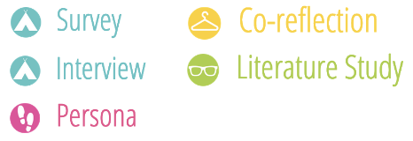
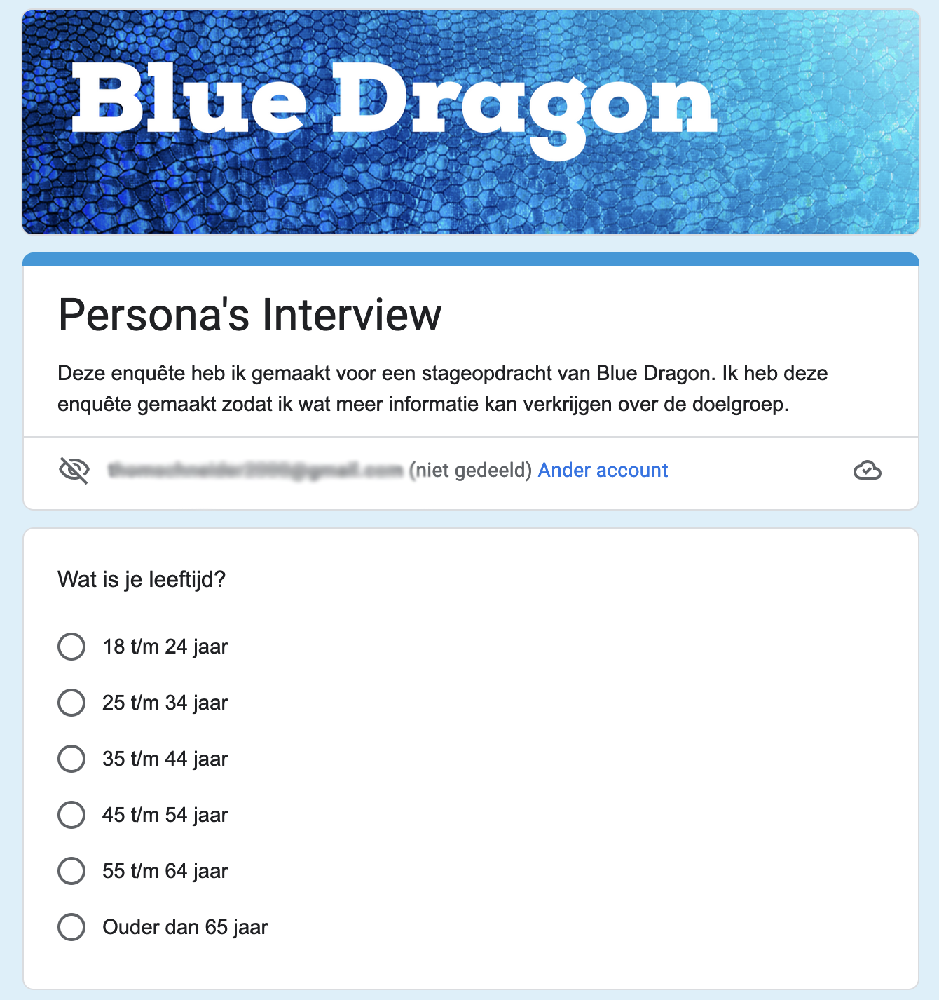
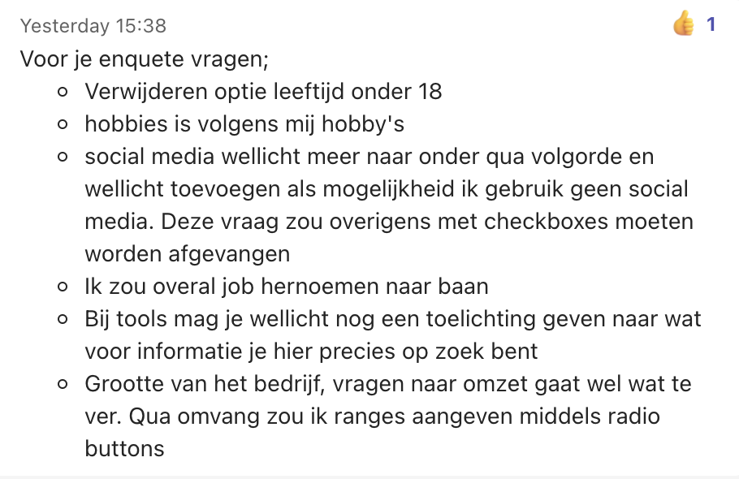

# Doelgroep Persona's

<figure><figcaption>
Versie 1.0
</figcaption></figure>



## Inleiding

Om een beter en duidelijker beeld te krijgen van de doelgroep van Blue Dragon, ben ik een aantal persona's gaan opstellen met de informatie die ik heb verkregen. Ik heb hiervoor gekozen omdat ik dan een goede en duidelijke beschrijving kan krijgen van een persona, zo wordt het een stuk makkelijker om content te produceren wat bij de behoeften en wensen van de stakeholder past.

## Onderzoeksmethoden

<figure><figcaption></figcaption></figure>

## Enquête

Om een duidelijker beeld te krijgen van de doelgroep heb ik besloten om persona's te gaan maken. Daarom ben ik een enquête gaan opstellen, zodat ik wat aanvullende informatie kan verkrijgen over de personen in deze desbetreffende doelgroep.

<figure><figcaption></figcaption></figure>

Nadat ik de enquête heb opgesteld, heb ik een Email gemaakt waarin ik vraag of de gebruikers van dit systeem deze graag zouden willen invullen. Ik heb daarom op het internet opgezocht hoe ik een goede email moet formuleren om te vragen of iemand een enquête wil invullen.&#x20;

Na wat zoeken ben ik uiteindelijk bij een website gekomen met een artikel over "7 tips die ervoor zorgen dat mensen jouw vragenlijst invullen".



Met behulp van dit artikel heb ik een mooie email weten te formuleren.

> Beste, Naam
>
> Hoi mijn naam is Thom Schneider, ik zit in het 3de leerjaar van de studie ICT op het Fontys in Eindhoven.  Op dit moment loop ik stage bij Blue Dragon, tijdens mijn stageperiode ben ik bezig met een project om het content managementsysteem van Blue Dragon gebruiksvriendelijker te maken. &#x20;
>
> Om het systeem meer gebruiksvriendelijk te maken heb ik informatie nodig van de doelgroep die dit systeem in gebruik heeft. Daarom heb ik een enquête opgesteld met wat vragen, zodat ik een aantal persona’s kan maken waardoor het een stuk makkelijker wordt om content te produceren wat bij de behoeften en wensen van de stakeholders past.
>
> Enquête:
>
> [https://docs.google.com/forms/d/e/1FAIpQLSeAo7fffJJ1RF\_VbFnlMpsKi\_C33IXOG4NkqskCH6h6Za04yA/viewform?usp=sf\_link](https://docs.google.com/forms/d/e/1FAIpQLSeAo7fffJJ1RF\_VbFnlMpsKi\_C33IXOG4NkqskCH6h6Za04yA/viewform?usp=sf\_link)
>
> Bij voorbaat dank!

Vervolgens heb ik deze email laten lezen door mijn stagebegeleider, om nog wat feedback

## Persona's

## Feedback

Nadat ik mijn enquête had opgesteld, heb ik het formulier opgestuurd naar mijn bedrijfsbegeleider zodat hij er nog een keer overheen kan kijken voordat het verstuurd wordt. Toen mijn bedrijfsbegeleider de enquête had doorgenomen had hij een aantal feedback punten die ik moest verbeteren.

<figure><figcaption></figcaption></figure>

Vervolgens heb ik de feedback van de enquête verbeterd zodat deze opgestuurd kan worden naar de stakeholders.
