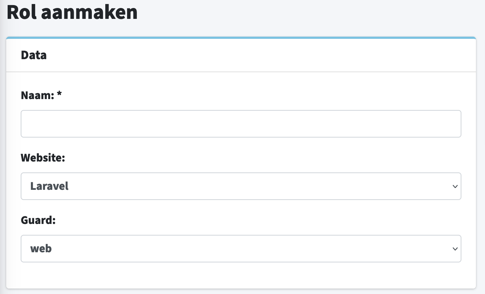

# Gebruiksvriendelijkheid Onderzoek

<figure><figcaption>
Versie 1.0
</figcaption></figure>



## Inleiding

In dit document ga ik onderzoek doen naar hoe ik iets gebruiksvriendelijk maak. Blue Dragon heeft een eigen CMS ontwikkelt waarin klanten aanpassingen kunnen maken aan verschillende componenten. De functionaliteit werkt al naar behoren, alleen is hier nog niet naar gekeken vanuit een gebruikersperspectief. Mijn taak hiervoor is een gebruiksvriendelijk design te maken voor Blue Dragon’s CMS. Ik ben hier onderzoek naar gaan doen omdat dit zeer relevant is voor mijn project aangezien ik de gebruiksvriendelijkheid moet verbeteren.

In dit gebruiksvriendelijkheid onderzoek wil ik antwoord krijgen op de volgende vragen:

* Wat houdt gebruiksvriendelijkheid in?
* Wat maakt het huidige design niet gebruiksvriendelijk?
* Waarom heeft Blue Dragon dit zo aangepakt?
* Hoe voorkomt Blue Dragon dit de volgende keer?
* Hoe maak ik iets gebruiksvriendelijk?
* Wat zijn de vereisten om iets gebruiksvriendelijk te maken?
* Hoe kan ik testen of iets gebruiksvriendelijk is?

## Onderzoeksmethoden

<figure><figcaption></figcaption></figure>

#### Literature Study&#x20;

Tijdens dit onderzoek heb ik gekozen voor de onderzoeksmethode “Literature study”. De onderzoeksmethode “Literature study” houdt in dat ik online research ga doen door te zoeken op relevante trefwoorden die met mijn onderzoek te maken hebben.&#x20;

#### Trend Analysis&#x20;

Voor dit onderzoek heb ik gekozen voor de “Trend Analysis" onderzoeksmethode, omdat ik wil weten welke UX-trends er op dit moment populair zijn. Vanuit dit standpunt wil ik dan gaan kijken of ik dit ook kan toepassen bij mijn project.

## Wat houdt gebruiksvriendelijkheid in?

Misschien is het leuk om te beginnen met een definitie. Want wat is nu eigenlijk gebruiksvriendelijkheid? Experts zeggen hierover het volgende:

> _” Gebruiksvriendelijkheid is een concept dat onder andere door ergonomen wordt bestudeerd. Iets is gebruiksvriendelijk wanneer een beoogde eindgebruiker van een product, het effectief, efficiënt en naar tevredenheid kan gebruiken”._

Gebruiksvriendelijkheid, ook wel usability genoemd, is een indicatie voor hoe snel en eenvoudig een bezoeker informatie kan vinden op een website. Het gaat hierbij om de mate van effectiviteit en efficiëntie. Bezoekers houden van websites/apps die eenvoudig en snel in gebruik zijn, dat bespaart namelijk tijd en ergernissen.&#x20;

Een voorbeeld van gebruiksvriendelijkheid is, bij het invullen van een contact of bestelformulier dat bezoekers duidelijke aanwijzingen en beschrijvingen moeten krijgen om zonder problemen de juiste informatie in te vullen.

## Waarom is gebruiksvriendelijkheid belangrijk?

De gebruiksvriendelijkheid bepaald de ervaring van de gebruiker van je website. Hierbij moet je denken aan bijvoorbeeld de navigatie, lay-out van de pagina, typografie en kleurgebruik. Het ligt ook aan de websitesoftware, als deze snel en makkelijk is kan de bezoeker beter gebruik maken van de website voor een betere ervaring.&#x20;

Maar waarom is gebruiksvriendelijkheid nu belangrijk? Een gebruiksvriendelijke website leidt namelijk tot terugkerende bezoekers wat kan resulteren in loyaliteit, meer conversies en interactie met de klant.

## Welke aspecten maken het CMS van Blue Dragon niet gebruiksvriendelijk?

Omdat er tijdens de ontwikkeling van het maken van het CMS geen rekening is gehouden dat klanten dit CMS ook gaan gebruiken, is het niet bepaald gebruiksvriendelijk voor de klanten.  Verschillende aspecten die het huidige CMS onvriendelijk maken zijn de moeilijke termen die gebruikt worden, dat in sommige gevallen de workflow niet klopt en dat er een aantal UX richtlijnen niet gevolgd zijn.&#x20;

## 

In dit geval om een rol aan te maken kun je een keuze maken welke guard je wil gebruiken, maar wat is nu weer een guard? Dit soort dingen komen veel vaker voor, en is het daarom minder gebruiksvriendelijk. Ook staan er een aantal UX keuzes in het huidige design die niet volgens de richtlijnen gaan. Zoals verschillende kleuren CTA's, dit geeft onduidelijkheid over wat wel en niet clickable is. Ook waren er een aantal gevallen waar de workflow niet klopt hier ga ik verder op in tijdens de [concept fase](concept.md#user-flows).

De reden dat dit zo is ontwikkeld komt doordat het CMS in eerste instantie alleen intern werd gebruikt door de developers, maar omdat er steeds meer vraag kwam vanuit de klant om zelf hun componenten/inhoud aan te passen heeft Blue Dragon besloten om dit CMS ook aan de klant te leveren.

## Wat zijn de belangrijkste kenmerken van gebruiksvriendelijkheid?

### Overzichtelijkheid

Een gebruiksvriendelijk systeem is overzichtelijk. Dit betekent dat er een heldere menustructuur is waarbij de belangrijkste functies van het systeem direct zichtbaar zijn. Kerntaken zijn dus niet weggestopt in pull-downs of submenu’s.

### Logica & Samenhang

Logica en samenhang is essentieel voor een goede gebruikservaring van de software. Een gebruiker moet snel door de verschillende onderdelen van een systeem kunnen navigeren op een manier die voor hem of haar logisch aanvoelt.

### Impressie

Hoe intuïtiever een systeem is des te meer de gebruiker het systeem als gebruiksvriendelijk zal ervaren. De bediening moet consequent zijn. Oftewel, door alle onderdelen van het CMS moet bij voorkeur zoveel mogelijk dezelfde werkwijze, look & feel en/of navigatiemethodiek gebruikt zijn.

### Herkenbaarheid

Door gebruik te maken van globale iconen en symbolen herkent de gebruiker sneller wat de achterliggende functie van de feature is.

### Eenvoud

De bediening moet voor iedereen, bij voorkeur zo snel mogelijk, te begrijpen zijn. Idealiter zonder dat hier een vooropleiding voor noodzakelijk is.

### Clicks

Een efficiënt menu zorgt ervoor dat de gebruikers zo min mogelijk clicks hoeven te doen om het doel te bereiken.

### Snelheid

Tegenwoordig zijn de meeste CMS online oftewel web gebaseerde systemen. Het systeem draait dus niet op de locatie van de gebruiker maar op een Cloudplatform van de leverancier. Het is hierbij belangrijk dat het systeem en het centrale platform snel wijzigingen, uploads en andere activiteiten van de gebruiker kan verwerken.

### Stabiliteit

Hiermee wordt bedoeld dat het systeem doorlopend goed blijft functioneren zonder regelmatig vast te lopen of uit te vallen.



## Waarom test ik de gebruiksvriendelijkheid?

Stakeholders, ontwerpers en gebruikers kijken allemaal naar hetzelfde scherm, maar kunnen allemaal iets op een andere manier interpreteren. Daarom is het handig om de gebruiksvriendelijkheid te testen, in de praktijk wordt dit een “usability test” genoemd.&#x20;

Tijdens de usability test kunnen we aannames bevestigen of onderuithalen. We testen om de problemen te ontdekken om uiteindelijk het ontwerp beter te maken. Het helpt om keuzes te maken in het belang van de gebruiker. Een geoptimaliseerde website levert uiteindelijk een hoger resultaat op.

## Wanneer test ik de gebruiksvriendelijkheid?

Een usability onderzoek, gebruiksonderzoek of een gebruikerstest kan je op verschillende momenten uitvoeren in het ontwikkel traject. Zelfs tijdens de concept fase kan je al testen met bijvoorbeeld schetsen (wireframes).&#x20;

Een usability test tijdens de ontwerpfase onderzoekt je aannames en test eventuele knelpunten bij het bereiken van gewenste doelen in het interactie design. In deze fase maak je nog geen gebruik van een visueel ontwerp waardoor de focus echt op de gebruiksvriendelijkheid van het functioneel ontwerp ligt. Vormgeving heeft namelijk bijna geen invloed op de effectiviteit, maar op de beleving.&#x20;

Speelt de interactie in op de behoefte van de doelgroep? Weet de doelgroep zijn of haar weg te vinden? De gebruiker moet direct overweg kunnen met de website en zijn doel zo snel mogelijk kunnen bereiken. Consistentie speelt hier een belangrijke rol. Natuurlijk wordt er ook geadviseerd om in de latere fases de ontwikkeling te blijven testen. Eigenlijk moet je altijd blijven testen en verbeteren. Een website is nooit echt af.

## Hoe test ik de gebruiksvriendelijkheid?

Er zijn veel verschillende onderzoeksmethodes om de gebruiksvriendelijkheid van iets te meten, om zo bottlenecks te kunnen identificeren. Het nadeel hiervan is dat het trekken van conclusies grotendeels wordt gebaseerd op aannames.

### Webanalytics

Webanalyse is het meten, verzamelen, analyseren en rapporteren van webgegevens om het gebruik van het internet te begrijpen en te optimaliseren. Aan de hand van webanalytics tools, zoals Google Analytics, wordt onderzoek gedaan naar het uitstappercentage, het bouncepercentage, het conversiepercentage en de stroom van bezoekers die het gewenste proces doorlopen. De bottleneck zoals bijvoorbeeld de uitstappagina in de trechter kan hiermee snel geïdentificeerd worden.

### Expert scan

Het systeem wordt door experts bekeken en beoordeeld op een aantal, vooraf gedefinieerde, onderdelen. Denk hierbij aan laadsnelheid, structuur en vindbaarheid.

### Survey

Surveys zijn een uitstekend middel om vooraf of achteraf onderzoek te doen naar verschillende facetten van een systeem. Zowel een selecte als aselecte steekproef is mogelijk. Aselect betekent dat respondenten willekeurig worden gekozen. Een selecte steekproef bestaat uit respondenten die voldoen aan vooraf gedefinieerde kenmerken.

### Prototyping

Een versimpelde versie van de website bijvoorbeeld een moodboard, wireframe of concept wordt voorgelegd aan een testpersoon of testgroep. De bevindingen worden geanalyseerd om het eindproduct waar nodig bij te schaven.

### Mouse of eye tracking

De naam zegt het al, muis of oogbewegingen worden nauwkeurig geanalyseerd met tools. Het resultaat is een hitte map waarbij in gradaties wordt weergeven waar gebruikers kijken of met de muis bewegen. Zo blijkt uit eerdere onderzoeken bijvoorbeeld dat veel websites in een F-vorm worden bekeken.

### Usability onderzoek

Een uitgebreide test waarin bijvoorbeeld een focus-group wordt gevraagd een specifieke handeling uit te voeren, zoals bijvoorbeeld het bestellen van een product. Op basis van kwalitatief veldonderzoek wordt onderzoek gedaan naar de bottlenecks van het systeem. Het eindresultaat is een rapport met aanbevelingen op basis van klantbehoeftes. Deze verbeteringen maken de website voor de gebruikers tot een omgeving waar ze geholpen worden en zorgen voor een verhoogde conversie.

## Conclusie

In dit onderzoek is gezocht naar een antwoord op de vraag: “Hoe maak ik iets gebruiksvriendelijk?” Hiervoor is een kwantitatief onderzoek uitgevoerd naar huidige UX- designs en de effecten daarvan.

Uit de resultaten van dit onderzoek is gebleken dat er vele verschillende aspecten zijn om iets gebruiksvriendelijk te maken. Zo zijn de grootste en belangrijkste aspecten; overzichtelijkheid, herkenbaarheid, logica en de samenhang van het systeem. Om deze aspecten te testen zijn er ook veel methodes die toegepast kunnen worden om zo informatie te verkrijgen over de gebruikservaring.&#x20;

De methodes die het vaakst gebruikt worden zijn webanalytics en usability onderzoek, deze worden het vaakst gebruikt omdat je met deze methode alle stappen van een gebruiker kunt volgen. Als die stappen dan geanalyseerd zijn kunnen we hier aannames uit trekken om zo de gebruikerservaring te verbeteren en de conversie te verhogen.

## Vervolg stap

Nu dat ik weet welke aspecten het huidige CMS van Blue Dragon onvriendelijk maken, en ook hoe ik deze weer gebruiksvriendelijk maak. Ga ik onderzoek doen naar de doelgroep die dit CMS gebruikt, zo ga ik kritische vragen stellen over het huidige CMS.
