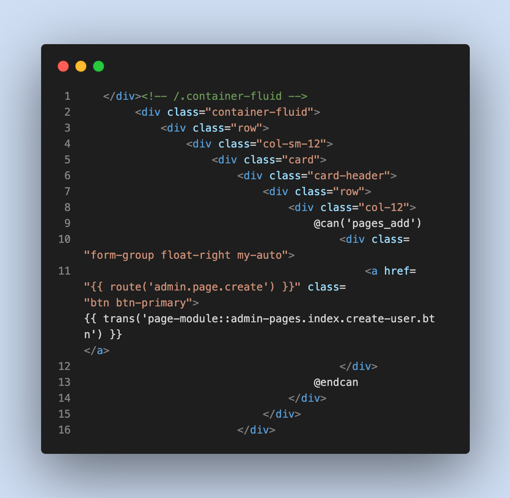

# Laravel Bootstrap to Tailwind

<figure><figcaption></figcaption></figure>

## Inleiding

Voor dit onderdeel van het project heb ik de opdracht gekregen om te kijken of het mogelijk is om de Bootstrap css code te converteren naar tailwind css. Dit kan door middel van een tool genaamd "Tailwindo". Tailwindo kan de Bootstrap code omzetten naar Tailwind alleen is dit niet heel nauwkeurig. Van daar is het ook mijn taak om te kijken of het beter is om de Bootstrap code te converteren naar Tailwind, of om het gewoon vanaf scratch te maken.

## Tailwindo

Voor het omzetten van de Bootstrap code gebruik ik de tool Tailwindo, Deze tool kan CSS framework (momenteel Bootstrap) classes in HTML/PHP (een van uw keuze) bestanden converteren naar gelijkwaardige Tailwind CSS classes.

Voor het omzetten van de code moet je composer downloaden om Tailwindo te runnen. je voert dan de volgende command in:&#x20;

```
composer global require awssat/tailwindo
```

Nu dat Tailwindo succesvol is geïnstalleerd kun je beginnen met het omzetten van de Bootstrap code, dit doe je door middel van de volgende command:

```
cd ~/my-project

tailwindo resources/views --extensions=php --recursive=true --replace=true
```

Als u meer informatie wilt over het gebruik van Tailwindo dan verwijs ik u naar de documentatie van de tool zelf.



## Resultaat

Nadat ik de commands heb gerunnend kun je zien dat de Bootstrap code (Afbeelding 1) is geconverteerd naar Tailwind code (Afbeelding 2). Als de code uit afbeelding 2 uitgevoerd wordt moet het hetzelfde weergeven als in afbeelding 1 maar dat gebeurd niet omdat het converteren niet super nauwkeurig is.

<div>

<figure><figcaption><p>Afbeelding 1</p></figcaption></figure>

 

<figure><figcaption><p>Afbeelding 2</p></figcaption></figure>

</div>

Omdat het converteren van Bootstrap naar Tailwind niet super nauwkeurig is, is het design een wat veranderd waardoor de keuze gemaakt moet worden om verder te gaan met dit design of om het nieuwe design vanaf scratch te maken.

<div>

<figure><figcaption><p>Bootstrap</p></figcaption></figure>

 

<figure><figcaption><p>Tailwind</p></figcaption></figure>

</div>

