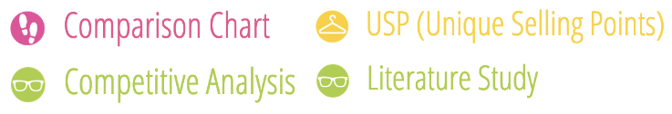

# Marktonderzoek

<figure><figcaption>
Versie 1.0
</figcaption></figure>



## Inleiding

Om erachter te komen wat voor een soortgelijke producten er al op de markt zijn en wat daarvan de unique selling points van zijn, ga ik een marktonderzoek starten om zo een beter beeld te krijgen hoe ik de service die Blue Dragon aanbiedt te optimaliseren.

Een marktonderzoek is ook een uitstekend middel om aan belangrijke informatie te komen als basis voor een doelgerichte marktbewerking. Marktonderzoek biedt o.a. inzicht in de behoeftes en wensen van de doelgroep, toetst de tevredenheid van de klanten en kan een beeld geven van de omvang van de doelgroep.

De volgende stap is het uitwerken van de informatie over de concurrerende producten: welke functies ze hebben, hoe gebruikers ermee omgaan, welke functies moeten worden overwogen om in Blue Dragons product op te nemen en welke moeten worden vermeden.

## Onderzoeksmethoden

<figure><figcaption></figcaption></figure>

#### Literature Study

Bij Literature study maak je gebruik van bestaande informatie. Bijvoorbeeld informatie die je online vindt. Dit vraagt wel een tijdsinvestering, omdat je de resultaten vervolgens ook goed moet analyseren.

#### Competitive Analysis

Bij Competitive Analysis identificeer ik de belangrijkste concurrenten en maak ik een lijst van hun aanbod. Daarbij kijk ik ook welke gebruikersbehoeften niet door de concurrent worden vervuld.

#### Usp&#x20;

Bij de usp's benoem ik alle belangrijke unieke verkooppunten.

#### Comparison Chart

Tijdens dit onderzoek gebruik ik een vergelijkingstabel zodat ik alle grote concurrenten op een rijtje kan zetten, zodat ik dan weer kan kijken na hoe andere concurrenten sommige design keuzes aanpakken.

## Concurrentieanalyse

Een concurrentieanalyse is een fundamenteel instrument voor marketingonderzoek dat wordt gebruikt om de sterke en zwakke punten van een concurrent te vergelijken. Het kan een bedrijf helpen om hun concurrenten te identificeren, wat hun sterke en zwakke punten zijn, en wat ze moeten doen om beter te zijn dan zij.

Een concurrentieanalyse wordt vaak uitgevoerd door te kijken naar de producten of diensten van het bedrijf in relatie tot die van andere bedrijven. Dit proces stelt een organisatie in staat om haar eigen sterke en zwakke punten te evalueren ten opzichte van de concurrentie.

Contentmanagementsystemen zijn een belangrijk onderdeel van de online business. CMS'en worden gebruikt als hulpmiddel om inhoud op internet te publiceren en te bewerken. Ze helpen bij het beter doorzoekbaar en toegankelijk maken van inhoud via verschillende platforms. De meest voorkomende CMS'en zijn WordPress, Drupal, Joomla, SharePoint en PrestaShop.

Voor deze concurrentieanalyse kies ik de grootste CMS concurrent Wordpress. WordPress is een systeem om een website, blog of een webshop mee te beheren zonder dat je hier veel technische kennis voor nodig hebt. Hoewel WordPress draait op de programmeertaal PHP, hoef je zelf geen regel PHP te schrijven als je een website wilt bouwen met WordPress. Doordat WordPress zo eenvoudig is in gebruik, wordt het tegenwoordig enorm veel gebruikt voor het maken van websites.&#x20;

WordPress is open source, wat inhoudt dat iedereen de code van WordPress kan inzien, aanpassen en verspreiden. Je kunt volledig gratis een kopie van WordPress downloaden op WordPress.org. Hier mag je vervolgens mee doen wat je wilt.

WordPress is veruit de populairste CMS die er bestaat, **ruim 37%** van alle websites op het internet draait erop. Het begon als een blogplatform, maar is sinds die tijd uitgegroeid tot een volledige CMS die je kunt gebruiken om elke soort website te bouwen, van e-commerce winkels tot ledensites, fora en meer. De populariteit van WordPress is aan verschillende factoren te danken:

1. Het is **gratis** en open source.
2. Je kunt kiezen uit duizenden WordPress thema’s waarmee je de look van je site aan kunt passen.
3. Er zijn meer dan **55.000** plug-ins die de functionaliteit van je site kunnen verruimen.

Maar natuurlijk is de gebruiksvriendelijkheid van Wordpress ook een grote factor die ervoor zorgt dat Wordpress een van de grootste Contentmanagementsystemen is. De gebruikersinterface van WordPress is ontworpen om gemakkelijk te gebruiken te zijn, zelfs voor mensen zonder technische kennis. Het biedt een visuele editor waarmee gebruikers gemakkelijk webpagina's en blogberichten kunnen maken en bewerken, met behulp van een eenvoudig point-and-click interface. De interface bevat ook een variatie aan ingebouwde hulpmiddelen en functies, zoals een mediabibliotheek voor het beheer van afbeeldingen en andere media, een plugin-systeem voor het uitbreiden van de functionaliteit van de website, en een variatie aan aanpassingsopties voor het veranderen van het uiterlijk en het gevoel van de site. In het algemeen maakt de gebruiksvriendelijke interface van WordPress het een toegankelijk en krachtig platform voor het maken en beheren van websites.

## Gebruikers interactiviteit met Wordpress user interface

Gebruikers communiceren op verschillende manieren met de gebruikersinterface van WordPress, afhankelijk van hun individuele behoeften en voorkeuren. Enkele veel voorkomende manieren waarop gebruikers met de WordPress gebruikersinterface omgaan zijn de volgende:

**Inhoud maken en bewerken:** Met de visuele editor in WordPress kunnen gebruikers gemakkelijk webpagina's en blogberichten maken en bewerken, met behulp van een eenvoudige point-and-click interface. Gebruikers kunnen tekst, afbeeldingen, video's en andere media aan hun inhoud toevoegen, en een variatie aan opmaakopties gebruiken om de inhoud eruit te laten zien zoals zij dat willen.

**Media beheren:** De WordPress mediabibliotheek is een ingebouwde tool waarmee gebruikers gemakkelijk hun mediabestanden, zoals afbeeldingen en video's, kunnen beheren. Gebruikers kunnen nieuwe mediabestanden uploaden naar de bibliotheek, bestaande bestanden bekijken en organiseren, en media invoegen in hun inhoud.

**De website aanpassen:** WordPress biedt een verscheidenheid aan aanpassingsopties waarmee gebruikers het uiterlijk en het gevoel van hun website kunnen veranderen. Gebruikers kunnen kiezen uit een reeks vooraf ontworpen thema's, of hun eigen thema aanpassen met behulp van de ingebouwde thema-editor. Ze kunnen ook plugins installeren en configureren om nieuwe functies en functionaliteit aan hun site toe te voegen.

**Gebruikers en rechten beheren:** Met WordPress kunnen gebruikers meerdere gebruikersaccounts aanmaken en beheren, elk met een eigen unieke gebruikersnaam en wachtwoord. Gebruikers kunnen aan elke account verschillende rollen en machtigingen toekennen, waarmee ze bepalen welke gebruikers toegang hebben tot bepaalde delen van de website en wat ze daar kunnen doen.

In het algemeen maakt de gebruiksvriendelijke interface van WordPress het gebruikers gemakkelijk om hun websites te maken en te beheren, het uiterlijk en het gevoel van hun site aan te passen, en te bepalen wie er toegang heeft en wat ze er kunnen doen.

## De USP's (Unique Selling Points)

Nadat ik onderzoek heb gedaan naar de IT-branche en wat de verschillende concurrenten zijn, kan ik een aantal unique selling points benoemen waardoor een van de concurrenten uitblinkt vergeleken met de rest. Een unique selling point is een eigenschap waarmee een zich product onderscheidt van andere vergelijkbare producten.&#x20;

### Usp van Wordpress

Enkele van de belangrijkste kenmerken die Wordpress populair maken zijn de gebruiksvriendelijke interface, het grote aantal beschikbare plugins en thema's om de functionaliteit uit te breiden, en de mogelijkheid om gemakkelijk te worden aangepast aan de specifieke behoeften van een breed scala aan gebruikers. Bovendien is WordPress een open-source platform, wat betekent dat het gratis te gebruiken is en door iedereen kan worden aangepast. Dit heeft bijgedragen tot de wijdverspreide toepassing ervan door particulieren, bedrijven en organisaties over de hele wereld.

### Usp Blue Dragons CMS

Belangrijke kenmerken dat het systeem van Blue Dragon heeft zijn; het CMS wordt zo geoptimaliseerd dat er geen onnodige plug-ins gebruikt moeten worden, de communicatie tussen de klant en Blue Dragon is uitstekend en de schaalbaarheid van het systeem, zo kan het systeem afgestemd worden op wat de klant wil hebben.

## Conclusie

In dit onderzoek is gezocht naar de vraag welke concurrerende producten welke functies hebben, hoe gebruikers hiermee omgaan en welke functies overwogen moeten worden. Om te beginnen met welke concurrerende producten er zijn, ben ik uitgekomen bij een aantal verschillende CMS’en, zoals WordPress, Drupal, Joomla, SharePoint en PrestaShop. In dit onderzoek heb ik gekozen om Wordpress te vergelijken met het CMS van Blue Dragon, omdat Wordpress het grootste en gebruiksvriendelijkste CMS is. Ik heb daarna gekeken naar hoe gebruikers het systeem van Wordpress gebruiken. In bijna alle gevallen zijn de werkzaamheden van een gebruiker; de inhoud maken, media beheren, de website aanpassen en de rechten beheren van verschillende gebruikers. Ondanks dat het CMS van Blue Dragon werkt met blok componenten en Wordpress met een visuele editor, heb ik toch een aantal functies gevonden die het CMS van Blue Dragon ook kan gebruiken. Zo heb je bijvoorbeeld een functie waarbij je componenten kunt dupliceren wat heel handig is. Verder heeft Wordpress ook een multiselect functie waarbij je meerdere items kunt aantikken om die vervolgens te bewerken of verwijderen.

## Vervolg stap

Nu dat ik weet welke soortgelijke producten er bestaan en hoe de gebruikers deze producten gebruiken. Kan ik verder gaan met de vraag hoe ik die gebruiksvriendelijkheid toepas en waarom het huidige CMS van Blue Dragon niet gebruiksvriendelijk is.

