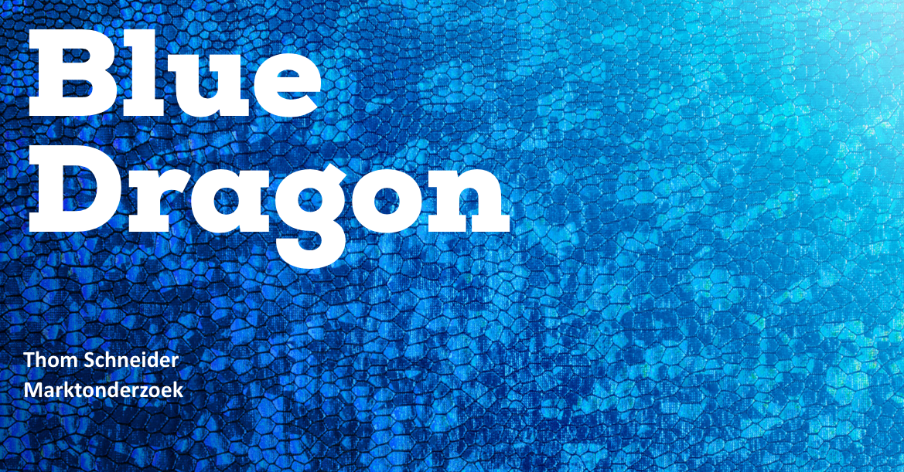
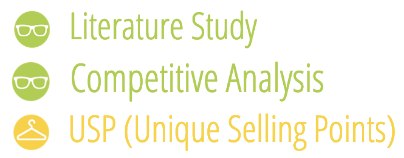
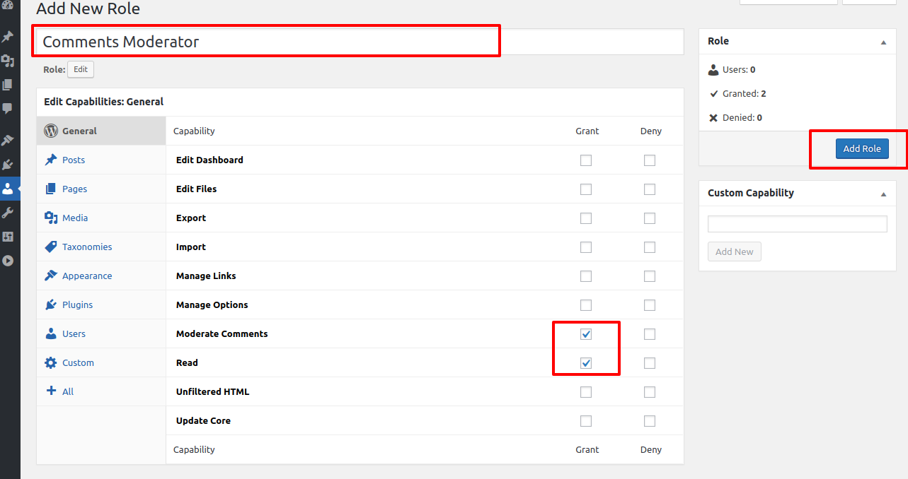

# Marktonderzoek

<figure><figcaption>
Versie 1.0
</figcaption></figure>

## Inleiding

Om erachter te komen wat voor een soortgelijke producten er al op de markt zijn en wat daarvan de unique selling points van zijn, ga ik een marktonderzoek starten om zo een beter beeld te krijgen hoe ik de service die Blue Dragon aanbiedt te optimaliseren.

Een marktonderzoek is ook een uitstekend middel om aan belangrijke informatie te komen als basis voor een doelgerichte marktbewerking. Marktonderzoek biedt o.a. inzicht in de behoeftes en wensen van de doelgroep, toetst de tevredenheid van de klanten en kan een beeld geven van de omvang van de doelgroep.

De volgende stap is het uitwerken van de informatie over de soortgelijke producten: welke functies ze hebben, hoe gebruikers ermee omgaan met een CMS, welke functies moeten worden overwogen om in Blue Dragons product op te nemen en welke moeten worden vermeden.

## Onderzoeksmethoden

<figure><figcaption></figcaption></figure>

#### Literature Study

Bij Literature study maak je gebruik van bestaande informatie. Bijvoorbeeld informatie die je online vindt. Dit vraagt wel een tijdsinvestering, omdat je de resultaten vervolgens ook goed moet analyseren.

#### Competitive Analysis

Bij Competitive Analysis identificeer ik de belangrijkste concurrenten en maak ik een lijst van hun aanbod. Daarbij kijk ik ook welke gebruikersbehoeften niet door de concurrent worden vervuld.

#### Usp&#x20;

Bij de usp's benoem ik alle belangrijke en unieke punten van een bepaald product.

#### Comparison table

Een vergelijkingstabel of vergelijkingstabel beschrijft en vergelijkt attributen en kenmerken van bestaande producten of tools om de beste optie voor uw project te bepalen.

## Welke soortgelijke CMS’en zijn er?

Contentmanagementsystemen zijn een belangrijk onderdeel van de online business. CMS'en worden gebruikt als hulpmiddel om inhoud op internet te publiceren en te bewerken. Ze helpen bij het beter doorzoekbaar en toegankelijk maken van inhoud via verschillende platforms. Ik heb gekozen om de volgende CMS'en te vergelijken omdat deze het beste/populairste zijn en het best te vergelijken zijn met het CMS van Blue Dragon. Deze CMS’en zijn WordPress, Drupal, Joomla en Typo3.

#### WordPress:

WordPress staat bekend om zijn gebruiksgemak en heeft een gebruiksvriendelijke interface. Het is geschikt voor beginners en biedt een grote keuze aan thema's en plug-ins die het makkelijk maken om je website aan te passen en functies toe te voegen.

#### Drupal:

Drupal is een meer geavanceerd CMS dat geschikt is voor ontwikkelaars en meer technisch onderlegde gebruikers. Het heeft een steilere leercurve en is niet zo gebruiksvriendelijk als WordPress of Joomla voor beginners.

#### Joomla:

Joomla is een ander populair CMS dat bekend staat om zijn gebruiksvriendelijkheid. Het heeft een eenvoudige en intuïtieve interface, en het biedt een verscheidenheid aan sjablonen en extensies om u te helpen uw website te bouwen en aan te passen.

#### TYPO3:

TYPO3 is een CMS dat geschikt is voor grote organisaties en ondernemingen. Het heeft een complexe interface en vereist een bepaald niveau van technische expertise om effectief te gebruiken. Het is niet zo gebruiksvriendelijk als andere CMS'en voor beginners.

Over het algemeen worden WordPress en Joomla als gebruiksvriendelijker beschouwd, terwijl Drupal en TYPO3 meer geschikt zijn voor ontwikkelaars of meer technisch onderlegde gebruikers. [\[1\]](https://happytalents.nl/blogs/cms-systeem/)

## Wat zijn de unique selling points van de soortgelijke producten?

#### Wordpress:

* Eenvoudige installatie: WordPress kan gemakkelijk worden geïnstalleerd en ingesteld, met een eenvoudig en ongecompliceerd proces.
* Intuïtief dashboard: Het dashboard van WordPress is ontworpen om gemakkelijk te gebruiken, met een duidelijke, intuïtieve lay-out en eenvoudige navigatie.
* Thema's en plug-ins WordPress heeft een grote map met thema's en plugins die gemakkelijk kunnen worden geïnstalleerd om het uiterlijk en de functionaliteit van een website aan te passen.
* WYSIWYG-editor: Joomla bevat een WYSIWYG (What You See Is What You Get) editor, waarmee gebruikers inhoud kunnen creëren en bewerken op een manier die sterk lijkt op de uiteindelijk gepubliceerde versie.
* Toegankelijkheidsfuncties: WordPress is ontworpen om toegankelijk te zijn voor gebruikers met een handicap, met functies zoals een hoge contrastmodus en ondersteuning voor schermlezers. [\[2\]](https://www.wpbeginner.com/why-you-should-use-wordpress/)

#### Drupal:

* Aanpasbare lay-out: Met Drupal kunnen gebruikers de lay-out van hun website aanpassen met behulp van een drag-and-drop interface.
* Toegankelijkheidsfuncties: Drupal is ontworpen om toegankelijk te zijn voor gebruikers met een handicap, met functies zoals een hoge contrastmodus en ondersteuning voor schermlezers.
* Geavanceerd permissiesysteem: Drupal heeft een krachtig permissiesysteem waarmee beheerders kunnen bepalen wie toegang heeft tot verschillende delen van de website en deze kan bewerken. [\[3\]](https://www.o8.agency/blog/reasons-drupal-remains-leading-cms)

#### Joomla:

* Intuïtieve lay-out: De gebruikersinterface van Joomla is ontworpen om gemakkelijk te gebruiken, met een duidelijke, intuïtieve lay-out en eenvoudige navigatie.
* Drag-and-drop aanpassing van de lay-out: Joomla laat gebruikers toe om gemakkelijk de lay-out van hun website te herschikken met behulp van een drag-and-drop interface.
* Uitbreidings map: Joomla heeft een grote extensie directory, die een breed scala aan add-ons bevat die gemakkelijk geïnstalleerd kunnen worden om de functionaliteit van het CMS uit te breiden. [\[4\]](https://platinaxe.com/10-advantages-of-using-joomla-cms/)

#### TYPO3:

* Templating systeem: TYPO3 heeft een krachtig templating systeem waarmee gebruikers aangepaste templates kunnen maken voor verschillende delen van hun website. [\[5\]](https://blog.nitsantech.com/blog/choose-typo3)

## Wat zijn de unique selling points van Blue Dragons huidige CMS?

Belangrijke kenmerken dat het systeem van Blue Dragon heeft zijn; het CMS wordt zo geoptimaliseerd dat er geen onnodige plug-ins gebruikt moeten worden, een geavanceerd permissie systeem, de communicatie tussen de klant en Blue Dragon is uitstekend en de schaalbaarheid van het systeem, zo kan het systeem afgestemd worden op wat de klant wil hebben.

## Gebruikers interactiviteit Blue Dragons CMS

Voor dit deel van het onderzoek wil ik gaan onderzoeken wat gebruikers het vaakst doen binnen het CMS van Blue Dragon. Ik kan deze informatie verkrijgen vanuit de persona’s die ik gemaakt heb. Als ik die informatie uiteindelijk heb, kan ik gaan kijken naar welke functies ik kan overwegen om in het nieuwe CMS ontwerp te zetten.

Gebruikers willen graag hun media beheren, dit kan door middel van een mediabibliotheek. Een mediabibliotheek is een ingebouwde tool waarmee gebruikers gemakkelijk hun mediabestanden, zoals afbeeldingen en video's, kunnen beheren. Gebruikers kunnen nieuwe mediabestanden uploaden naar de bibliotheek, bestaande bestanden bekijken en organiseren, en media invoegen in hun inhoud.

Gebruikers willen ook hun content/website kunnen aanpassen. CMS’en bieden verschillende aanpassingsopties aan waarmee gebruikers het uiterlijk en het gevoel van hun website kunnen veranderen. Gebruikers kunnen kiezen uit een reeks vooraf ontworpen thema's, of hun eigen thema aanpassen met behulp van een ingebouwde thema-editor. Ze kunnen ook plug-ins installeren en configureren om nieuwe functies en functionaliteit aan hun site toe te voegen.

Verder willen gebruikers ook rollen en permissies kunnen beheren. Met een CMS kunnen gebruikers meerdere gebruikersaccounts aanmaken en beheren, elk met een eigen unieke gebruikersnaam en wachtwoord. Gebruikers kunnen aan elke account verschillende rollen en machtigingen toekennen, waarmee ze bepalen welke gebruikers toegang hebben tot bepaalde delen van de website en wat ze daar kunnen doen.&#x20;

## Vergelijkingstabel

<table><thead><tr><th>Criteria</th><th data-type="rating" data-max="5">Wordpress</th><th data-type="rating" data-max="5">Drupal</th><th data-type="rating" data-max="5">Joomla</th><th data-type="rating" data-max="5">TYPO3</th><th data-type="rating" data-max="5">Blue Dragon</th></tr></thead><tbody><tr><td>Functionaliteit</td><td>4</td><td>3</td><td>3</td><td>4</td><td>3</td></tr><tr><td>Gebruiksgemak</td><td>4</td><td>3</td><td>4</td><td>2</td><td>3</td></tr><tr><td>Aanpasbaarheid</td><td>5</td><td>4</td><td>4</td><td>4</td><td>2</td></tr><tr><td>Schaalbaarheid</td><td>4</td><td>3</td><td>3</td><td>3</td><td>4</td></tr><tr><td>Veiligheid</td><td>4</td><td>4</td><td>4</td><td>4</td><td>3</td></tr></tbody></table>

### **Criteria beschrijving:**

**Functionaliteit:** Welke soorten functies en mogelijkheden biedt elk CMS? Heeft uw zelfgemaakte CMS bijvoorbeeld, ondersteuning voor meerdere talen, of e-commerce functionaliteit?

**Gebruiksgemak:** Hoe gemakkelijk is elk CMS te gebruiken? Hebben ze intuïtieve interfaces, of vereisen ze veel technische kennis om op te zetten en te gebruiken?

**Aanpasbaarheid:** Hoe gemakkelijk is het om elk CMS aan te passen? Hebben ze een breed scala aan thema's en plug-ins beschikbaar, of zijn gebruikers beperkt in hun mogelijkheden om wijzigingen aan te brengen in het uiterlijk en het gevoel van hun website?

**Schaalbaarheid:** Hoe goed kan elk CMS omgaan met grote hoeveelheden verkeer of inhoud? Kunnen ze een groot aantal gebruikers of een groot aantal pagina's en berichten aan?

**Veiligheid:** Hoe veilig is elk CMS? Zijn er maatregelen genomen om hacken en andere veiligheidsrisico's te voorkomen?

Aan de hand van de tabel kun je zien dat sommige CMS'en beter zijn dan de anderen op verschillende criteria, om nu dus een optimaal CMS te ontwerpen moet ik gaan kijken naar welke aspecten/functies ik kan toevoegen aan het CMS van Blue Dragon om dit te optimaliseren. [\[6\]](https://www.temok.com/blog/cms-platforms-usability/)

<figure><figcaption></figcaption></figure>

## Advies

## Conclusie

## Vervolg stap

Nu dat ik weet welke soortgelijke producten er bestaan en welke functies ik kan gebruiken voor het nieuwe CMS ontwerp. Kan ik verder gaan met de vraag hoe ik die gebruiksvriendelijkheid toepas en waarom het huidige CMS van Blue Dragon niet gebruiksvriendelijk is.

## Bronnenlijst

1. Balgobind, R. (2022, 15 maart). _CMS Systeem_. Happy Talents. [https://happytalents.nl/blogs/cms-systeem/](https://happytalents.nl/blogs/cms-systeem/)
2. Editorial Staff & About the Editorial Staff. (2023, 1 januari). _6 Most Important Reasons to Use WordPress in 2023_. WPBeginner. [https://www.wpbeginner.com/why-you-should-use-wordpress/](https://www.wpbeginner.com/why-you-should-use-wordpress/)
3. Viebrock, S. (z.d.). _6 Reasons Drupal Remains a Leading CMS in 2023_. [https://www.o8.agency/blog/reasons-drupal-remains-leading-cms](https://www.o8.agency/blog/reasons-drupal-remains-leading-cms)
4. https:\\/\\/platinaxe.com\\/author\\/agota-nagy\\/#author. (2022, 29 april). _10 Advantages of Using Joomla CMS - Platinaxe_. Platinaxe - We will make your revenue grow. [https://platinaxe.com/10-advantages-of-using-joomla-cms/](https://platinaxe.com/10-advantages-of-using-joomla-cms/)
5. TYPO3 Development, NEOS CMS, WordPress Development, TYPO3 Flow. (2018, 13 maart). _Why Use TYPO3? A Deep Dive Into 51 Good Reasons_. Nitsan. [https://blog.nitsantech.com/blog/choose-typo3](https://blog.nitsantech.com/blog/choose-typo3)
6. Kaluger, O. (2020, 23 januari). _Ultimate Guide To Most Popular CMS Platforms Usability and Functionalities | Temok Hosting Blog_. Temok Hosting Blog | Temok Hosting Blog. [https://www.temok.com/blog/cms-platforms-usability/](https://www.temok.com/blog/cms-platforms-usability/)
