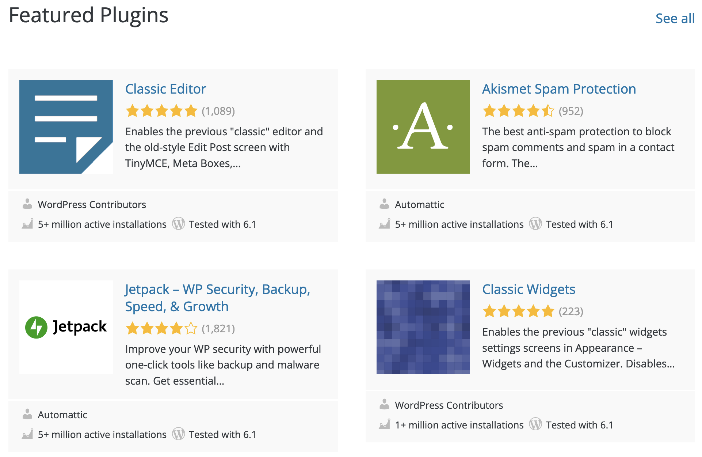

# Marktonderzoek

<figure><figcaption>
Versie 1.0
</figcaption></figure>



## Inleiding

Om erachter te komen wat voor een soortgelijke producten er al op de markt zijn en wat daarvan de unique selling points van zijn, ga ik een marktonderzoek starten om zo een beter beeld te krijgen hoe ik de service die Blue Dragon aanbiedt te optimaliseren.&#x20;

Een marktonderzoek is ook een uitstekend middel om aan belangrijke informatie te komen als basis voor een doelgerichte marktbewerking. Marktonderzoek biedt o.a. inzicht in de behoeftes en wensen van de doelgroep, toetst de tevredenheid van de klanten en kan een beeld geven van de omvang van de doelgroep.

In dit marktonderzoek wil ik antwoord hebben op de volgende vragen:

* Wat zijn de grote bekende concurrenten?
* Wat zijn de usp's van de concurrenten?
* Wat zijn de punten van concurrenten die beter kunnen?

## Onderzoeksmethoden

<figure><figcaption></figcaption></figure>

#### Literature Study

Bij Literature study maak je gebruik van bestaande informatie. Bijvoorbeeld informatie die je online vindt. Dit vraagt wel een tijdsinvestering, omdat je de resultaten vervolgens ook goed moet analyseren.

#### Competitive Analysis

Bij Competitive Analysis identificeer ik de belangrijkste concurrenten en maak ik een lijst van hun aanbod. Daarbij kijk ik ook welke gebruikersbehoeften niet door de concurrent worden vervuld.

#### Usp&#x20;

Bij de usp's benoem ik alle belangrijke unieke verkoop punten.

#### Comparison Chart

Tijdens dit onderzoek gebruik ik een vergelijkingstabel zodat ik alle grote concurrenten op een rijtje kan zetten, zodat ik dan weer kan kijken na hoe andere concurrenten sommige design keuzes aanpakken.

## Concurrentie Analyse

Als je op Google opzoek gaat naar professionele CMS-systemen kom je al snel terecht bij verschillende CMS zoals WordPress, Magento en Drupal. Dit zijn allemaal professionele tegenhangers van het CMS van Blue Dragon.&#x20;

WordPress is een systeem om een website, blog of een webshop mee te beheren zonder dat je hier veel technische kennis voor nodig hebt. Hoewel WordPress draait op de programmeertaal PHP, hoef je zelf geen regel PHP te schrijven als je een website wilt bouwen met WordPress. Doordat WordPress zo eenvoudig is in gebruik, wordt het tegenwoordig enorm veel gebruikt voor het maken van websites. Sterker nog: méér dan **30 procent** van het hele internet gebruikt WordPress.&#x20;

WordPress is open source, wat inhoudt dat iedereen de code van WordPress kan inzien, aanpassen en verspreiden. Je kunt volledig gratis een kopie van WordPress downloaden op WordPress.org. Hier mag je vervolgens mee doen wat je wilt.&#x20;

Ook heb je andere CMS-systemen zoals Shopify. Shopify is een e-commerce platform wat speciaal ontwikkeld is om gemakkelijk een goede en overzichtelijke webshop te bouwen. Je kan met Shopify fysieke, maar ook digitale producten verkopen.

De meeste CMS-systemen kun je gratis downloaden op het internet, veel van die CMS- systemen hebben verschillende plug-ins en extra’s die gebruikt kunnen worden tegen een betaling waardoor je wat extra features kunt krijgen. Een nadeel hiervan is dat er conflicten kunnen ontstaan als je meerdere plug-ins bij elkaar hebt staan, of als er bijvoorbeeld een plugin wordt verwijderd waardoor iets niet meer ondersteund kan worden.

<figure><figcaption></figcaption></figure>

WordPress is veruit de populairste CMS die er bestaat, ruim 37% van alle websites op het internet draait erop. Het begon als een blogplatform, maar is sinds die tijd uitgegroeid tot een volledige CMS die je kunt gebruiken om elke soort website te bouwen, van e-commerce winkels tot ledensites, fora en meer. De populariteit van WordPress is aan verschillende factoren te danken:

1. Het is **gratis** en open source.
2. Je kunt kiezen uit duizenden WordPress thema’s waarmee je de look van je site aan kunt passen.
3. Er zijn meer dan **55.000** plug-ins die de functionaliteit van je site kunnen verruimen.

## De nadelen van de concurrentie

Bij dit onderdeel van het onderzoek ga ik research doen naar wat de nadelen zijn van de concurrentie. In dit geval pak ik weer de concurrent WordPress, omdat dit een goed voorbeeld is van een gebruiksvriendelijke CMS. Ik som deze nadelen op om zo een goed overzicht te krijgen op welke punten ik moet letten voor mijn project.

Moeilijkheidsgraad

Het kan moeilijk zijn om je weg te vinden in het ontwerp, de ontwikkeling en het onderhoud van WordPress, vooral als je geen technische ervaring hebt.

De kosten

Hoewel het platform WordPress gratis te downloaden is, zijn er allerlei thema’s die wel geld kosten. Het hosten van een website via WordPress kost minimaal € 4,00 dit kan oplopen tot € 45,00.

Kwetsbaarheid van de website

Veiligheid is een grote uitdaging voor veel gebruikers. Alleen al het feit dat WordPress het meest gebruikte CMS is, maakt het een belangrijk doelwit voor cybercriminelen. De grote afhankelijkheid van plug-ins die door verschillende mensen zijn ontwikkeld, verhoogt ook de kans dat kwaadaardige code naar de functionaliteiten van uw site glipt.

Frequente updates

Het is niet genoeg om WordPress gewoon te installeren. Je moet verschillende plug-ins en thema's installeren om ervoor te zorgen dat het goed functioneert. Hoe meer plug-ins u gebruikt, hoe meer compatibiliteitsproblemen je zult krijgen.

Slechte SEO

De SEO-vriendelijkheid van WordPress kan problemen opleveren voor mensen zonder SEO- ervaring. In WordPress, als de inhoud is gemarkeerd in veel categorieën of is over-tagged, Google markeert het als dubbele inhoud. Dit kan de positie van uw site op de SERP's aanzienlijk beïnvloeden.

Trage laad snelheid

WordPress is nog steeds een traag platform door alle toegevoegde plug-ins, databases en codebases. Dat zijn echter niet de enige dingen die uw website kunnen vertragen. Grote afbeeldingen, veel tekst op een pagina en onbetrouwbare hosting kunnen de snelheid van uw website beïnvloeden.&#x20;

Paginasnelheid is cruciaal voor uw website. U wilt een snel ladende website zodat uw publiek niet ongeduldig wordt en besluit weg te gaan, waardoor u zaken kunt verliezen omdat ze niet zien wat u te bieden hebt.

## De USP's (Unique Selling Points)

Nadat ik onderzoek heb gedaan naar de IT-branche en wat de verschillende concurrenten zijn, kan ik een aantal unique selling points benoemen waardoor een van de concurrenten uitblinkt vergeleken met de rest. Een unique selling point is een eigenschap waarmee een zich product onderscheidt van andere vergelijkbare producten.&#x20;

Om een aantal usp's te achterhalen heb ik gekozen om de usp's te benoemen van WordPress een van de grootste CMS concurrenten.&#x20;

* Het gebruik van WordPress is zeer eenvoudig, zo kan iemand zonder enige technische kennis een website opzetten.
* WordPress heeft heel veel plug-ins die je kan installeren voor extra features.
* WordPress is open source software die iedereen kan gebruiken.
* WordPress heeft veel verschillende thema's die de gebruiker kan kiezen, ook zijn deze thema's goed responsive.

Hieronder beschrijf ik ook een paar usp van het systeem wat Blue Dragon heeft.

* Het CMS wordt meegeleverd als service van Blue Dragon.
* Het CMS wordt zo geoptimaliseerd dat er geen onnodige plug-ins gebruikt moeten worden.
* De communicatie tussen de klant en het bedrijf verloopt goed en snel.
* De schaalbaarheid van het systeem.
* Het systeem word gedesignd op basis van de doelgroep.

## Vergelijkingstabel

In de tabel hieronder heb ik een aantal van de meest gebruikt CMS-systemen vergeleken op verschillende kenmerken, die moeten voldoen aan de eisen van een goed CMS-systeem.&#x20;

<figure><figcaption></figcaption></figure>

Uit deze vergelijkingstabel blijkt dat WordPress de beste optie is van deze CMS-systemen. Maar omdat WordPress populairder is dan de rest loopt het ook meer risico op het gebied van veiligheid. Ook kun je uit deze tabel afleiden dat het gebruiksgemak van Joomla niet zo goed is, omdat je veel technische kennis nodig hebt om deze CMS te gebruiken.

## Conclusie

Met dit marktonderzoek wilde ik antwoord hebben op een aantal vragen die ik aan het begin van het onderzoek heb vastgesteld. Na wat onderzoek te doen heb ik die antwoorden gekregen. Zo heb ik gekeken naar wat de grootste CMS concurrenten zijn die er bestaan, na wat gezocht te hebben op het internet kwam ik al snel bij WordPress, Shopify en Hubspot enz. Ook heb ik onderzoek gedaan naar de vraag wat de unique selling points zijn van deze concurrenten, en dat is vooral dat de user interface duidelijk en makkelijk is voor de gebruiker, ookal heeft de gebruiker niet zoveel kennis van CMS-systemen. En als laatste heb ik ook nog onderzoek gedaan naar wat voor een punten beter kunnen bij de concurrenie, zo kan ik kijken waarop ik kan letten zodat ik dit in het CMS van Blue Dragon kan verbeteren.

