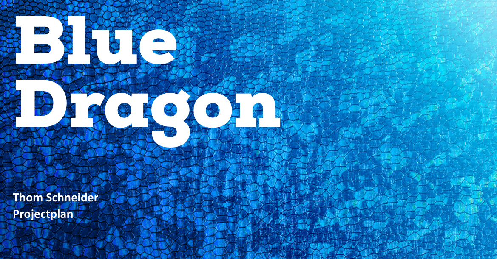
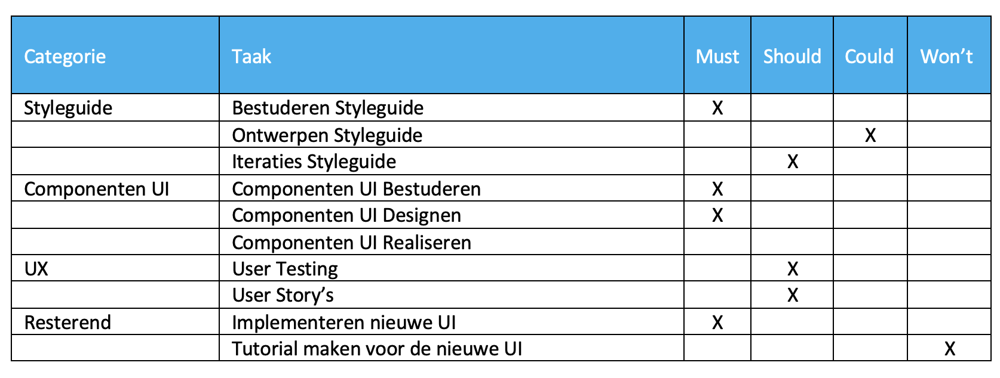
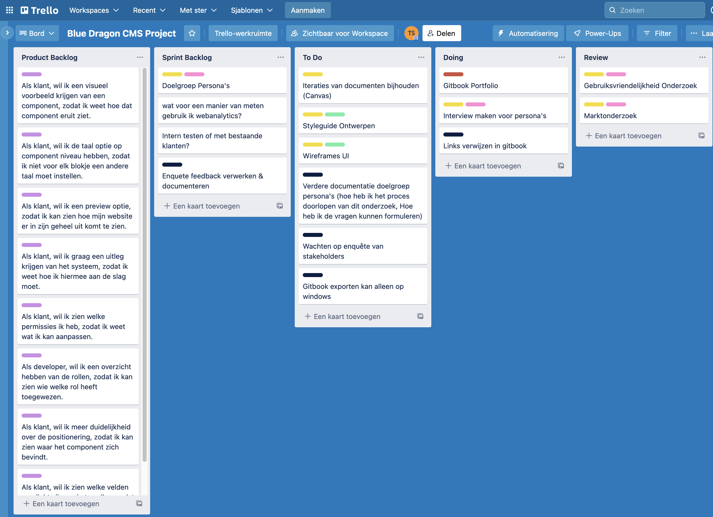
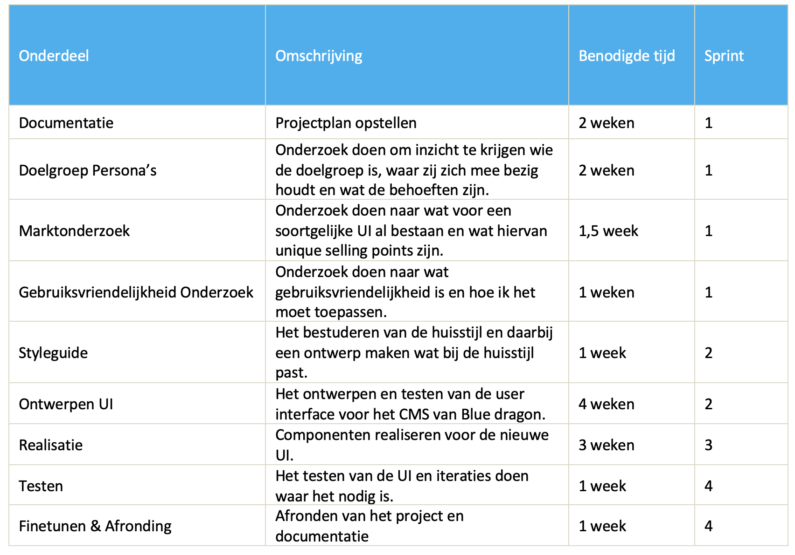
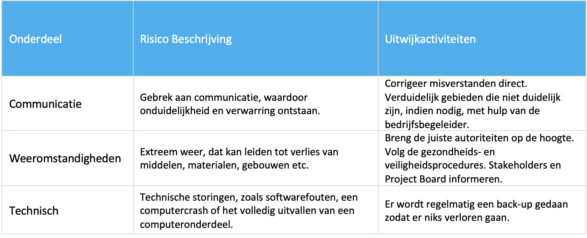

# Project Plan

<figure><figcaption>
Versie 1.3
</figcaption></figure>

## Inleiding

Het projectplan is een document dat wordt gebruikt om zowel de projectuitvoering als de projectcontrole te begeleiden.\
\
De betrokkenen zijn:

* **Bedrijfsbegeleider** Verreijt, S
* **Bedrijfsbegeleider** Timmermans, R
* **Stagebegeleider** Janssen,Olaf O.T.A

## Project Opdracht

### Context

De opdracht wordt uitgevoerd voor het bedrijf Blue Dragon. Blue Dragon is een all-you-can-communicate marketing agency die bedrijven helpt tot grote hoogte te laten stijgen. Ze produceren een reeks producten en diensten met een hoogwaardige grafische vormgeving, dit doen ze op het raakvlak van creativiteit, technologie en connectiviteit. Blue dragon is veel meer dan alleen een online marketingbureau. Blue dragon zorgt ervoor dat klanten online duidelijker en krachtiger aanwezig zijn.&#x20;

Naast online productie en activatie, social mediamanagement en SEO bieden ze nog veel meer aan. Zo kunt u ook bij Blue Dragon terecht voor design en content creatie maar ook voor databasemanagement en gamification. Momenteel is Blue Dragon een modulair content managementsysteem aan het ontwikkelen dat ze kunnen bieden als professionele tegenhanger voor bijvoorbeeld WordPress. De digitale oplossingen die dit bedrijf biedt passen heel goed bij mijn opleiding richting Media & Design.

### Doel van het project

Het doel van het project is dat er een gebruiksvriendelijke User interface moet komen voor de klanten, omdat tijdens de ontwikkeling van dit beheersysteem enkel is nagedacht over de technische vereisten en nog niet bekeken is vanuit een gebruikersperspectief. Mijn taak voor deze opdracht is ervoor zorgen dat de user interface van dit systeem gebruikersvriendelijk wordt. Het eind doel van dit project is dan ook om een gebruiksvriendelijk ontwerp neer te zetten voor de klanten van Blue Dragon. Het CMS wat Blue Dragon wordt alleen geleverd aan klanten die een website hebben gemaakt door Blue Dragon, dit CMS is dus niet voor iedereen beschikbaar.

### De opdracht

De aanleiding dat Blue Dragon een eigen CMS ontwikkeld heeft is dat bestaande CMS zoals Wordpress open source plug-ins gebruiken. Zo kan het voorkomen dat deze plug-ins niet meer verder gesupport worden of zelfs verwijderd worden door de ontwikkelaar. Een andere aanleiding voor het maken van een eigen CMS is de schaalbaarheid zodat het systeem makkelijk kan uitbreiden. Ook is het veiliger dan bijvoorbeeld een Wordpress website omdat deze nogal vaak gehackt worden.

Daarom is Blue Dragon een eigen CMS gaan ontwikkelen zodat ze niet meer afhankelijk zijn van de open source plug-ins. Dit is ook gelijk een unique selling point voor dit systeem, omdat de gebruiker dan niet hoeft te vrezen dat er bepaalde dingen verloren gaan doordat een plug-in niet meer gebruikt kan worden.

Tijdens de ontwikkeling van dit Blue Dragon CMS is er nog niet gedacht aan gebruiksvriendelijkheid omdat er op dit moment nog geen vraag naar was, de klanten hiervan wilde de aanpassingen door Blue Dragon laten uitvoeren. Dit systeem wordt zowel intern gebruikt door de developers als door de klanten van Blue Dragon.

> De opdracht is dat ik een gebruiksvriendelijke user interface ga ontwerpen en realiseren voor het content managementsysteem van Blue dragon.

### Scope

Voor dit project ga ik aan de slag met de Moscow Methode, ik heb voor deze methode gekozen omdat ik dan meer overzicht krijg over het project. Zo krijg ik duidelijk te zien wat als eerste gedaan moet worden, binnen welke termijn en waarom. Met het toekennen van prioriteiten aan eisen wordt dit project beter hanteerbaar en wordt er sneller naar de deadline toegewerkt.

<figure><figcaption></figcaption></figure>

### Product Breakdown Structure

<figure><figcaption></figcaption></figure>

### Onderzoeksvragen

Tijdens mijn stageperiode ga ik veel onderzoek doen naar bepaalde vraagstukken die ik heb. Ik heb samen met mijn bedrijfsbegeleider en wat collega’s de opdracht goed doorgenomen en wat vragen opgesteld. Uiteindelijk heb ik een hoofdvraag en wat secondaire vragen kunnen formuleren.

#### Design Challenge

> Ik ga in opdracht van Blue Dragon een gebruiksvriendelijke user interface ontwerpen voor de klanten die dit systeem in gebruik hebben, zodat hun sneller en duidelijker componenten kunnen aanpassen en toevoegen op hun website.

#### Hoofdvraag

* Op welke manier kan ik het ontwerp van het content managementsysteem van Blue Dragon optimaliseren, zodat de gebruikservaring voor de eindgebruikers wordt verbeterd?

#### Secondaire vragen

* Hoe kan ik het systeem van Blue Dragon Gebruiksvriendelijk maken?
* Wat zijn de wensen en eisen van de verschillende stakeholders?
* Wat is het meest geschikte framework wat voldoet aan de gestelde eisen voor het CMS van Blue Dragon?
* Wat maakt het huidige systeem van Blue Dragon niet gebruiksvriendelijk?
* Wat zijn soortgelijke producten en wat zijn hier de unique selling points hiervan?

## Aanpak & Planning

### Aanpak

#### Agile Scrum Methode

Tijdens mijn stageperiode gaat mijn voorkeur uit naar de agile scrum methode, ik heb hiervoor gekozen omdat ik dan verspillingen voorkom doordat ik het gehele project in kleine taken deel die ik afzonderlijk kan afronden. Ook heb ik hiervoor gekozen omdat ik al wel eens vaker met deze methode heb gewerkt. Voor deze methode ga ik gebruik maken van een programma genaamd “Trello”.

Trello is een programma waar ik gemakkelijk scrum boards kan aan maken en managen. Het scrum board wat ik ga maken kent verschillende fases, deze fases worden aangemaakt zodat ik een beter overzicht heb in wat de status is van verschillende taken.

* Product Backlog: Hierin komt een volledige collectie te staan van alle user stories en taken die ik wil gaan uitvoeren.&#x20;
* Sprint Backlog: Hierin komen alle user stories en taken te staan die ik af wil hebben, deze krijgen ook een deadline.&#x20;
* To Do: Hierin komen alle user stories en taken die ik nog moet uitvoeren.&#x20;
* Doing: Hierin komen alle user stories en taken waar ik mee bezig ben.&#x20;
* Review: Hierin komen alle user stories en taken die afwachten op een feedback.&#x20;
* Done: Hierin komen alle user stories en taken die klaar zijn.&#x20;

Meer informatie over de Scrum methode: [https://watisscrum.nl/wat-is-scrum-werken/](https://watisscrum.nl/wat-is-scrum-werken/)

<figure><figcaption></figcaption></figure>

#### UCD Methode

In dit proces wordt gebruik gemaakt van verschillende onderzoek/ontwerptechnieken om voor gebruikers zeer bruikbare en toegankelijke producten te maken. Ontwerpers gebruiken een combinatie van onderzoeksmethoden en hulpmiddelen als enquêtes en interviews. Ook worden er generatieve methoden gebruikt zoals brainstormen om inzicht te krijgen in de behoeften van gebruikers. Ik heb gekozen voor de User Centered Design methode omdat ik hier al mee heb gewerkt en omdat ik het een goede methode vind die past bij dit project.

#### Test Aanpak

Het testen wordt gedaan in de vorm van code reviews, deze code reviews worden lokaal gehouden of op Git. Hiervoor is gekozen omdat het voor structuur zorgt en er opmerkingen kunnen worden geplaats die van belang kunnen zijn in de toekomst.

### Onderzoeksmethoden

#### CMD Methods

<figure><figcaption></figcaption></figure>

Tijdens mijn stageproject ga ik de CMD onderzoeksmethode gebruiken. Ik heb voor deze methode gekozen omdat het een goede manier biedt om de verschillende overeenkomsten tussen onderzoeksmethoden te begrijpen, zodat ik een geschikte methode of combinatie van methodes kan kiezen.

### Library

Voor dit onderzoek gedeelte ga ik een product analysis doen om te kijken wat voor een UI al bestaan en hoe ik iets uniek kan maken. Ik ga ook onderzoek doen naar wat het meest geschikte framework is om te gebruiken wat voldoet aan de gestelde eisen.

### Field

Voor field research ga ik een doelgroep onderzoek doen om de wensen van de doelgroep beter te kunnen begrijpen. Tijdens het maken van dit project ga ik ook nog wat onderzoek doen op het internet om te kijken wat en waarom bepaalde dingen gemaakt zijn.

### Lab

Bij dit gedeelte van het onderzoek ga ik verschillende prototypes maken om te controleren of het product werkt en of het design aanspreekt en gebruiksvriendelijk is. Hiervoor wil ik user tests gaan doen en usability tests zodat ik kan zien of er nog iteraties moeten komen.

### Showroom

Het is handig om de stakeholders up-to-date te houden met de voortgang van mijn project, ik doe dit door gebruik te maken van de showroom methode. Het is goed om de unique selling points te laten zien, want zo krijgen stakeholders inzicht van wat deze service uniek maakt.

### Workshop

Bij dit project ga ik meerdere dingen gebruiken van “Workshop”, dit zal in de vorm zijn van proof of concepts en prototypes.

## Opdeling Project

Mijn stageperiode begint vanaf 29 Augustus 2022 tot en met 20 Januari 2023. Tijdens deze periode wil ik het project opdelen in 4 sprints. De deadline voor het stagerapport is 10 Januari 2023.

**Sprint 1**: Maandag 29-08-2022 t/m Vrijdag 30-09-2022 (5 weken)

* Deze sprint gebruik ik om het projectplan te maken en om de benodigde onderzoeken te doen voor het project.

**Sprint 2**: Maandag 03-10-2022 t/m Vrijdag 28-10-2022 (4 weken)

* Deze sprint wil ik gaan gebruiken voor het ontwerpen van de user interface, ook wil ik mijn design keuzes gaan testen.

**Sprint 3**: Maandag 31-10-2022 t/m Vrijdag 02-12-2022 (5 weken)

* Deze sprint wil ik gaan gebruiken voor het realiseren van de nieuwe user interface.

**Sprint 4**: Maandag 05-12-2022 t/m Vrijdag 20-01-2023 (5 weken en 2 dagen)

* Deze sprint wil ik gaan gebruiken voor het verder realiseren en testen van de UI.

Tijdens deze stageperiode ben ik ook aan het documenteren dus heb ik dit bij de tijd inbegrepen.

### Tijdsplan

<figure><figcaption></figcaption></figure>

## Project Organisatie

### Communicatie 

Tijdens mijn stageperiode zit ik 40 uur op kantoor, mocht er ooit iets gebeuren waardoor ik niet op het kantoor kan zijn, dan heb ik de mogelijkheid om vanuit thuis te werken. Op kantoor heb ik contact met mijn bedrijfsbegeleider en andere collega’s die mij kunnen helpen met vragen die ik heb.

Aan het einde van elke sprint laat ik de voortgang van het project zien en vraag ik om feedback bij mijn begeleider van Blue dragon. Het contact met mijn stagebegeleider vindt elke week op een woensdagmiddag plaats via een Microsoft Teams call. Mocht er ooit iets zijn waardoor de meeting niet door kan gaan meld ik dit bij mijn stagebegeleider, dit is ook wederzijds. De communicatie met de stakeholders wordt gedaan via Microsoft Teams of E-mail.

## Financiën en Risico’s 

### Risico’s & Uitwijkactiviteiten 

<figure><figcaption></figcaption></figure>

## Project Onderdelen

### Research

* Doelgroep Persona's
* CMS Vergelijking
* Marktonderzoek
* Gebruiksvriendelijkheid Onderzoek

### UI Design & Realisatie

* Componenten UI Analyseren
* User Interface Ontwerpen
* User Interface Realiseren

### User Experience

* User Testing
* User Stories

## Feedback

Tijdens het maken van een eerste aanzet van het project plan heb ik gevraagd of mijn semestercoach en bedrijfsbegeleider even door het document kunnen kijken voor eventuele feedback.&#x20;

Nadat ik het document terug had ontvangen heb ik wat feedback gekregen op diverse onderdelen van het projectplan. Hieronder staat een afbeelding met feedback die ik had gekregen van mijn bedrijfsbegeleider.

<figure><figcaption></figcaption></figure>
