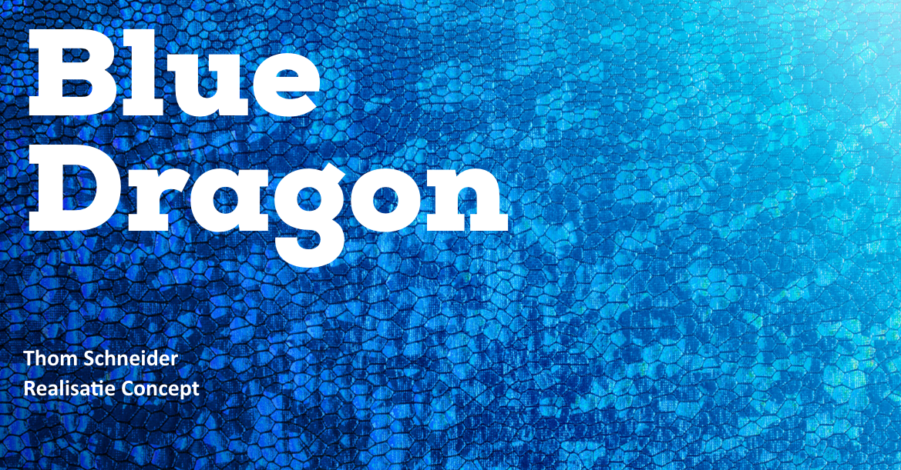

# Realisatie Concept

<figure><figcaption></figcaption></figure>

## Inleiding

Nadat ik de concept fase heb afgerond, is het tijd om het concept te realiseren. Tijdens de realisatie fase zal ik een aantal dingen realiseren zoals de login en een aantal componenten.

## Flowbite

Tijdens het realiseren van het concept heb ik een library gebruikt genaamd "Flowbite". Flowbite is een open-source library van UI componenten gebaseerd op het utility-first Tailwind CSS framework met ondersteuning voor dark mode, een Figma design systeem, en meer.

Het bevat alle veelgebruikte componenten die een website nodig heeft, zoals knoppen, dropdowns, navigatiebalken, modals, maar ook enkele meer geavanceerde interactieve elementen zoals datepickers.

### Set up

Het installeren van Flowbite was niet moeilijk, op de website staat een goede en duidelijke tutorial over hoe je Flowbite moet installeren. Je kunt dit doen via een CDN link wat heel makkelijk toegang biedt tot Flowbite, maar omdat ik in een bestaande omgeving werk moet ik dit installeren met Npm.&#x20;


