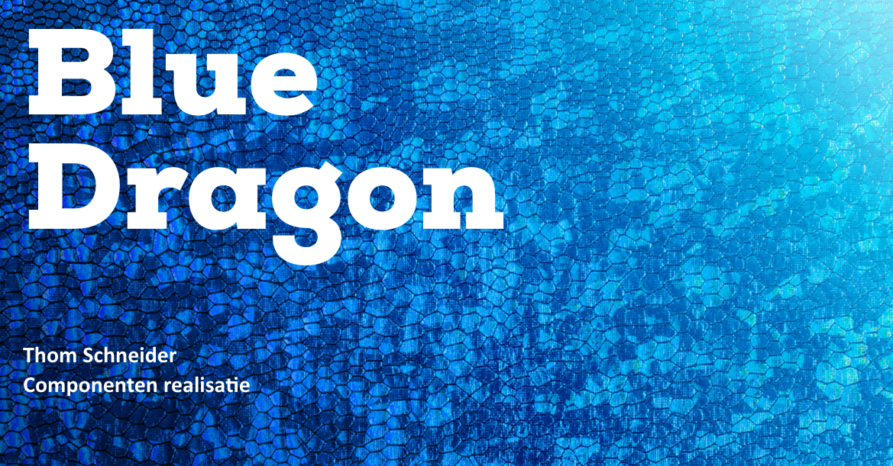

# Componenten realiseren

<figure><figcaption></figcaption></figure>

## Inleiding

In dit deel van het portfolio laat ik zien wat voor een componenten ik heb gerealiseerd en hoe dit was verlopen.

## Login

Ik ben begonnen met het maken van het nieuwe login scherm, omdat ik nog niet veel kennis van Tailwind had moest ik wel een aantal keer de documentatie bekijken van Tailwind. In de documentatie van Tailwind staan alle commands die je kunt gebruiken om een bepaalde style op een object te zetten. Tijdens dat ik dit login scherm aan het maken was stuitte ik op een probleem omdat ik de checkbox style niet kon veranderen. Na wat onderzoek te doen en de documentatie verder door te lezen, ben ik erachter gekomen hoe ik deze checkbox moest aanpassen.

<figure><figcaption></figcaption></figure>

Voor meer informatie over de documentatie van Tailwind verwijs ik u door naar:



## Pop over items

Voor deze pop over items heb ik Flowbite gebruikt, Flowbite heeft zelf al een functie die javascript events triggert dus dat is wel fijn. Ik heb daarna deze pop over items gevuld met de gewenste content en buttons.

<figure><figcaption></figcaption></figure>

## Tabel

Ik heb deze tabel ook gemaakt met behulp van Flowbite. Ik ben gaan zoeken naar een tabel component binnen de Flowbite library, uiteindelijk had ik er een gevonden die ik nog wat kan aanpassen zodat het design klopt.

<figure><figcaption></figcaption></figure>
