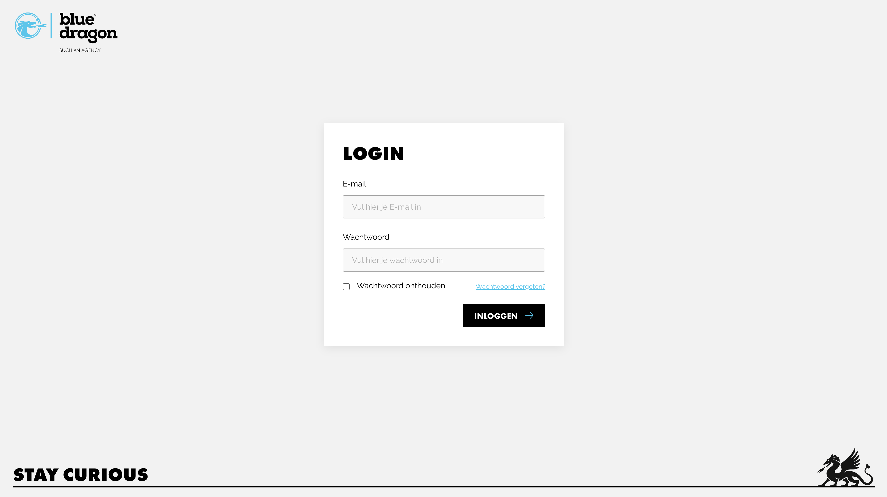
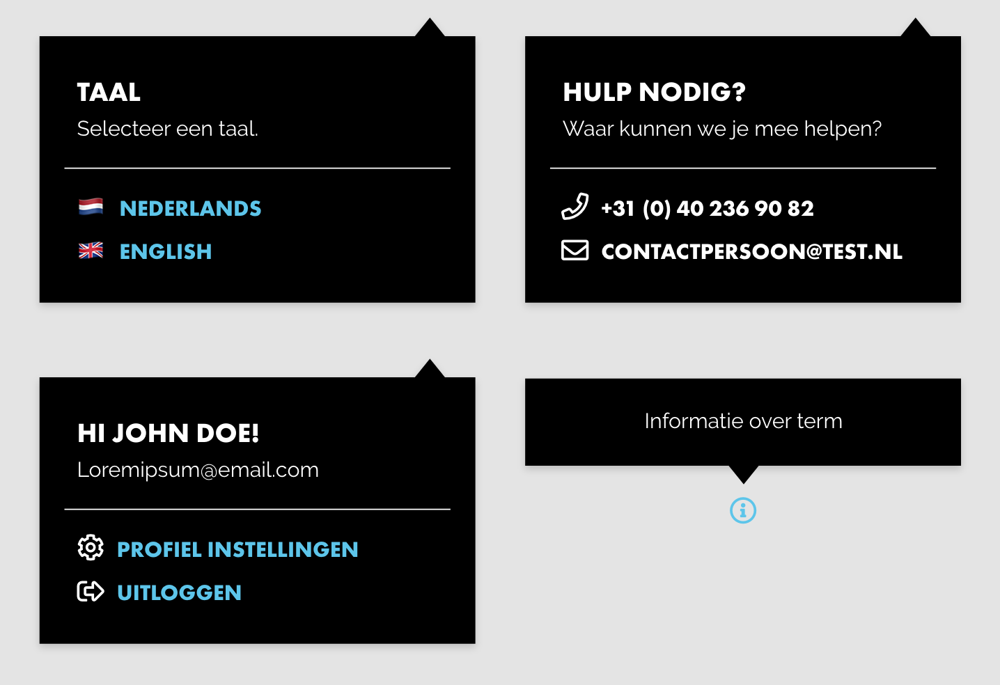

# Componenten realiseren

<figure><figcaption></figcaption></figure>

## Inleiding

In dit deel van het portfolio laat ik zien wat voor een componenten ik heb gerealiseerd en hoe dit was verlopen. Deze componenten worden uiteindelijk op de Git van Blue Dragon gezet zodat deze later gebruikt kunnen worden in de echte omgeving.

## Login

Ik ben begonnen met het maken van het nieuwe login scherm, omdat ik nog niet veel kennis van Tailwind had moest ik wel een aantal keer de documentatie bekijken van Tailwind. In de documentatie van Tailwind staan alle commands die je kunt gebruiken om een bepaalde style op een object te zetten. Tijdens dat ik dit login scherm aan het maken was stuitte ik op een probleem omdat ik de checkbox style niet kon veranderen. Na wat onderzoek te doen en de documentatie verder door te lezen, ben ik erachter gekomen hoe ik deze checkbox moest aanpassen.

<figure><figcaption></figcaption></figure>

Voor meer informatie over de documentatie van Tailwind verwijs ik u door naar:



## Pop over items

Voor deze pop over items heb ik Flowbite gebruikt, Flowbite heeft zelf al een functie die JavaScript events triggert dus dat is wel fijn. Ik heb daarna deze pop over items gevuld met de gewenste content en buttons.

<figure><figcaption></figcaption></figure>

## Git

Deze compontenten worden aparte blade files gemaakt, vervolgens worden deze opgeslagen op de Git van Blue Dragon. Omdat de huidige omgeving met Laravel werkt is het makkelijk om via Git een component in te laden. De componenten die ik hierboven heb gemaakt komen op de Git te staan zodat deze ingeladen kunnen worden voor het nieuwe design. Bij Blue Dragon gebruiken ze Smart Git, Smart Git is een tool waarin je gemakkelijk nieuwe commits kunt pushen naar de Git van Blue Dragon, dit zorgt voor goede versie beheer en management.

## Conclusie

Het leren van Tailwind code is een interessante ervaring geweest. Het was soms een uitdaging, maar het was ook de moeite waard. Tailwind is een modern CSS framework dat het gemakkelijker maakt om lay-outs te maken, terwijl het ook meer controle geeft over het ontwerp.

Ik vond dat Tailwind het gemakkelijker maakte om een consistente look en feel te creëren voor het CMS. Het was ook gemakkelijk om het uiterlijk van het CMS aan te passen door de Tailwind classes aan te passen. Ik kon snel stijlen toevoegen aan mijn elementen, zonder extra code te hoeven schrijven.

