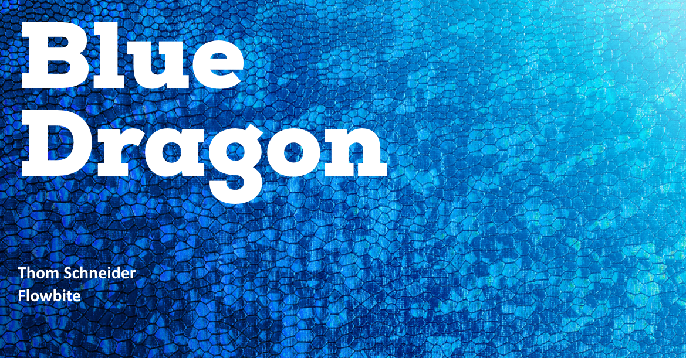

# Flowbite

<figure><figcaption></figcaption></figure>

## Inleiding

Nadat ik de concept fase heb afgerond, is het tijd om het concept te realiseren. Tijdens de realisatie fase is het een goed idee om een component library te gebruiken daarom heb ik gekozen voor Flowbite.

## Flowbite

Tijdens het realiseren van het concept heb ik een library gebruikt genaamd "Flowbite". Ik heb gezocht naar een Tailwind component library die ook Laravel en webpack ondersteund, en toen kwam ik al snel uit bij Flowite. Flowbite is een open-source library van UI componenten gebaseerd op het utility-first Tailwind CSS framework met ondersteuning voor dark mode, een Figma design systeem, en meer.

Het bevat alle veelgebruikte componenten die een website nodig heeft, zoals knoppen, dropdowns, navigatiebalken, modals, maar ook enkele meer geavanceerde interactieve elementen zoals datepickers. Ik heb voor deze Tailwind library gekozen omdat Flowbite, Laravel en webpack compatible is. Er zijn ook meerdere Tailwind component library zoals [Daisyui](https://daisyui.com/) en [Mamba UI](https://mambaui.com/), ik heb niet voor deze gekozen omdat deze niet compatible zijn met Laravel en webpack, dus kan ik het niet toepassen in de echte werkomgeving.

### Set up

Het installeren van Flowbite was niet moeilijk, op de website staat een goede en duidelijke tutorial over hoe je Flowbite moet installeren. Je kunt dit doen via een CDN link wat heel makkelijk toegang biedt tot Flowbite, maar omdat ik in een bestaande omgeving werk moet ik dit installeren met Npm.&#x20;

Voor meer informatie over het installeren van Flowbite, verwijs ik u door naar deze video.


