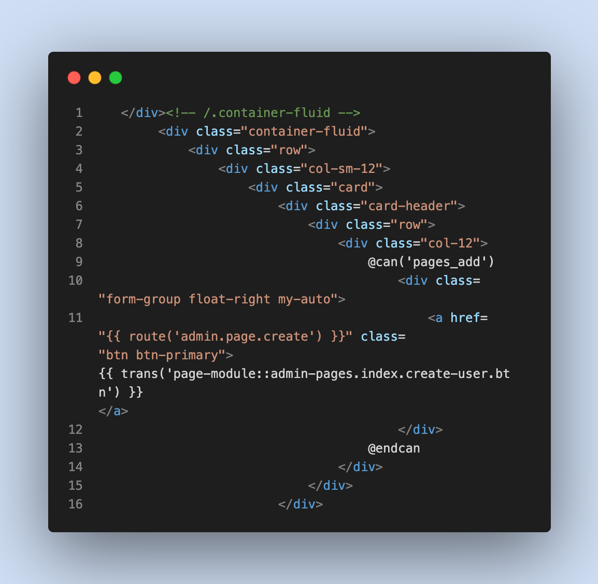
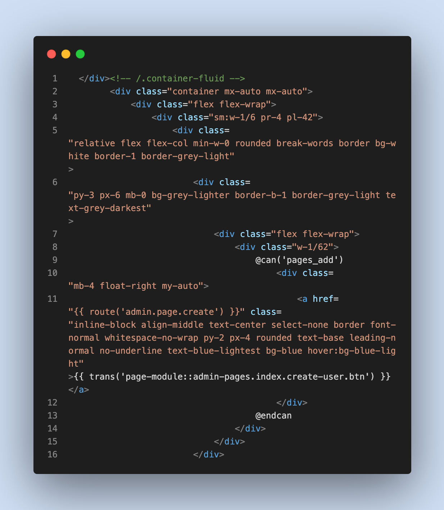
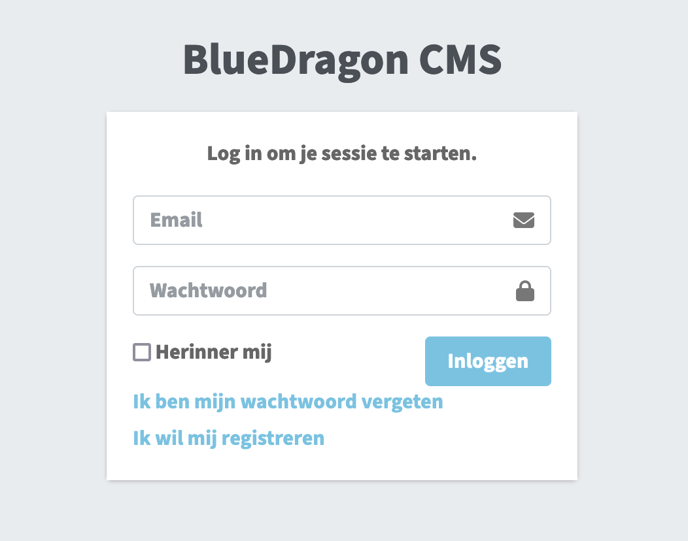
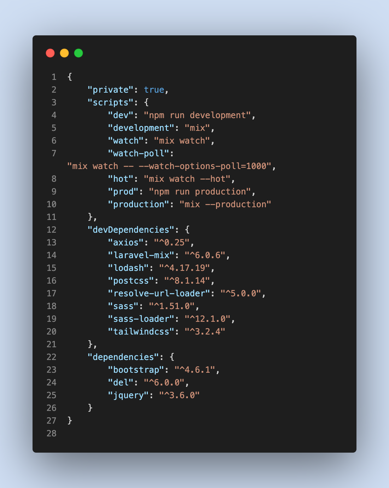
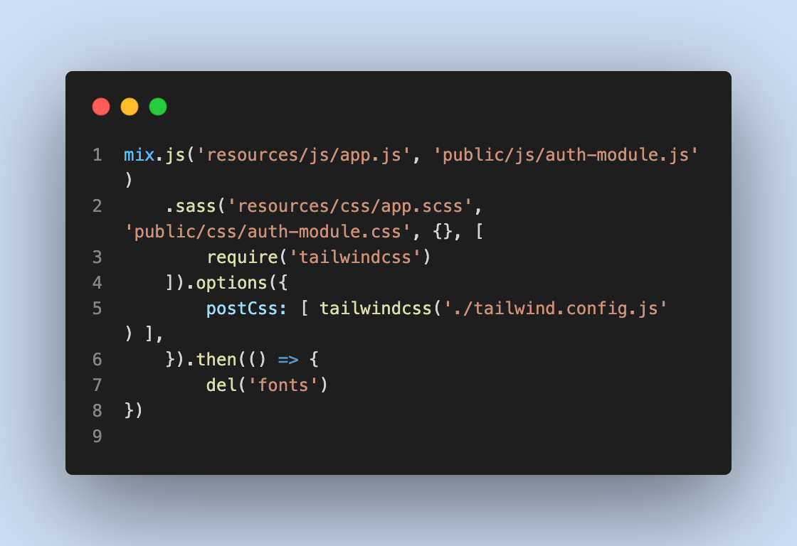

# Laravel Bootstrap to Tailwind

<figure><figcaption></figcaption></figure>

## Inleiding

Voor dit onderdeel van het project heb ik de opdracht gekregen om te kijken of het mogelijk is om de Bootstrap css code te converteren naar Tailwind css. Dit kan door middel van een tool genaamd "Tailwindo". Tailwindo kan de Bootstrap code omzetten naar Tailwind alleen lees ik dat dit niet heel nauwkeurig is. Van daar is het ook mijn taak om te kijken of het beter is om de Bootstrap code te converteren naar Tailwind, of om het gewoon vanaf scratch te maken.

## Tailwindo

Voor het omzetten van de Bootstrap code gebruik ik de tool Tailwindo, Deze tool kan CSS framework (momenteel Bootstrap) classes in HTML/PHP (een van uw keuze) bestanden converteren naar gelijkwaardige Tailwind CSS classes.

Voor het omzetten van de code moet je composer hebben om Tailwindo te runnen. je voert dan de volgende command in:&#x20;

```
composer global require awssat/tailwindo
```

Nu dat Tailwindo succesvol is geïnstalleerd kun je beginnen met het omzetten van de Bootstrap code, dit doe je door middel van de volgende command:

```
cd ~/my-project

tailwindo resources/views --extensions=php --recursive=true --replace=true
```

Als u meer informatie wilt over het gebruik van Tailwindo dan verwijs ik u naar de documentatie van de tool zelf.



## Resultaat

Nadat ik de commands heb gerunnend kun je zien dat de Bootstrap code (Afbeelding 1) is geconverteerd naar Tailwind code (Afbeelding 2). Als de code uit afbeelding 2 uitgevoerd wordt moet het hetzelfde weergeven als in afbeelding 1, wat een goed resultaat geeft want de Bootstrap code is omgezet naar Tailwind.

<div>

<figure><figcaption><p>Afbeelding 1</p></figcaption></figure>

 

<figure><figcaption><p>Afbeelding 2</p></figcaption></figure>

</div>

Omdat het converteren van Bootstrap naar Tailwind niet super nauwkeurig is, is het design wat veranderd waardoor de keuze gemaakt moet worden om verder te gaan met dit design of om het nieuwe design vanaf scratch te maken. Maar het is wel fijn om alvast een start te hebben met de Tailwind code, dus is het in dit geval makkelijker om verder te gaan in dat geconverteerde bestand.

<div>

<figure><figcaption><p>Bootstrap</p></figcaption></figure>

 

<figure><figcaption><p>Tailwind</p></figcaption></figure>

</div>

## Implementatie

Maar om uiteindelijk mijn eigen design te laten runnen in de echte omgeving zijn er wat meer stappen nodig. Omdat het al een bestaand project is met een eigen omgeving is het nogal lastig om ineens Tailwind te gebruiken in deze omgeving. Daarom heb ik een tutorial gevolgd om Webpack.mix.js met Tailwind werkend te krijgen.



<div>

<figure><figcaption><p>Package.json</p></figcaption></figure>

 

<figure><figcaption><p>Webpack.mix.js</p></figcaption></figure>

</div>

Omdat je in Laravel met allemaal verschillende routes werkt, moest ik deze aanpassen zodat ik Tailwind kan gebruiken binnen de omgeving. In de Webpack.mix.js kun je de standaard route een soort van omleiden zodat andere bestanden hier geen last van hebben. Zo heb ik een stukje code gemaakt die de Tailwind Css meeneemt in deze Laravel omgeving. Ik heb dit nu gedaan voor de "Auth-module.js". De Auth-module.js is een map waarin verschillende Blade views staan voor de login. Blade is de eenvoudige, maar krachtige templating-engine die met Laravel wordt meegeleverd. Het vervelende is nu wel dat Tailwind alleen werkt binnen de  "Auth-module" er zijn nog veel meer modules nodig die toegevoegd moeten worden om het CMS van Blue Dragon compleet te maken.

In de package.json staan een aantal commands die ik kan gebruiken zodat ik Tailwind kan runnen in de omgeving. Zo heb je bijvoorbeeld:&#x20;

```
npm run watch - Builds process automatically

npm run prod - Builds process manually with no commands

npm run dev - Builds whole process manually
```

Maar omdat de omgeving draait via docker moet ik deze ook elke keer weer updaten via composer. Daarvoor gebruik ik de volgende code:

```
Composer run publish - Publish the newly build code
```

Omdat ik mijn eigen code in een andere omgeving stop moest ik ook een aantal directory paths veranderen zodat de images goed worden ingeladen. Uiteindelijk is dit mij gelukt met behulp van wat research op het internet, ook heb ik een handige video gevonden die goed uitlegde hoe ik dit moest doen.



## Conclusie

Het omzetten van Laravel Bootstrap naar Tailwind was niet super moeilijk omdat er duidelijk was aangegeven hoe ik dit moest omzetten. Ondanks dat ik heb gelezen dat de tool Tailwindo niet super nauwkeurig werkt, heb ik toch besloten om verder te werken aan het geconverteerde bestand omdat de blauwdruk van het component er dan al een soort van staat, in mijn geval was dit handig maar bij sommige gevallen is het wel makkelijker om vanaf scratch te beginnen, dus is Tailwindo zeker wel de moeite waard. In sommige gevallen is het wel makkelijker om bijvoorbeeld een tabel vanaf scratch te maken aangezien dat soort componenten minder goed worden omgezet. Het moeilijke gedeelte van dit deel van het project was juist het overzetten van mijn Tailwind code in de huidige CMS omgeving. Dit was moeilijk omdat ik Tailwind moest installeren in een bestaand project, wat het vooral lastig maakte is dat Laravel werkt met bepaalde routes die bestanden aan elkaar linken. Dus om Tailwind in die omgeving te krijgen moet ik de Tailwind files ook meenemen in die routes die al bepaald zijn. Dit kan ik doen door de Webpack.mix.js file aan te passen en mijn eigen route te maken om de Tailwind files mee te nemen. Na wat onderzoek gedaan te hebben is het mij eindelijk gelukt om Tailwind te runnen binnen de huidige omgeving.
