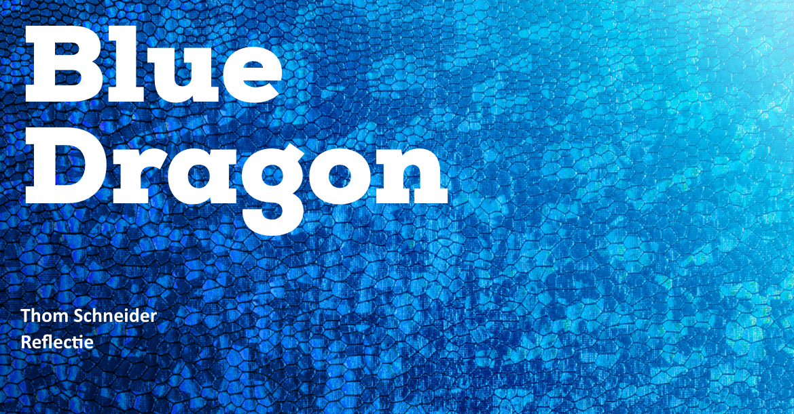

# Reflectie

<figure><figcaption></figcaption></figure>

### Reflectie

Als media student die stage liep bij Blue Dragon, was het een ongelooflijk leuke en interessante ervaring om het CMS gebruiksvriendelijk te maken. Door dit project heb ik zowel mijn technische vaardigheden als mijn begrip van user experience kunnen ontwikkelen. Ik kon mijn kennis van user experience design, en mijn technische vaardigheden gebruiken om een intuïtiever CMS te maken.

Een van de meest belonende aspecten van dit project was het zien van mijn werk in actie. Nadat ik het CMS had aangepast, kon ik met eigen ogen zien hoe mijn aanpassingen een positieve impact hadden op de gebruikerservaring. Het was fijn om de positieve feedback van gebruikers te zien en te weten dat ik een verschil had kunnen maken.

Deze stage gaf me ook de kans om feedback te krijgen van ervaren professionals in het veld. Ik kon leren van hun feedback, en kreeg meer vertrouwen in mijn vaardigheden. &#x20;

Het werken in een team met ontwikkelaars heeft mijn inzicht in het ontwikkelingsproces en het belang van samenwerking zeker vergroot. Ik heb inzicht gekregen in de verschillende rollen die vervuld moeten worden om een effectief en gebruiksvriendelijk CMS te maken. Ik heb ook kunnen leren over codering en de verschillende talen die bij webontwikkeling worden gebruikt. Hierdoor heb ik de elementen van een succesvol CMS beter kunnen begrijpen en hoe ik een CMS kan maken die zowel gebruiksvriendelijk als efficiënt is.

Bovendien heb ik geleerd hoe ik effectief met ontwikkelaars kan communiceren en mijn ideeën op een duidelijke en begrijpelijke manier kan verwoorden. Dit was een geweldige leerervaring omdat ik zo mijn communicatievaardigheden kon oefenen in een professionele omgeving.

Al met al was dit project een geweldige leerervaring. Het stelde me in staat mijn kennis toe te passen om een praktisch en nuttig systeem te creëren. Ik was in staat om de behoeften van de gebruiker te begrijpen, een plan op te stellen en een prototype te maken voordat ik een aantal componenten van het systeem ging coderen en testen. Ik heb hierdoor een beter begrip van het proces van het ontwerpen en creëren van een gebruiksvriendelijk content managementsysteem.

### Creatief proces

Tijdens mijn stage periode, werd ik voortdurend uitgedaagd om creatief te denken. Mijn dagelijkse verantwoordelijkheden omvatten het bedenken van innovatieve oplossingen voor problemen, en het ontwerpen van gebruikerservaringen. Om mijn creatieve gedachten te inspireren, heb ik gemerkt dat muziek een belangrijke rol speelt in mijn werk.

Muziek helpt me ook om me te motiveren. Als ik me overweldigd voel door een taak, kan het luisteren naar een favoriet nummer helpen om me weer op de rails te krijgen, ook kan het helpen mijn energie in de taak te steken en met creatieve oplossingen te komen.

Een andere manier waar ik creatieve ideeën vandaan heb gehaald is het kijken naar hoe andere ontwerpers iets hebben gemaakt. Door te kijken naar andere ontwerpen krijg ik al snel een beeld van hoe ik iets anders zou willen doen bij dat desbetreffende ontwerp.

### Communicatie

Tijdens mijn stage leerde ik het belang van effectieve communicatie om een succesvol gebruiksvriendelijk CMS te creëren. Dit omvatte het luisteren naar de behoeften van klanten, het begrijpen van hun eisen, en vervolgens terug te communiceren naar hen hoe het ontwerp kan voldoen aan hun behoeften. Ik leerde ook het belang van het onderhouden van een goede relatie met klanten, omdat ik zo feedback kon krijgen op het ontwerp en de nodige wijzigingen kon aanbrengen.

Ook zag ik het belang van communicatie binnen het team, zodat iedereen op één lijn zat en samenwerkte. Door goede communicatie konden we ideeën bespreken, van elkaar leren en tot een ontwerp komen dat niet alleen gebruiksvriendelijk is, maar ook esthetisch verantwoord.

### Persoonlijke groei

Ik ben er trots op hoeveel ik in de loop van mijn studie ben gegroeid als mediastudent. Ik heb meer vertrouwen gekregen in mijn vermogen om met verschillende software en tools te werken, en ik begrijp hoe belangrijk het is om mijn ideeën effectief te kunnen communiceren om succesvolle projecten te creëren. Ik ben ook trots op mijn vermogen om georganiseerd te blijven en mijn tijd verstandig te beheren om projecten op tijd en zo goed mogelijk af te ronden.

### Professional identiteit

Tijdens mijn stage periode heb ik een beter inzicht gekregen in de principes van UX-ontwerp, wat van grote waarde is geweest bij het maken van efficiëntere en effectievere digitale producten. Bovendien heb ik beter kunnen begrijpen hoe gebruikerservaring en ontwerp op elkaar inwerken om een beter totaalproduct te creëren.

Dankzij deze ervaring heb ik ook een beter inzicht gekregen in het belang van gebruikersonderzoek en de rol die dit speelt bij het creëren van succesvolle producten. Ik heb kunnen leren hoe ik verschillende tools en methoden kan gebruiken om onderzoek te doen om inzicht te krijgen in het gedrag en de voorkeuren van gebruikers. Hierdoor heb ik digitale producten kunnen creëren die zijn afgestemd op de behoeften van de gebruiker.&#x20;

Dankzij mijn stage heb ik ook relaties kunnen opbouwen met andere professionals op dit gebied, wat erg nuttig is geweest voor het uitbreiden van mijn netwerk en het verkrijgen van inzichten van ervaren professionals.
