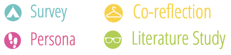

# Persona's

<figure><figcaption>
Versie 1.0
</figcaption></figure>



## Inleiding

Nu dat ik weet waar de fouten liggen binnen het huidige design en hoe ik gebruiksvriendelijkheid moet toepassen en testen, ben ik begonnen met het maken van persona's. Omdat de doelgroep bij Blue Dragon al bekend is, heeft het geen zin om te beginnen met een heel nieuw doelgroep onderzoek. Daarom heb ik ervoor gekozen om een aantal persona op te stellen. Ik heb hiervoor gekozen omdat ik dan een goede en duidelijke visualisatie kan krijgen van mijn onderzoeksresultaten, zo wordt het een stuk makkelijker om content te produceren wat bij de behoeften en wensen van de stakeholder past.

## Onderzoeksmethoden

<figure><figcaption></figcaption></figure>

#### Survey&#x20;

Om de persona’s te maken op basis van de doelgroep heb ik informatie nodig van personen binnen deze doelgroep, daarom heb ik een enquête gemaakt met een aantal vragen om zo een beter beeld te krijgen van de personen binnen deze doelgroep.&#x20;

#### Persona&#x20;

Een persona kan functioneren als een model om een groep gebruikers te vertegenwoordigen die een product op een vergelijkbare manier zouden gebruiken op basis van hun gedeelde kenmerken, eigenschappen, houdingen of doelen.&#x20;

#### Co-reflection&#x20;

Betrek belanghebbenden en andere deskundigen vroeg in het ontwerpproces om een innovatieve koers uit te zetten en de belanghebbenden open te stellen voor nieuwe ideeën.&#x20;

#### Literature study&#x20;

Bij Literature study maak je gebruik van bestaande informatie. Bijvoorbeeld informatie die je online vindt. Dit vraagt wel een tijdsinvestering, omdat je de resultaten vervolgens ook goed moet analyseren.&#x20;

## Hoe maak je een persona?

#### 1. Online Desk research

Je kunt veel informatie voor het maken van je persona online vinden. Gebruik informatie uit Google Analytics zoals geslacht en leeftijd van je websitebezoekers.&#x20;

Als je doelgroep uit een bepaalde stad of provincie komt, kun je bijvoorbeeld Wikipedia gebruiken om meer te leren over deze locatie. Bekijk hoe er over je product of dienst wordt gesproken op social media.

* Bestaan er relevante LinkedIn groepen rondom je business?
* Zijn er video’s over je product op YouTube?
* Hoe zoekt je doelgroep in zoekmachines?
* Welke vragen worden er gesteld in Google?

#### 2. Field research bij bestaande klanten

Gebruik informatie die je al hebt van bestaande klanten. Niet alleen demografische gegevens en andere data, maar ook achterliggende vraagstukken of uitdagingen.

* Wat speelt er momenteel bij ze?
* Welke problemen los je voor ze op?
* Waarom hebben ze voor jou gekozen?

#### 3. Analyseer je gegevens

Nu dat je een behoorlijke hoeveelheid gegevens verzameld hebt. Kun je deze informatie samenvatten met behulp van het online onderzoek en field onderzoek.

#### 4. Persona maken

Nu dat er onderzoek is gedaan en alle informatie geanalyseerd is, is het tijd om de persona's te gaan uitwerken.

## Wat moet je voorkomen bij het maken van persona’s?

Probeer te voorkomen dat je jouw persona te veel baseert op één bestaande klant. Het is juist de bedoeling om gegevens van al je belangrijke klanten te bundelen. Voorkom ook dat je te veel aan de oppervlakte blijft, bijvoorbeeld door je persona alleen op demografische gegevens te baseren. Juist de doelen en motivaties zijn belangrijk om de persona volledig te begrijpen.

## Enquête Opstellen

Ik heb een enquête gemaakt om erachter te komen wat de belanghebbende leuk of niet leuk vinden, wat hun pijnpunten zijn, en vooral, wat hun doelen zijn en hoe zij die gewoonlijk bereiken. Verder heb ik ook nog wat aanvullende informatie gevraagd zodat ik mijn persona's beter kan opstellen.

Nadat ik de enquête heb opgesteld, heb ik een e-mail gemaakt waarin ik vraag of de gebruikers van dit systeem deze graag zouden willen invullen. Ik heb daarom op het internet opgezocht hoe ik een goede email moet formuleren om te vragen of iemand een enquête wil invullen.&#x20;

Na wat zoeken ben ik uiteindelijk bij een website gekomen met een artikel over "7 tips die ervoor zorgen dat mensen jouw vragenlijst invullen".



Vervolgens heb ik deze e-mail laten lezen door mijn stagebegeleider, om nog wat feedback te vragen. Uiteindelijk heb ik wat nuttige feedback gehad wat erg fijn was. Ik heb deze feedback gelijk verwerkt en heb daarna de mail verstuurd naar de stakeholders.

> Hallo Naam,&#x20;
>
> Momenteel loop ik stage bij Blue Dragon, tijdens mijn stageperiode ben ik bezig met een project om het content managementsysteem van Blue Dragon wat je momenteel in gebruik hebt nog gebruiksvriendelijker te maken.&#x20;
>
> Om het systeem meer gebruiksvriendelijk te maken zou het fijn zijn om meer informatie te verkrijgen over de doelgroep die dit systeem in gebruik heeft. Daarom heb ik een enquête opgesteld met wat vragen, zodat ik een aantal persona’s kan maken waardoor het een stuk makkelijker wordt om de gebruiksvriendelijk mogelijk verder te optimaliseren naar de behoeften en wensen van jullie als klant. Het invullen van de enquête duurt ongeveer 10 minuten, en je gegevens worden anoniem verwerkt.&#x20;
>
> Enquête:
>
> https://docs.google.com/forms/d/e/1FAIpQLSeAo7fffJJ1RF\_VbFnlMpsKi\_C33IXOG4NkqskCh6Za04yA/viewform?usp=sf\_link
>
> Bij voorbaat dank!

Nadat ik mijn enquête had opgesteld, heb ik het formulier opgestuurd naar mijn bedrijfsbegeleider zodat hij er nog een keer overheen kan kijken voordat het verstuurd wordt. Toen mijn bedrijfsbegeleider de enquête had doorgenomen had hij een aantal feedback punten die ik heb verbeterd.

<figure><figcaption></figcaption></figure>

Vervolgens heb ik de feedback van de enquête verbeterd zodat deze opgestuurd kan worden naar de belanghebbende.

## Persona's

Na een tijdje wachten heb ik een aantal antwoorden gekregen op mijn enquête. Ik heb mijn persona's gemaakt met een tool van Hubspot.&#x20;

<figure><figcaption></figcaption></figure>

 

<figure><figcaption></figcaption></figure>

## Conclusie

Tijdens het maken van deze persona’s, is het mij duidelijker geworden op welke aspecten ik mij moet focussen bij het designen van het nieuwe Blue Dragon CMS.

Van de persona's die ik heb gemaakt kun je afleiden dat ze allebei ongeveer dezelfde tools gebruiken, omdat ze in hetzelfde vakgebied zitten. Nu dat ik weet welke tools mijn persona's gebruiken op een dagelijkse basis, kan ik rekening houden met het design van die tools. Ook kun je zien dat de voorkeur van communicatie via de mail en telefoon word gedaan, dus hier kan ik ook op letten dat ik ergens het mail adres of telefoon nummer van het contact persoon vermeld. Ook zijn er een aantal frustraties vermeld die volgens de gebruikers in het systeem zitten. Doordat ik deze informatie heb, kan ik bij het design rekening houden met deze belangrijke punten. Verder staat er ook wat de goals zijn van de persona's binnen het CMS. Je kunt hier uit afleiden welke processen de gebruiker binnen dit systeem gebruikt, zo kan ik deze stappen na lopen voor eventuele optimalisatie van deze processen.

## Vervolg stap

Nu dat ik weet waar het mis gaat bij de gebruikers van dit systeem ga ik een ontwerp maken, waar de gebruikers bekend mee zijn en waar de pijnpunten van deze gebruikers worden verholpen.&#x20;

&#x20;
