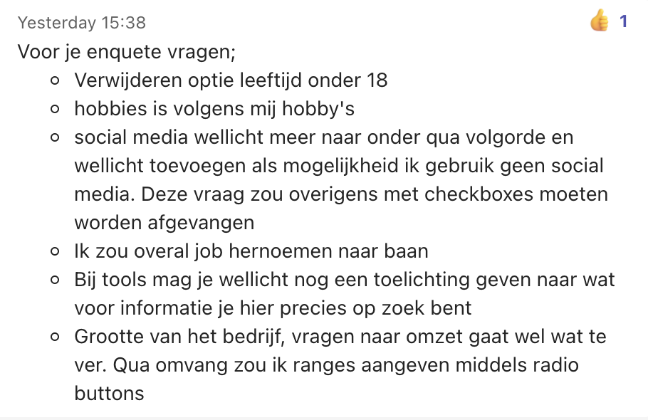
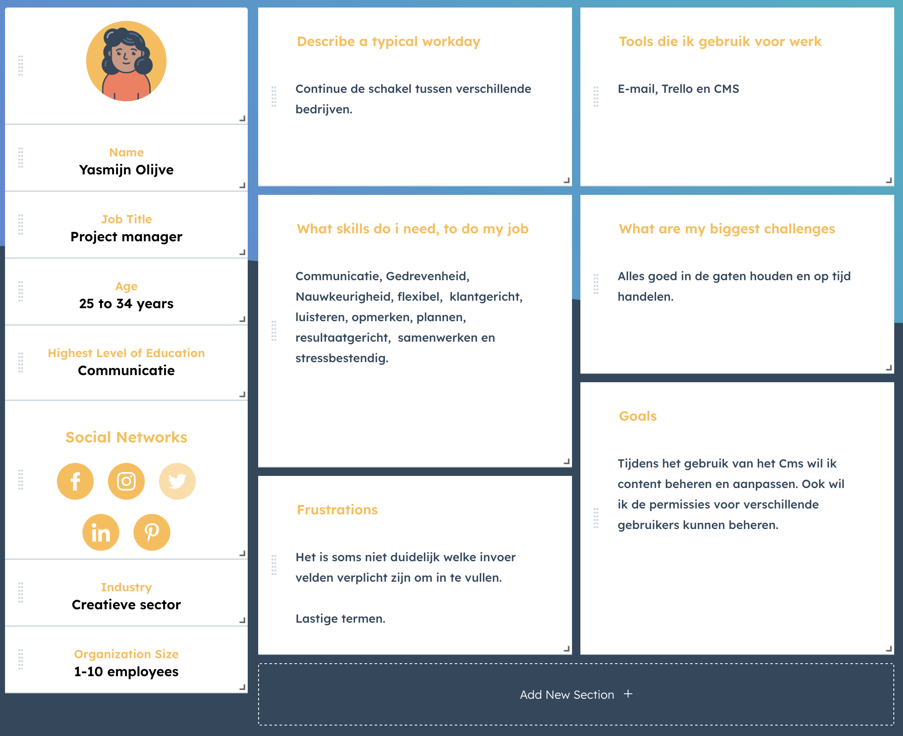

# Persona's

<figure><figcaption>
Versie 1.0
</figcaption></figure>

## Inleiding

Ik heb gekozen om een aantal persona's te maken, zodat ik erachter kan komen waar het fout gaat bij de klanten. Met behulp van het maken van persona's krijg ik een visueel beeld van mijn onderzoeksresultaten.

## Onderzoeksmethoden

<figure><figcaption></figcaption></figure>

#### Survey&#x20;

Om de persona’s te maken op basis van de doelgroep heb ik informatie nodig van personen binnen deze doelgroep, daarom heb ik een enquête gemaakt met een aantal vragen om zo een beter beeld te krijgen van de personen binnen deze doelgroep.&#x20;

#### Persona&#x20;

Een persona kan functioneren als een model om een groep gebruikers te vertegenwoordigen die een product op een vergelijkbare manier zouden gebruiken op basis van hun gedeelde kenmerken, eigenschappen, houdingen of doelen.&#x20;

#### Co-reflection&#x20;

Betrek belanghebbenden en andere deskundigen vroeg in het ontwerpproces om een innovatieve koers uit te zetten en de belanghebbenden open te stellen voor nieuwe ideeën.&#x20;

#### Literature study&#x20;

Bij Literature study maak je gebruik van bestaande informatie. Bijvoorbeeld informatie die je online vindt. Dit vraagt wel een tijdsinvestering, omdat je de resultaten vervolgens ook goed moet analyseren.&#x20;

## Enquête Opstellen

Ik heb een enquête gemaakt om erachter te komen wat de belanghebbende leuk of niet leuk vinden, wat hun pijnpunten zijn, en vooral, wat hun doelen zijn en hoe zij die gewoonlijk bereiken. Verder heb ik ook nog wat aanvullende informatie gevraagd zodat ik mijn persona's beter kan opstellen. [\[1\]](https://enqueteexpert.nl/enquete-vragen-voorbeelden/website-beoordeling-gebruiksvriendelijkheid)

Nadat ik de enquête heb opgesteld, heb ik een e-mail gemaakt waarin ik vraag of de gebruikers van dit systeem deze graag zouden willen invullen. Ik heb daarom op het internet opgezocht hoe ik een goede email moet formuleren om te vragen of iemand een enquête wil invullen.&#x20;

Na wat zoeken ben ik uiteindelijk bij een website gekomen met een artikel over "7 tips die ervoor zorgen dat mensen jouw vragenlijst invullen".



Vervolgens heb ik deze e-mail laten lezen door mijn stagebegeleider, om nog wat feedback te vragen. Uiteindelijk heb ik wat nuttige feedback gehad wat erg fijn was. Ik heb deze feedback gelijk verwerkt en heb daarna de mail verstuurd naar de belanghebbende die dit systeem nu in gebruik hebben.

> Hallo Naam,&#x20;
>
> Momenteel loop ik stage bij Blue Dragon, tijdens mijn stageperiode ben ik bezig met een project om het content managementsysteem van Blue Dragon wat je momenteel in gebruik hebt nog gebruiksvriendelijker te maken.&#x20;
>
> Om het systeem meer gebruiksvriendelijk te maken zou het fijn zijn om meer informatie te verkrijgen over de doelgroep die dit systeem in gebruik heeft. Daarom heb ik een enquête opgesteld met wat vragen, zodat ik een aantal persona’s kan maken waardoor het een stuk makkelijker wordt om de gebruiksvriendelijk mogelijk verder te optimaliseren naar de behoeften en wensen van jullie als klant. Het invullen van de enquête duurt ongeveer 10 minuten, en je gegevens worden anoniem verwerkt.&#x20;
>
> Enquête:
>
> https://docs.google.com/forms/d/e/1FAIpQLSeAo7fffJJ1RF\_VbFnlMpsKi\_C33IXOG4NkqskCh6Za04yA/viewform?usp=sf\_link
>
> Bij voorbaat dank!

Nadat ik mijn enquête had opgesteld, heb ik het formulier opgestuurd naar mijn bedrijfsbegeleider zodat hij er nog een keer overheen kan kijken voordat het verstuurd wordt. Toen mijn bedrijfsbegeleider de enquête had doorgenomen had hij een aantal feedback punten die ik heb verbeterd.

<figure><figcaption></figcaption></figure>

Vervolgens heb ik de feedback van de enquête verbeterd zodat deze opgestuurd kan worden naar de belanghebbende.

Na een tijd gewacht te hebben, had ik 4 reacties gekregen op mijn enquête. In de enquête werden de deelnemers gevraagd naar hun ervaring met het CMS. Veel van de respondenten meldden dat het CMS niet geheel gebruiksvriendelijk was en noemden frustraties bij het navigeren door de interface en dat er veel lastige termen werden gebruikt. In het algemeen bleek uit de resultaten van de enquête dat er problemen waren met de gebruiksvriendelijkheid van het CMS voor de klanten van Blue Dragon.&#x20;

## Persona's

Nu dat ik wat informatie terug heb gekregen van de klanten van Blue Dragon, ben ik aan de slag gegaan met het maken van de persona's. [\[2\]](https://vandermeerwaarde.nl/2018/in-7-stappen-een-persona/)

<figure><figcaption></figcaption></figure>

 

<figure><figcaption></figcaption></figure>

## Conclusie

Tijdens het maken van deze persona’s, is het mij duidelijker geworden op welke aspecten ik mij moet focussen bij het designen van het nieuwe Blue Dragon CMS.

Van de persona's die ik heb gemaakt kun je afleiden dat ze allebei ongeveer dezelfde tools gebruiken, omdat ze in hetzelfde vakgebied zitten. Nu dat ik weet welke tools mijn persona's gebruiken op een dagelijkse basis, kan ik rekening houden met het design van die tools. Ook kun je zien dat de voorkeur van communicatie via de mail en telefoon wordt gedaan, dus hier kan ik ook op letten dat ik ergens het mailadres of telefoon nummer van het contactpersoon vermeld. Ook zijn er een aantal frustraties vermeld die volgens de gebruikers in het systeem zitten. Doordat ik deze informatie heb, kan ik bij het design rekening houden met deze belangrijke punten. Verder staat er ook wat de goals zijn van de persona's binnen het CMS. Je kunt hieruit afleiden welke processen de gebruiker binnen dit systeem gebruikt, zo kan ik deze stappen na lopen voor eventuele optimalisatie van deze processen.

## Vervolg stap

Nu dat ik weet waar het mis gaat bij de gebruikers van dit systeem ga ik een marktonderzoek starten. Ik ga dit onderzoek doen om erachter te komen welke concurrenten er zijn, welke functies ze hebben, hoe gebruikers ermee omgaan, welke functies moeten worden overwogen om in Blue Dragons product op te nemen en welke moeten worden vermeden.

## Bronnenlijst

1. _Voorbeeldvragen Website Beoordeling Gebruiksvriendelijkheid | ENQUÊTE EXPERT_. (n.d.). [https://enqueteexpert.nl/enquete-vragen-voorbeelden/website-beoordeling-gebruiksvriendelijkheid](https://enqueteexpert.nl/enquete-vragen-voorbeelden/website-beoordeling-gebruiksvriendelijkheid)
2. Mostert, R. (2021, May 20). _In 7 stappen een persona creëren_. Vandermeerwaarde. [https://vandermeerwaarde.nl/2018/in-7-stappen-een-persona/](https://vandermeerwaarde.nl/2018/in-7-stappen-een-persona/)
