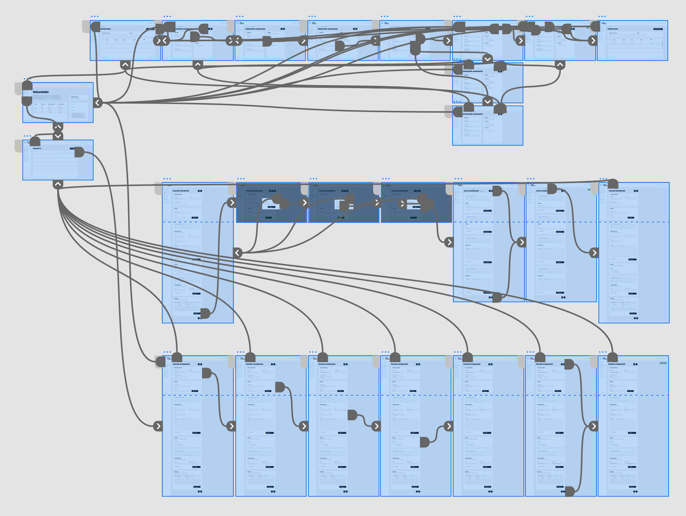

# Testen

<figure><figcaption></figcaption></figure>

## Inleiding

Tijdens de test fase ga ik aan de slag met het testen van mijn design, ik ga dit testen door middel van een interactief prototype in Adobe XD. Het doel van de user tests is om te valideren dat mijn onderzoeksbevindingen in de praktijk juist zijn.

## Testplan

#### Usability onderzoek

Het testen van interactieve prototypes voor een gebruiksvriendelijk CMS is een belangrijk onderdeel van het creëren van een succesvol eindproduct. Bij het testen van interactieve prototypes is het belangrijk om rekening te houden met de gebruiker en hun ervaring met het systeem.&#x20;

<figure><figcaption></figcaption></figure>

Door het uitvoeren van grondige tests kan ik ervoor zorgen dat het CMS intuïtief, gebruiksvriendelijk en makkelijk te gebruiken is. Bij het testen van interactieve prototypes is het belangrijk om te beginnen met het maken van testcases. De testcases moeten het ontwerp van het prototype en de taken die de gebruiker gaat uitvoeren bevatten.&#x20;

Door het opstellen van de testcases heb ik een stappenplan van wat er getest moet worden, en hoe het succes van het prototype gemeten kan worden. Zodra de testcases klaar zijn, ga ik een steekproef doen bij een aantal gebruikers. Deze steekproef bestaat uit gebruikers die het CMS daadwerkelijk gaan gebruiken, maar ook uit gebruikers die niet bekend zijn met het systeem. Ik ga ook de ervaring van de gebruikers volgen terwijl ze met het prototype werken. Dit omvat het maken van aantekeningen over hoe de gebruiker omgaat met het systeem, en de feedback die ze geven.

Nadat het testen van de gebruikers is voltooid, ga ik de resultaten analyseren en de gebieden identificeren die moeten worden verbeterd. Dit kunnen wijzigingen zijn in de gebruikersinterface, de navigatie of de functionaliteit van het systeem. Zodra de verbeteringen zijn geïdentificeerd, kan ik het prototype bijwerken en opnieuw testen.

## Test cases

Ik heb de onderstaande test cases gemaakt op basis van de [user requirements](concept.md#user-requirements).

### Test case 1

> **Beschrijving:**&#x20;
>
> Test of de gebruiker een nieuwe pagina kan aanmaken met behulp van het CMS.
>
>
>
> **Stappen:**
>
> ****
>
> 1. Log in op het CMS met een geldige gebruikersaccount.
> 2. Log in op het CMS met een geldige gebruikersaccount.
> 3. Navigeer naar de "Pagina's" sectie van het CMS.
> 4. Klik op de "Nieuwe pagina" knop.
> 5. Voer de instellingen in van de pagina.
> 6. Voer de inhoud in van de pagina.
> 7. Voeg een gebruiker toe aan de pagina, die deze pagina kan beheren.
> 8. Voer de Seo informatie in van de pagina.
> 9. Klik op de knop "Opslaan" om de nieuwe pagina op te slaan.
>
>
>
> **Verwacht resultaat:**
>
> Een nieuwe pagina met de opgegeven naam en inhoud wordt gemaakt en getoond in de "Pagina" sectie van het CMS.
>
>
>
> **Werkelijk resultaat:**
>
> Een nieuwe pagina met de opgegeven naam en inhoud is succesvol aangemaakt en wordt getoond in de "Pagina" sectie van het CMS.
>
>
>
> **Conclusie:**
>
> De testcase is geslaagd, aangezien de gebruiker zoals verwacht een nieuwe pagina kon aanmaken met behulp van het CMS.

### Test case 2

> **Beschrijving:**&#x20;
>
> Test of extra pagina-inhoud kan worden toegevoegd aan een pagina door middel van blokken in het CMS.
>
> &#x20;
>
> **Stappen:**
>
> &#x20;
>
> 1. Log in op het CMS met een geldige gebruikersaccount.
> 2. Navigeer naar de "Pagina's" sectie van het CMS.
> 3. Zoek de pagina die in de vorige testcase is aangemaakt.
> 4. Klik op de "Edit" knop voor de pagina.
> 5. Voeg in de content editor extra content toe aan de pagina (bijv. tekst, afbeeldingen, video's, etc.)
> 6. Klik onderaan de pagina op de knop "Nieuw blok".
> 7. Selecteer een blok type uit de dropdown.
> 8. Vul de inhoud in voor het nieuwe blok.
> 9. Klik op de knop "Opslaan" om de wijzigingen op te slaan.
>
> &#x20;
>
> **Verwacht resultaat:**
>
> De extra inhoud is toegevoegd aan de pagina en wordt correct weergegeven in de tabel waar de blokken staan.
>
> &#x20;
>
> **Werkelijk resultaat:**
>
> De extra inhoud is toegevoegd aan de pagina en wordt correct weergegeven in de blok tabel. De inhoud van de pagina is bijgewerkt zoals verwacht.
>
> &#x20;
>
> **Conclusie:**
>
> De testcase is geslaagd, want de gebruiker was in staat om met behulp van het CMS de pagina-inhoud aan de pagina toe te voegen.

### Test case 3

> **Beschrijving:**&#x20;
>
> Test of de gebruiker een gebruiker kan aanmaken en een rol kan toevoegen.
>
> &#x20;
>
> **Stappen:**
>
> &#x20;
>
> 1. Log in op het CMS met een geldige gebruikersaccount.
> 2. Navigeer naar de "Gebruikers" sectie van het CMS.
> 3. Klik op de "Nieuwe gebruiker" knop voor op pagina.
> 4. Vul de gebruikers gegevens in voor de nieuwe gebruiker.
> 5. Voeg een rol toe aan de nieuwe gebruiker.
> 6. Klik op de knop "Opslaan" om de wijzigingen op te slaan.
>
> &#x20;
>
> **Verwacht resultaat:**
>
> De nieuwe gebruiker is toegevoegd met de gewenste rol en wordt weergegeven in de gebruikers tabel.
>
> &#x20;
>
> **Werkelijk resultaat:**
>
> De nieuwe gebruiker wordt toegevoegd met de gewenste rol, en de nieuwe gebruiker wordt correct weergegeven in de gebruiker tabel.
>
> &#x20;
>
> **Conclusie:**
>
> De testcase is geslaagd, want de gebruiker was in staat om een nieuwe gebruiker aan te maken met een gewenste rol.

## Conclusie

Aan het begin van het project heb ik een aantal onderzoeken gedaan die ik tijdens het testen kan toetsen, zo heb ik persona's gemaakt zodat ik weet wat de wensen en frustraties van de gebruikers zijn. Met deze informatie kon ik een design maken wat goed aansluit bij de gebruikers. Zo heb ik bijvoorbeeld de breadcrumbs duidelijker aangegeven zodat gebruikers kunnen zien in welke laag ze zitten, zodat de flow van het systeem beter verloopt. Ook heb ik door middel van mijn marktonderzoek kunnen aantonen welke functies ik heb overgenomen zodat ik deze kan toepassen in het nieuwe CMS ontwerp van Blue Dragon. Deze functies zijn bijvoorbeeld, de optie om meerdere rows te selecteren, een extra filter optie en de optie om verschillende componenten te kunnen dupliceren. En tot slot mijn onderzoek over gebruiksvriendelijkheid, waar ik heb kunnen vaststellen waar het mis gaat bij het huidige design, en hoe ik dit probleem kan oplossen.&#x20;

Aan de hand van het usability onderzoek, kan ik concluderen dat het nieuwe design goed en efficiënt werkt. Tijdens het testen wisten de gebruikers goed waar ze naar toe moesten navigeren om uiteindelijk hun doel te bereiken, dit valideert dat mijn onderzoeksresultaten juist zijn en het systeem helpen gebruiksvriendelijker te maken.
